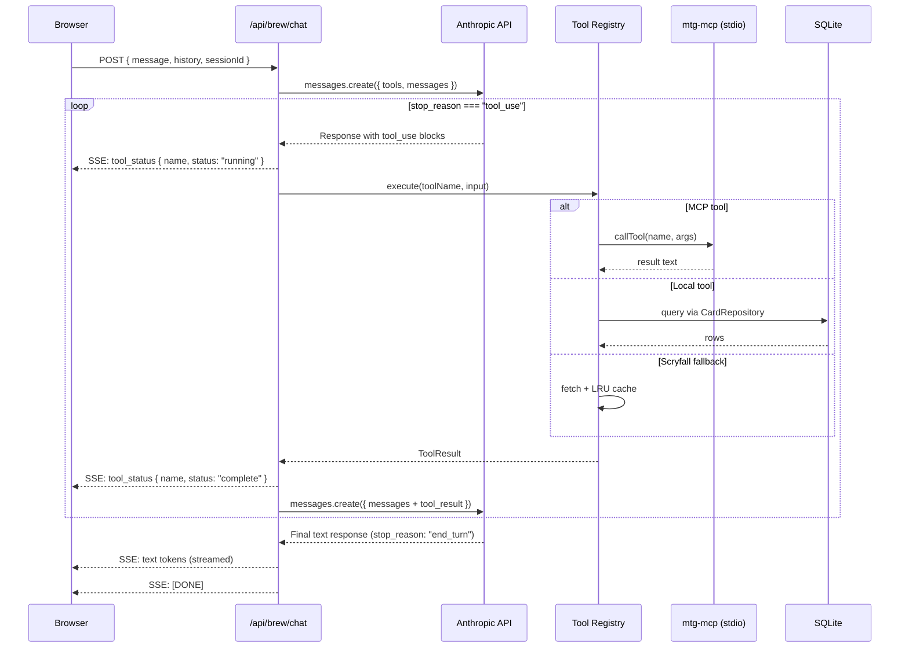

# Design Document: Brew AI Tools

## Overview

Brew AI Tools refactors the `/api/brew/chat` endpoint from a pure text-streaming Sonnet conversation into a tool-use loop that gives Oracle real-time access to card data, collection ownership, deck state, EDHREC recommendations, combo interactions, and rules — eliminating hallucination for factual claims.

The architecture connects three layers:
1. **MCP Client** — a singleton `mtg-mcp` child process (already implemented in `src/lib/mcp-client.ts`) providing Scryfall, EDHREC, Commander Spellbook, rules, bracket, and deck import tools
2. **Tool Registry** — a typed map from Anthropic tool names → executor functions, combining MCP-proxied tools, local SQLite tools (collection, deck context), and a direct Scryfall fallback
3. **Tool Execution Loop** — server-side logic that detects `stop_reason: "tool_use"`, executes tools, appends results, and re-invokes Claude until a final text response is produced

### Key Design Decisions

- **Reuse existing MCP client singleton** — the `getMcpClient()` pattern in `src/lib/mcp-client.ts` already handles connection management, reconnection, and error recovery. The tool-use feature extends this rather than creating a parallel client.
- **Anthropic SDK `messages.create` (non-streaming) per loop iteration** — each iteration of the tool loop uses a non-streaming call to detect `stop_reason` reliably. Only the final text response streams via SSE. This avoids partial-stream parsing complexity while keeping the user experience responsive (tool status events fill the gap).
- **Repository pattern for data access** — `CardRepository` interface with async signatures enables SQLite now, Supabase later, without changing tool executors.
- **Tool-call timeout per invocation (15s) + total loop timeout (30s)** — prevents runaway tool chains from blocking the response indefinitely.
- **In-memory LRU cache for direct Scryfall REST** — only the fallback `scryfall_search` tool hits Scryfall directly; all other card data routes through `mtg-mcp` which manages its own rate limiting.

---

## Architecture

### Tool Execution Loop



### Module Layout

```
src/lib/
├── mcp-client.ts              (existing — singleton MCP connection)
├── tool-registry.ts           (NEW — tool definitions + executor map)
├── tool-executor.ts           (NEW — tool execution loop logic)
├── tool-types.ts              (NEW — shared types for tool system)
├── card-repository.ts         (NEW — CardRepository interface)
├── sqlite-card-repository.ts  (NEW — SQLite implementation)
├── scryfall-cache.ts          (NEW — LRU cache + rate limiter)
└── brew-tool-prompt.ts        (NEW — system prompt with tool guidance)

src/app/api/brew/chat/
└── route.ts                   (MODIFIED — add tool loop)
```

---

## Components and Interfaces

### Tool Types (`tool-types.ts`)

```typescript
/** SSE event types for tool execution status */
export type ToolStreamEventType = 'tool_status' | 'text_delta' | 'done' | 'error'

export interface ToolStreamEvent {
  type: ToolStreamEventType
  tool_name?: string
  status?: 'running' | 'complete' | 'error'
  error_message?: string
  text?: string
}

/** Result returned from a tool executor */
export interface ToolExecutionResult {
  content: string
  is_error: boolean
}

/** A registered tool: schema + executor */
export interface RegisteredTool {
  definition: AnthropicToolDefinition
  execute: (input: Record<string, unknown>) => Promise<ToolExecutionResult>
}

/** Anthropic tool definition shape */
export interface AnthropicToolDefinition {
  name: string
  description: string
  input_schema: {
    type: 'object'
    properties: Record<string, unknown>
    required?: string[]
  }
}
```

### Tool Registry (`tool-registry.ts`)

The registry is a module-level `Map<string, RegisteredTool>` populated at import time. Adding a new tool requires:
1. Define the `AnthropicToolDefinition` (JSON Schema)
2. Implement the executor function
3. Register both in the map

```typescript
import type { RegisteredTool, AnthropicToolDefinition, ToolExecutionResult } from './tool-types'
import { getMcpClient } from './mcp-client'
import { getCardRepository } from './card-repository'

const registry = new Map<string, RegisteredTool>()

/** Get all tool definitions for the Anthropic API `tools` parameter */
export function getToolDefinitions(): AnthropicToolDefinition[] {
  return [...registry.values()].map(t => t.definition)
}

/** Execute a tool by name, returning the result */
export async function executeTool(
  name: string,
  input: Record<string, unknown>
): Promise<ToolExecutionResult> {
  const tool = registry.get(name)
  if (!tool) {
    return { content: `Unknown tool: ${name}`, is_error: true }
  }
  return tool.execute(input)
}

// --- MCP-proxied tools ---
function registerMcpTool(
  name: string,
  mcpToolName: string,
  description: string,
  inputSchema: AnthropicToolDefinition['input_schema']
) {
  registry.set(name, {
    definition: { name, description, input_schema: inputSchema },
    execute: async (input) => {
      try {
        const client = await getMcpClient()
        const result = await client.callTool({ name: mcpToolName, arguments: input })
        if (result.isError) {
          const msg = (result.content as any[])
            ?.filter((c: any) => c.type === 'text')
            .map((c: any) => c.text)
            .join('\n') || 'MCP tool error'
          return { content: msg, is_error: true }
        }
        const text = (result.content as any[])
          ?.filter((c: any) => c.type === 'text')
          .map((c: any) => c.text)
          .join('\n') || ''
        return { content: text, is_error: false }
      } catch (err) {
        const msg = err instanceof Error ? err.message : 'MTG data service unavailable'
        return {
          content: `MTG data service unavailable — try again or ask without tool verification. (${msg})`,
          is_error: true
        }
      }
    }
  })
}

// Register all tools on module load
// (see Data Models section for full schema definitions)
```

### Tool Execution Loop (`tool-executor.ts`)

```typescript
import Anthropic from '@anthropic-ai/sdk'
import { getToolDefinitions, executeTool } from './tool-registry'
import type { ToolStreamEvent, ToolExecutionResult } from './tool-types'

const TOOL_TIMEOUT_MS = 15_000
const LOOP_TIMEOUT_MS = 30_000
const MAX_TOOL_ITERATIONS = 10

export interface ToolLoopOptions {
  model: string
  system: Anthropic.MessageCreateParams['system']
  messages: Anthropic.MessageParam[]
  maxTokens: number
  onToolEvent: (event: ToolStreamEvent) => void
}

/**
 * Runs the tool-use loop: call Claude, execute tools, re-invoke until
 * the model produces a final text response (stop_reason !== "tool_use").
 * Returns the final message content blocks.
 */
export async function runToolLoop(
  anthropic: Anthropic,
  options: ToolLoopOptions
): Promise<Anthropic.Message> {
  const { model, system, messages, maxTokens, onToolEvent } = options
  const tools = getToolDefinitions()
  const loopStart = Date.now()
  let currentMessages = [...messages]
  let iterations = 0

  while (iterations < MAX_TOOL_ITERATIONS) {
    if (Date.now() - loopStart > LOOP_TIMEOUT_MS) {
      onToolEvent({ type: 'error', error_message: 'Tool execution timeout' })
      break
    }

    const response = await anthropic.messages.create({
      model,
      system,
      messages: currentMessages,
      tools: tools as any,
      max_tokens: maxTokens,
    })

    if (response.stop_reason !== 'tool_use') {
      return response
    }

    // Extract tool_use blocks
    const toolUseBlocks = response.content.filter(
      (b): b is Anthropic.ContentBlockParam & { type: 'tool_use' } =>
        b.type === 'tool_use'
    )

    // Execute each tool
    const toolResults: Anthropic.ToolResultBlockParam[] = []
    for (const toolUse of toolUseBlocks) {
      onToolEvent({
        type: 'tool_status',
        tool_name: toolUse.name,
        status: 'running'
      })

      let result: ToolExecutionResult
      try {
        result = await Promise.race([
          executeTool(toolUse.name, toolUse.input as Record<string, unknown>),
          new Promise<ToolExecutionResult>((_, reject) =>
            setTimeout(() => reject(new Error('Tool timeout')), TOOL_TIMEOUT_MS)
          )
        ])
      } catch (err) {
        result = {
          content: `Tool "${toolUse.name}" timed out after ${TOOL_TIMEOUT_MS / 1000}s`,
          is_error: true
        }
      }

      onToolEvent({
        type: 'tool_status',
        tool_name: toolUse.name,
        status: result.is_error ? 'error' : 'complete'
      })

      toolResults.push({
        type: 'tool_result',
        tool_use_id: toolUse.id,
        content: result.content,
        is_error: result.is_error,
      })
    }

    // Append assistant response + tool results to messages
    currentMessages = [
      ...currentMessages,
      { role: 'assistant', content: response.content },
      { role: 'user', content: toolResults },
    ]

    iterations++
  }

  // If we hit max iterations, make one final call without tools
  return anthropic.messages.create({
    model,
    system,
    messages: currentMessages,
    max_tokens: maxTokens,
  })
}
```

### CardRepository Interface (`card-repository.ts`)

```typescript
export interface OwnedCardInfo {
  card_name: string
  quantity: number
  set_code: string | null
  foil: boolean
}

export interface DeckAllocation {
  deck_id: number
  deck_name: string
  quantity: number
  is_commander: boolean
  allocation_status: 'original' | 'proxy'
}

export interface DeckContextCard {
  card_name: string
  primary_category: string
  additional_categories: string[]
  ownership_status: 'original' | 'proxy' | 'not_owned'
}

export interface DeckContextResult {
  total_cards: number
  cards: DeckContextCard[]
  category_counts: Record<string, number>
  category_health: Record<string, 'healthy' | 'low' | 'high'>
  suggestions: DeckContextCard[]
}

export interface CardRepository {
  /** Look up owned cards by exact name(s) */
  getOwnedCards(cardNames: string[]): Promise<OwnedCardInfo[]>

  /** Query all cards owned within a colour identity */
  getCardsByColourIdentity(colours: string[]): Promise<OwnedCardInfo[]>

  /** Get deck allocations for a specific card */
  getDeckAllocations(cardName: string): Promise<DeckAllocation[]>

  /** Get current deck state for a brew session */
  getDeckContext(sessionId: number): Promise<DeckContextResult | null>

  /** Get decision log for a session (exploration phase) */
  getDecisionLog(sessionId: number): Promise<Record<string, unknown> | null>
}

/** Factory function — returns the active repository implementation */
export function getCardRepository(): CardRepository {
  // Configuration constant — swap to SupabaseCardRepository when ready
  return new SqliteCardRepository()
}
```

### SqliteCardRepository (`sqlite-card-repository.ts`)

```typescript
import db from './db'
import { ensureDb } from './init-db'
import type {
  CardRepository, OwnedCardInfo, DeckAllocation, DeckContextResult
} from './card-repository'

export class SqliteCardRepository implements CardRepository {
  constructor() {
    ensureDb()
  }

  async getOwnedCards(cardNames: string[]): Promise<OwnedCardInfo[]> {
    if (cardNames.length === 0) return []
    const placeholders = cardNames.map(() => '?').join(',')
    const rows = db.prepare(`
      SELECT card_name, SUM(quantity) as quantity, set_code, foil
      FROM collection
      WHERE card_name IN (${placeholders})
      GROUP BY card_name
    `).all(...cardNames) as any[]
    return rows.map(r => ({
      card_name: r.card_name,
      quantity: r.quantity,
      set_code: r.set_code,
      foil: Boolean(r.foil),
    }))
  }

  async getCardsByColourIdentity(colours: string[]): Promise<OwnedCardInfo[]> {
    // colour_identity is stored as comma-separated in collection_extended
    // Filter cards where every colour in their identity is in the provided set
    const rows = db.prepare(`
      SELECT card_name, SUM(quantity) as quantity, set_code, foil
      FROM collection
      GROUP BY card_name
    `).all() as any[]
    // Filter in JS — SQLite lacks native colour identity subset queries
    // For Supabase migration, this becomes a proper query
    return rows.map(r => ({
      card_name: r.card_name,
      quantity: r.quantity,
      set_code: r.set_code,
      foil: Boolean(r.foil),
    }))
  }

  async getDeckAllocations(cardName: string): Promise<DeckAllocation[]> {
    const rows = db.prepare(`
      SELECT dc.deck_id, d.name as deck_name, dc.quantity, dc.is_commander
      FROM deck_cards dc
      JOIN decks d ON d.id = dc.deck_id
      WHERE dc.card_name = ?
    `).all(cardName) as any[]
    return rows.map(r => ({
      deck_id: r.deck_id,
      deck_name: r.deck_name,
      quantity: r.quantity,
      is_commander: Boolean(r.is_commander),
      allocation_status: 'original' as const, // default; proxy logic layered above
    }))
  }

  async getDeckContext(sessionId: number): Promise<DeckContextResult | null> {
    const session = db.prepare(`
      SELECT id, deck_id, status, skeleton_json, decision_log_json
      FROM brew_sessions WHERE id = ?
    `).get(sessionId) as any
    if (!session) return null

    if (session.deck_id) {
      // Building phase — query deck_cards
      const cards = db.prepare(`
        SELECT card_name, categories, tags, is_commander
        FROM deck_cards WHERE deck_id = ?
      `).all(session.deck_id) as any[]

      const deckCards: DeckContextResult['cards'] = cards.map(c => ({
        card_name: c.card_name,
        primary_category: (c.categories || 'Uncategorized').split(',')[0].trim(),
        additional_categories: (c.categories || '').split(',').slice(1).map((s: string) => s.trim()).filter(Boolean),
        ownership_status: 'original' as const,
      }))

      const categoryCounts: Record<string, number> = {}
      for (const card of deckCards) {
        categoryCounts[card.primary_category] = (categoryCounts[card.primary_category] || 0) + 1
      }

      return {
        total_cards: deckCards.length,
        cards: deckCards,
        category_counts: categoryCounts,
        category_health: {}, // computed from health-store if available
        suggestions: [],
      }
    }

    // Exploration phase — return skeleton from session if available
    if (session.skeleton_json) {
      try {
        const skeleton = JSON.parse(session.skeleton_json)
        return {
          total_cards: skeleton.totalCards || 0,
          cards: [],
          category_counts: {},
          category_health: {},
          suggestions: [],
        }
      } catch { /* fallback */ }
    }

    return null
  }

  async getDecisionLog(sessionId: number): Promise<Record<string, unknown> | null> {
    const session = db.prepare(`
      SELECT decision_log_json FROM brew_sessions WHERE id = ?
    `).get(sessionId) as any
    if (!session?.decision_log_json) return null
    try {
      return JSON.parse(session.decision_log_json)
    } catch {
      return null
    }
  }
}
```

### Scryfall Cache (`scryfall-cache.ts`)

```typescript
/** Simple LRU cache for direct Scryfall REST API calls */
export class LruCache<K, V> {
  private cache = new Map<K, V>()
  constructor(private maxSize: number) {}

  get(key: K): V | undefined {
    const value = this.cache.get(key)
    if (value !== undefined) {
      // Move to end (most recently used)
      this.cache.delete(key)
      this.cache.set(key, value)
    }
    return value
  }

  set(key: K, value: V): void {
    if (this.cache.has(key)) {
      this.cache.delete(key)
    } else if (this.cache.size >= this.maxSize) {
      // Delete least recently used (first entry)
      const firstKey = this.cache.keys().next().value
      if (firstKey !== undefined) this.cache.delete(firstKey)
    }
    this.cache.set(key, value)
  }

  has(key: K): boolean {
    return this.cache.has(key)
  }

  get size(): number {
    return this.cache.size
  }
}

/** Sliding-window rate limiter: max N requests per window */
export class SlidingWindowRateLimiter {
  private timestamps: number[] = []
  constructor(
    private maxRequests: number,
    private windowMs: number
  ) {}

  async acquire(): Promise<void> {
    const now = Date.now()
    this.timestamps = this.timestamps.filter(t => now - t < this.windowMs)
    if (this.timestamps.length >= this.maxRequests) {
      const oldestInWindow = this.timestamps[0]
      const waitMs = this.windowMs - (now - oldestInWindow)
      await new Promise(resolve => setTimeout(resolve, waitMs))
    }
    this.timestamps.push(Date.now())
  }
}

// Singleton instances
const cardCache = new LruCache<string, unknown>(500)
const rateLimiter = new SlidingWindowRateLimiter(10, 1000)

/** Direct Scryfall card search with caching and rate limiting */
export async function scryfallSearch(query: string): Promise<unknown> {
  const cached = cardCache.get(query)
  if (cached) return cached

  await rateLimiter.acquire()

  const url = `https://api.scryfall.com/cards/search?q=${encodeURIComponent(query)}`
  const response = await fetch(url, {
    headers: { 'User-Agent': 'TheOracle/0.1.0' }
  })

  if (!response.ok) {
    throw new Error(`Scryfall API error: ${response.status} ${response.statusText}`)
  }

  const data = await response.json()
  cardCache.set(query, data)
  return data
}
```

### Modified Chat Route (`/api/brew/chat/route.ts`)

The existing route refactors from pure `messages.stream()` to:
1. Build messages array (unchanged)
2. Run the tool execution loop (new)
3. Stream the final text response via SSE (adapted)
4. Emit `tool_status` events during tool execution (new)

The SSE event format becomes:

```
data: {"type":"tool_status","tool_name":"collection_lookup","status":"running"}

data: {"type":"tool_status","tool_name":"collection_lookup","status":"complete"}

data: {"type":"text_delta","text":"Based on your collection..."}

data: [DONE]
```

---

## Data Models

### Tool Definition Registry

| Tool Name | MCP Tool | Domain | Description |
|-----------|----------|--------|-------------|
| `mtg_ruling_search` | `mtg-ruling-search` | MCP | Search card rulings and official rules text |
| `mtg_rules_search` | `mtg-rules-search` | MCP | Search comprehensive rules by section/keyword |
| `mtg_commander_recommend` | `mtg-commander-recommend` | MCP | EDHREC top cards for a commander |
| `mtg_combos_search` | `mtg-combos-search` | MCP | Commander Spellbook combo interactions |
| `mtg_commander_deck` | `mtg-commander-deck` | MCP | Validate commander legality and partner rules |
| `mtg_commander_brackets` | `mtg-commander-brackets` | MCP | Bracket system power level criteria |
| `mtg_cardtypes_get` | `mtg-cardtypes-get` | MCP | Detailed card type information |
| `collection_lookup` | — | Local | Query owned cards by name, return ownership data |
| `deck_context` | — | Local | Query current brew session deck state |
| `scryfall_search` | — | Direct | Scryfall REST API search (fallback) |

### Tool Input Schemas

```typescript
// collection_lookup
{
  type: 'object',
  properties: {
    card_names: {
      type: 'array',
      items: { type: 'string' },
      description: 'One or more card names to check ownership for'
    },
    colour_identity: {
      type: 'array',
      items: { type: 'string', enum: ['W', 'U', 'B', 'R', 'G'] },
      description: 'Optional: filter owned cards by colour identity subset'
    }
  },
  required: ['card_names']
}

// deck_context
{
  type: 'object',
  properties: {
    session_id: {
      type: 'number',
      description: 'The brew session ID to query deck state for'
    }
  },
  required: ['session_id']
}

// scryfall_search
{
  type: 'object',
  properties: {
    query: {
      type: 'string',
      description: 'Scryfall search syntax query (e.g., "t:creature c:bg cmc<=3")'
    }
  },
  required: ['query']
}
```

### SSE Event Schema

```typescript
// Tool status event (emitted during tool execution)
{ type: 'tool_status', tool_name: string, status: 'running' | 'complete' | 'error' }

// Text delta event (streamed final response tokens)
{ type: 'text_delta', text: string }

// Error event
{ type: 'error', error_message: string }

// Done signal
'[DONE]'
```

---

## Correctness Properties

*A property is a characteristic or behavior that should hold true across all valid executions of a system — essentially, a formal statement about what the system should do. Properties serve as the bridge between human-readable specifications and machine-verifiable correctness guarantees.*

### Property 1: Tool Execution Loop Completeness

*For any* Anthropic response containing N tool_use blocks (where N >= 1), the tool execution loop SHALL execute all N tools, append all N tool results to the message history, and re-invoke the model — and the final message history SHALL contain exactly N tool_result entries corresponding to the N tool_use entries.

**Validates: Requirements 1.1, 1.2, 2.4**

### Property 2: Tool Status Event Emission

*For any* tool execution within the loop, the system SHALL emit exactly one "running" event before the tool executes and exactly one "complete" or "error" event after — and the events SHALL reference the correct tool name. The total number of event pairs SHALL equal the total number of tool invocations.

**Validates: Requirements 1.3**

### Property 3: Tool Error Propagation

*For any* tool executor that throws an error or times out, the resulting ToolExecutionResult SHALL have `is_error: true` and a non-empty content string describing the failure. The tool loop SHALL NOT terminate — it SHALL continue by feeding the error result back to the model.

**Validates: Requirements 1.5, 2.5**

### Property 4: Collection Lookup Returns Ownership Data

*For any* set of card names where some exist in the collection and some do not, the collection_lookup tool SHALL return exactly one entry per input card name. Owned cards SHALL have quantity > 0, a set_code string, and a foil boolean. Cards not in the collection SHALL have an explicit "not_owned" status.

**Validates: Requirements 3.1, 3.2, 3.4**

### Property 5: Collection Lookup Includes Deck Allocations

*For any* card that appears in one or more decks (via deck_cards table), the collection_lookup result for that card SHALL include an allocations array with one entry per deck, each containing the deck name and allocation status.

**Validates: Requirements 3.3**

### Property 6: Colour Identity Filter Subset Correctness

*For any* colour identity filter (a subset of {W, U, B, R, G}), every card returned by the collection_lookup tool with that filter SHALL have a colour identity that is itself a subset of the filter colours. No card outside the filter's identity SHALL appear in results.

**Validates: Requirements 3.5**

### Property 7: EDHREC Results Annotated with Ownership

*For any* EDHREC recommendation result set and any collection state, the enriched output SHALL annotate each card with the correct ownership status: "owned" if in collection and unallocated, "in [DeckName]" if allocated to another deck, or "not_owned" if not in collection. The annotation SHALL match the actual database state.

**Validates: Requirements 4.4**

### Property 8: Deck Context Returns Correct Card Data

*For any* valid brew session in building phase with N cards in the deck, the deck_context tool SHALL return total_cards equal to N, and each card entry SHALL contain a non-empty primary_category string, an additional_categories array, and an ownership_status value.

**Validates: Requirements 5.1, 5.2**

### Property 9: Category Health Computation

*For any* deck state where category targets are defined, the category_health for each monitored category SHALL be: "low" when count < target × 0.7, "high" when count > target × 1.3, and "healthy" otherwise. Modifying a card's additional_categories SHALL NOT change any category's health status.

**Validates: Requirements 5.3**

### Property 10: Phase Determines Deck Context Output

*For any* session in exploring phase (no commander committed), the deck_context tool SHALL return the decision log contents and no card list. *For any* session in building phase (commander committed, deck exists), the deck_context tool SHALL return the deck state with cards and categories.

**Validates: Requirements 5.5**

### Property 11: Tool Registry Structural Invariant

*For any* tool in the registry, it SHALL have: a non-empty name containing an underscore (domain prefix), a non-empty description string, an input_schema with type "object", and a callable executor function that returns a ToolExecutionResult. Additionally, `executeTool(name, {})` for any registered tool SHALL NOT return an "Unknown tool" error.

**Validates: Requirements 6.2, 6.3, 6.5**

### Property 12: LRU Cache Correctness

*For any* sequence of set/get operations on the LRU cache, the cache size SHALL never exceed maxSize (500). For any key that was set and not evicted, get(key) SHALL return the exact value that was set. When the cache is full and a new key is inserted, the least recently used entry SHALL be evicted.

**Validates: Requirements 8.2, 8.3**

### Property 13: Rate Limiter Sliding Window

*For any* sequence of acquire() calls to the rate limiter, no more than 10 calls SHALL complete within any 1-second sliding window. If the limit is reached, subsequent calls SHALL block until the window slides enough to permit them.

**Validates: Requirements 8.5**

---

## Error Handling

### Tool-Level Errors

| Failure | Recovery |
|---------|----------|
| MCP server crash / connection lost | `getMcpClient()` auto-reconnects on next call (existing pattern). Tool returns `is_error: true` with descriptive message. Model informed, can suggest retry or proceed without data. |
| Individual tool timeout (>15s) | Promise.race terminates the call. Tool returns error result. Model continues with remaining tools. |
| Total loop timeout (>30s) | Loop breaks, final call made without tools to produce best-effort text response. Client receives timeout indication via error event. |
| Unknown tool name in response | Registry returns `is_error: true` with "Unknown tool" message. Model self-corrects on next iteration. |
| Scryfall API rate limit (429) | Rate limiter prevents this. If it occurs despite limiter, retry after Retry-After header value. |
| SQLite query error | Wrapped in try/catch, returns error result. Does not crash the request. |
| Invalid session ID for deck_context | Returns null/error result indicating session not found. Model informs user. |

### Connection Recovery

The existing `mcp-client.ts` handles connection recovery:
- `transport.onclose` resets the singleton, triggering reconnection on next `getMcpClient()` call
- `callTool` retries once on connection errors (EPIPE, "Connection closed", "not connected")
- If both attempts fail, error propagates as a tool error result (not a request failure)

### Client-Side Degradation

If the SSE stream receives an error event:
- Tool-level errors: display a subtle indicator ("couldn't verify that card") but continue the conversation
- Loop timeout: display the partial response with a note that some verifications were skipped
- Connection errors: standard retry with exponential backoff (existing pattern)

---

## Testing Strategy

### Property-Based Tests (fast-check + Vitest)

The feature's core logic — tool execution loop orchestration, LRU cache correctness, rate limiter timing, collection lookup data integrity, and deck context computation — is well-suited to property-based testing. These are pure functions (or functions with mockable dependencies) with clear input/output behavior and universal properties.

**Library:** [fast-check](https://github.com/dubzzz/fast-check) (already in devDependencies)

**Configuration:**
- Minimum 100 iterations per property test
- Each test tagged with feature and property reference
- Tag format: `Feature: brew-ai-tools, Property {N}: {property_text}`

**Properties to implement:**

1. **Tool execution loop completeness** (Property 1) — generate mock Anthropic responses with 1-10 tool_use blocks, verify all executed and appended
2. **Tool status event emission** (Property 2) — generate random tool execution sequences, verify event count and ordering
3. **Tool error propagation** (Property 3) — generate tools that throw various errors, verify is_error result
4. **Collection lookup ownership data** (Property 4) — generate random collection DB state and card name arrays, verify result shape
5. **Collection deck allocations** (Property 5) — generate random deck_cards entries, verify allocation data
6. **Colour identity filter** (Property 6) — generate random colour subsets, verify all results are within identity
7. **EDHREC ownership annotation** (Property 7) — generate random EDHREC results + collection state, verify annotations
8. **Deck context card data** (Property 8) — generate random deck states in sessions, verify result structure
9. **Category health computation** (Property 9) — generate random category counts and targets, verify health classification
10. **Phase-dependent output** (Property 10) — generate sessions in both phases, verify correct output type
11. **Registry structural invariant** (Property 11) — iterate all registered tools, verify structural requirements
12. **LRU cache correctness** (Property 12) — generate random set/get sequences, verify size bounds and value integrity
13. **Rate limiter window** (Property 13) — generate burst patterns, verify timing constraints

### Unit Tests (Vitest)

- Tool registry contains all expected tools (7 MCP + 2 local + 1 Scryfall fallback)
- System prompt includes all required tool guidance sections (Requirements 10.1-10.8)
- SSE event format matches expected schema
- `SqliteCardRepository` methods return correct data shapes for known test fixtures
- `LruCache` eviction order (LRU, not FIFO)
- Tool definition schemas are valid JSON Schema
- Collection_lookup batching (multiple names in one call)
- Deck_context returns null for invalid session

### Integration Tests

- Full tool loop with mocked Anthropic API (verifying message assembly and iteration)
- MCP tool forwarding with live `mtg-mcp` process (requires `uvx mtg-mcp` available)
- `SqliteCardRepository` against a test database with known seed data
- End-to-end SSE stream parsing (tool events + text deltas + done signal)
- Rate limiter under concurrent load

### E2E Tests (Playwright)

- Send a message that triggers tool use, verify tool status indicators appear then disappear
- Verify card suggestions include ownership annotations in the rendered message
- Verify conversation continues after tool timeout (degraded but functional)
