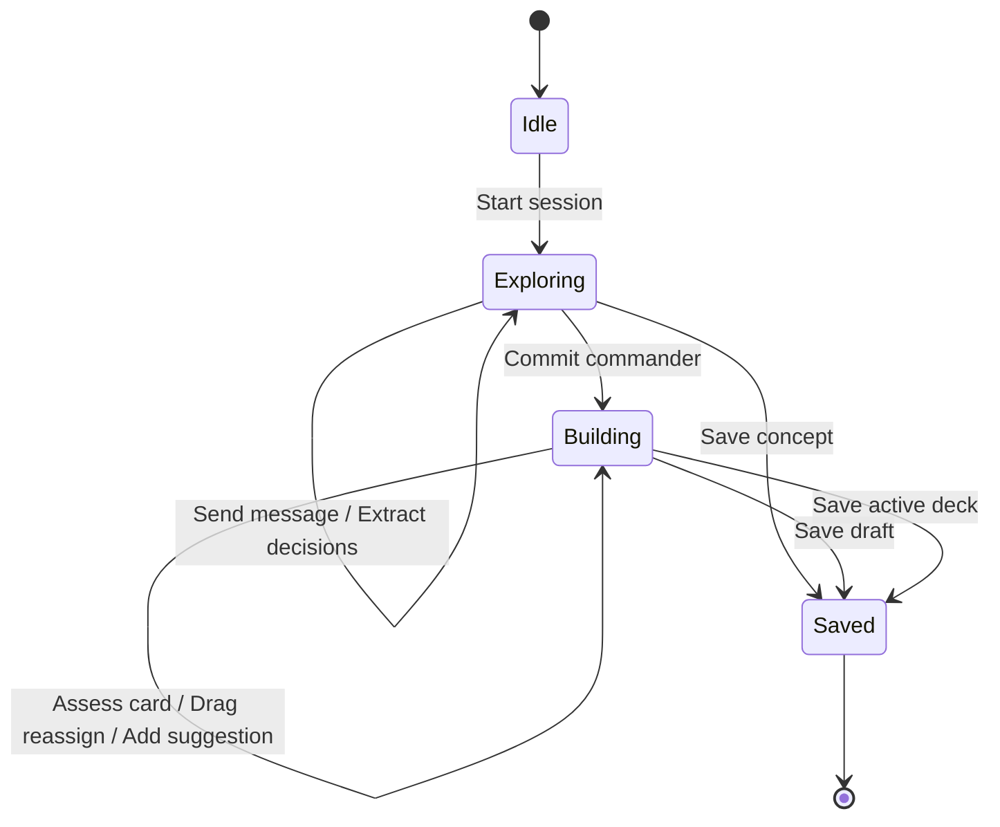
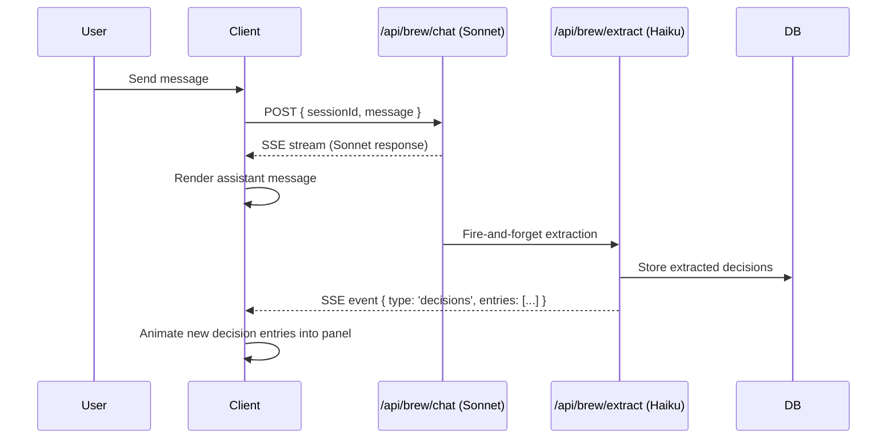

# Design Document: Brew Mode V2

## Overview

Brew Mode V2 replaces the current single-phase brew experience with a two-phase architecture:

1. **Exploration Phase** — conversational commander discovery with a Decision Log panel that silently extracts strategy decisions via Haiku
2. **Building Phase** — full deck workspace panel with AI-powered card assessment, category management, drag-to-reassign, and structured suggestions

The redesign introduces a model split (Sonnet for conversation/skeleton, Haiku for extraction/assessment), commander options cards rendered inline in chat, a primary + additional category data model, and concept/draft persistence with dashboard management.

### Key Design Decisions

- **Two-phase state machine** over progressive disclosure — the panel completely swaps on phase transition rather than adding sections incrementally. This keeps each phase focused and avoids panel clutter.
- **Silent extraction via Haiku** over explicit user input — decisions populate automatically from conversation. Users never need to manually enter strategy parameters.
- **Primary + additional category model** over flat multi-category — one category determines placement and health counting, additional categories provide cross-reference context without double-counting.
- **Drag-to-reassign** over right-click menus or modals — fastest path to category reassignment for iterative deck construction.
- **Assessment caching per session** over per-card global cache — assessment is deck-context-specific, so the same card may score differently in different decks.

---

## Architecture

### State Machine

The brew session follows a linear state machine with two primary phases:



**Phase definitions:**
- `exploring` — no commander committed; chat + Decision Log panel (260px)
- `building` — commander committed; chat + Deck Workspace panel (280px)

The transition from `exploring` → `building` is **immediate and synchronous** on the client. The panel swap and topbar update happen in a single React state update. Skeleton generation begins asynchronously after the transition.

### Model Assignment

| Task | Model | Justification |
|------|-------|---------------|
| Exploration conversation | Sonnet 4.6 | Creative, nuanced responses |
| Decision extraction | Haiku 4.5 | Fast, cheap, structured output |
| Skeleton generation | Sonnet 4.6 | Complex card selection + categorization |
| Card assessment (inline) | Haiku 4.5 | Fast per-card evaluation, cacheable |
| Debrief investigation | Haiku 4.5 | Conversational diagnosis |
| Debrief analysis | Sonnet 4.6 | Ranked recommendations |

### Prompt Caching Strategy

Both models use Anthropic's prompt caching via `cache_control: { type: 'ephemeral' }` on system prompt blocks:

```typescript
// Example: Haiku extraction call
const response = await anthropic.messages.create({
  model: 'claude-haiku-4-5-20251001',
  system: [
    {
      type: 'text',
      text: EXTRACTION_SYSTEM_PROMPT,
      cache_control: { type: 'ephemeral' },
    },
  ],
  messages: [...],
})
```

System prompts are identical across calls within a session, so subsequent calls hit the cache (5-minute TTL). This reduces latency by ~80% and cost by ~90% for system prompt tokens on repeated calls.

### Request Flow — Decision Extraction Pipeline



The extraction call is non-blocking — the Sonnet response streams to the user immediately. Extraction results arrive asynchronously and animate into the Decision Log without interrupting the conversation flow.

---

## Components and Interfaces

### Component Tree

```
BrewModePage (page.tsx)
├── BrewTopbar
│   ├── ExplorationTopbar (phase = exploring)
│   └── BuildingTopbar (phase = building)
├── OracleChat
│   ├── MessageList
│   │   ├── TextMessage
│   │   └── CommanderOptionsCard (structured inline)
│   └── ChatInput
└── RightPanel
    ├── DecisionLogPanel (phase = exploring, 260px)
    │   ├── DecisionSection ("Strategy" | "Parameters" | "Constraints")
    │   │   └── DecisionEntry[]
    │   ├── CommitButton (disabled until commander surfaced)
    │   └── SaveConceptButton
    └── DeckWorkspacePanel (phase = building, 280px)
        ├── WorkspaceHeader (commander art, name, type, pips, archetype)
        ├── WorkspaceTabs ("Deck list" | "Suggestions")
        ├── DeckListTab
        │   ├── PinnedSection (Win Conditions — teal)
        │   ├── PinnedSection (Alt Win Conditions — amber)
        │   ├── CategorySection[] (draggable targets)
        │   │   ├── CategoryHeader (name, count, health)
        │   │   └── CardRow[] (draggable sources)
        │   │       ├── GripHandle
        │   │       ├── OwnershipDot
        │   │       ├── CardName
        │   │       ├── AdditionalCategoryPills
        │   │       ├── CMC
        │   │       └── InlineAssessment (expanded on click)
        │   └── CardTooltip (hover, positioned left of panel)
        ├── SuggestionsTab
        │   ├── SuggestionGroup[] (grouped by category)
        │   │   └── SuggestionRow (+ button, reason line)
        └── WorkspaceFooter ([N]/100 cards, Save draft)
```

### Key Interfaces

```typescript
// --- Phase State ---

type BrewPhaseV2 = 'exploring' | 'building'

interface BrewSessionState {
  phase: BrewPhaseV2
  sessionId: number | null
  commander: CommittedCommander | null
  decisionLog: DecisionLog
  deckState: DeckState | null
  assessmentCache: Map<string, CardAssessment>
}

// --- Decision Log ---

interface DecisionLog {
  strategy: DecisionEntry[]
  parameters: DecisionEntry[]
  constraints: DecisionEntry[]
}

interface DecisionEntry {
  id: string
  key: string          // e.g. "ARCHETYPE", "COLOUR IDENTITY"
  value: string        // e.g. "Aristocrats", "Orzhov (WB)"
  sourceQuote: string  // Exact quote from conversation
  timestamp: number
}

// --- Commander Options Card ---

interface CommanderOption {
  name: string
  artUrl: string
  colourIdentity: string[]
  description: string
  owned: boolean
  scryfallId: string
}

interface CommanderOptionsCardProps {
  options: CommanderOption[]
  onCommit: (commander: CommanderOption) => void
}

// --- Committed Commander ---

interface CommittedCommander {
  name: string
  artUrl: string
  typeLine: string
  colourIdentity: string[]
  archetype: string | null  // From decision log
}

// --- Deck State ---

interface DeckState {
  cards: DeckCard[]
  suggestions: DeckCard[]
  isGenerating: boolean
}

interface DeckCard {
  card_name: string
  primary_category: string
  additional_categories: string[]
  ownership_status: 'original' | 'proxy' | 'not_owned'
  cmc: number
  type_line: string
  oracle_text: string
  edhrec_inclusion?: number
  price_ck?: number
}

// --- Card Assessment ---

interface CardAssessment {
  pros: string[]        // 2-3 items
  cons: string[]        // 1-2 items
  fit_score: number     // 1-10
  fit_note: string      // 2-3 sentences, deck-specific
}

// --- Category Health ---

interface CategoryHealth {
  name: string
  count: number
  target: number | null
  status: 'healthy' | 'low' | 'high' | 'unmonitored'
}
```

### API Routes (New/Modified)

| Route | Method | Purpose |
|-------|--------|---------|
| `/api/brew/chat` | POST (SSE) | Sonnet conversation + triggers extraction |
| `/api/brew/extract` | POST | Haiku decision extraction (internal) |
| `/api/brew/commit` | POST | Commit commander, trigger phase transition |
| `/api/brew/skeleton` | POST (SSE) | Sonnet skeleton generation |
| `/api/brew/assess` | POST | Haiku card assessment |
| `/api/brew/save` | POST | Save concept/draft/active deck |
| `/api/brew/session` | GET/DELETE | Session CRUD |

---

## Data Models

### Database Schema Changes

```sql
-- Migration: Add 'concept' to decks.status CHECK constraint
-- Rebuild decks table with updated CHECK
ALTER TABLE decks ... 
  CHECK(status IN ('active', 'draft', 'concept'));

-- Migration: Add decision_log column to brew_sessions
ALTER TABLE brew_sessions ADD COLUMN decision_log_json TEXT DEFAULT '{"strategy":[],"parameters":[],"constraints":[]}';

-- Migration: Update brew_sessions.status to include new phases
-- Rebuild with CHECK(status IN ('exploring', 'building', 'complete', 'abandoned'))

-- Migration: Add assessment_cache to brew_sessions
ALTER TABLE brew_sessions ADD COLUMN assessment_cache_json TEXT DEFAULT '{}';
```

### Persistence Model

| Entity | Storage | Notes |
|--------|---------|-------|
| Concept (exploration, no commander) | `brew_sessions` with status 'exploring' | decision_log_json persists the full log |
| Draft (building, incomplete) | `decks` with status 'draft' + linked `brew_sessions` | Both deck cards and session state persisted |
| Active deck | `decks` with status 'active' | Final state after save |
| Assessment cache | `brew_sessions.assessment_cache_json` | Per-session, per-card cache of Haiku assessments |

### Category Mapping — Archidekt Sync

The primary + additional category model maps bidirectionally to Archidekt's flat category array:

```typescript
// Export to Archidekt
function toArchidektCategories(card: DeckCard): string[] {
  return [card.primary_category, ...card.additional_categories]
}

// Import from Archidekt
function fromArchidektCategories(categories: string[]): {
  primary: string
  additional: string[]
} {
  const [primary, ...additional] = categories
  return { primary: primary ?? 'Uncategorized', additional }
}
```

---

## Correctness Properties

*A property is a characteristic or behavior that should hold true across all valid executions of a system — essentially, a formal statement about what the system should do. Properties serve as the bridge between human-readable specifications and machine-verifiable correctness guarantees.*

### Property 1: Phase Transition on Commander Commit

*For any* valid commander (name exists in Scryfall, legal as commander), committing that commander SHALL transition the session phase from `exploring` to `building`, store the commander data, and the phase SHALL never revert to `exploring` within the same session.

**Validates: Requirements 2.3, 2.4, 5.5, 14.1**

### Property 2: Decision Categorization

*For any* extracted decision entry with a recognized type, `categorizeDecision(entry)` SHALL return the correct section: strategy-related types (archetype, playstyle, win_approach) → "Strategy", measurable types (colour_identity, bracket) → "Parameters", limitation types (constraints, exclusions) → "Constraints".

**Validates: Requirements 4.3, 4.5, 12.2**

### Property 3: Archidekt Category Round-Trip

*For any* DeckCard with `primary_category` P and `additional_categories` [A1, A2, ...], exporting to Archidekt and re-importing SHALL produce an equivalent card with the same `primary_category` P and same `additional_categories` [A1, A2, ...] in order.

**Validates: Requirements 8.4, 8.5**

### Property 4: Primary Category Determines Placement

*For any* deck state, each card SHALL appear in exactly one Category_Section determined by its `primary_category`, and the count displayed in that section's header SHALL equal the number of cards with that `primary_category`.

**Validates: Requirements 8.2, 6.6**

### Property 5: Additional Categories Don't Affect Health

*For any* deck state, modifying a card's `additional_categories` (adding or removing entries) SHALL NOT change the `Health_Status` of any category section. Health is computed solely from `primary_category` counts.

**Validates: Requirements 8.3**

### Property 6: Drag Reassign Updates Primary Category Only

*For any* card dragged from Category A to Category B (where A ≠ B), after the drop: the card's `primary_category` SHALL equal B, Category A's count SHALL decrease by 1, Category B's count SHALL increase by 1, and the card's `additional_categories` SHALL be unchanged.

**Validates: Requirements 9.5, 9.7**

### Property 7: Drag to Same Category Is Idempotent

*For any* card dropped onto its own current category section header, the deck state SHALL remain unchanged (no mutations to any card, count, or health status).

**Validates: Requirements 9.6**

### Property 8: Card Removal Maintains Count Invariant

*For any* card removed from the deck, the total card count (footer) SHALL decrease by exactly 1, the card's primary_category section count SHALL decrease by exactly 1, and the card SHALL not appear in any section after removal.

**Validates: Requirements 7.7, 6.7**

### Property 9: Assessment Cache Prevents Duplicate Calls

*For any* card assessed once within a session, subsequent assessment requests for the same card SHALL return the cached result without invoking the Haiku model, and the cached result SHALL be identical to the original.

**Validates: Requirements 7.6**

### Property 10: Adding Suggestion Transfers Between Lists

*For any* suggestion added to the deck via the + button, the card SHALL be removed from the suggestions list and added to the deck list under its `primary_category`. The suggestions tab count SHALL decrease by 1, the deck list tab count SHALL increase by 1, and the footer total SHALL increase by 1.

**Validates: Requirements 13.3**

### Property 11: Footer Count Invariant

*For any* deck state, the footer card count SHALL equal the sum of cards across all category sections (including pinned win condition sections). This invariant SHALL hold after any operation (add, remove, drag-reassign).

**Validates: Requirements 6.7**

### Property 12: Active Decks Never Show Delete

*For any* deck with status `'active'`, no delete action (button, menu item, or confirmation) SHALL be rendered in any UI context (dashboard tile, detail page, or panel).

**Validates: Requirements 10.6**

---

## Error Handling

### Model Failures

| Failure | Recovery |
|---------|----------|
| Sonnet conversation timeout | Show error toast, re-enable input, allow retry |
| Haiku extraction fails | Silent — decision log simply doesn't update. No user disruption. |
| Skeleton generation fails | Show error in workspace with "Retry" button. Preserve decision log. |
| Haiku assessment fails | Show "Assessment unavailable" in inline expansion with retry link |
| Scryfall validation fails | Filter invalid commanders from options card silently. If all fail, show plain text fallback. |

### State Recovery

- **Page refresh during exploration** — session is persisted after each message exchange. Resume from last message.
- **Page refresh during building** — deck state is persisted. Resume with full deck workspace.
- **Network disconnect** — SSE reconnection with exponential backoff. Messages queued locally.
- **Concurrent sessions** — only one active session per user. Starting new session prompts to abandon or resume existing.

### Drag-and-Drop Edge Cases

- **Drop outside panel** — cancel drag, restore original opacity, no state change
- **Drop on non-header area** — cancel drag, no state change (only headers are valid targets)
- **Rapid successive drags** — debounce state updates, process in order

---

## Testing Strategy

### Property-Based Tests (fast-check)

The feature's core logic — category management, state transitions, count invariants, and Archidekt mapping — is well-suited to property-based testing. These are pure functions with clear input/output behavior and universal properties that should hold across all valid inputs.

**Library:** [fast-check](https://github.com/dubzzz/fast-check) (TypeScript, integrates with Vitest)

**Configuration:**
- Minimum 100 iterations per property test
- Each test tagged with feature and property reference

**Tag format:** `Feature: brew-mode-v2, Property {N}: {property_text}`

**Properties to implement:**
1. Phase transition (Property 1) — generate random valid commanders, verify transition
2. Decision categorization (Property 2) — generate random decision entries with types, verify section assignment
3. Archidekt round-trip (Property 3) — generate random category arrays, verify export→import identity
4. Primary category placement (Property 4) — generate random deck states, verify card counts match section counts
5. Additional categories isolation (Property 5) — generate random additional_categories mutations, verify health unchanged
6. Drag reassign (Property 6) — generate random source/target category pairs, verify state mutations
7. Same-category drop idempotence (Property 7) — generate random cards, drop on own category, verify no change
8. Removal count invariant (Property 8) — generate random removals, verify count decrements
9. Assessment caching (Property 9) — generate random card names, verify cache hit on second call
10. Suggestion transfer (Property 10) — generate random suggestions, verify list transfer and count updates
11. Footer count invariant (Property 11) — generate random deck operations, verify footer always equals sum
12. Active deck delete protection (Property 12) — generate random deck statuses, verify active never shows delete

### Unit Tests (Vitest)

- Commander Options Card rendering with various option counts
- Decision Log animation trigger on new entry
- Topbar content per phase
- Card tooltip positioning and content
- Inline assessment expand/collapse (accordion behavior)
- Workspace header rendering from commander data
- Health status calculation thresholds
- Drag visual feedback (opacity, border)

### Integration Tests

- Sonnet → Haiku extraction pipeline (mocked models, real API routes)
- Session persistence and resume across page reload
- Skeleton generation with decision log context forwarding
- Prompt caching verification (cache_control headers present)
- Scryfall validation filtering invalid commanders
- Archidekt push/pull with category mapping

### E2E Tests (Playwright)

- Full exploration → commit → building flow
- Drag-to-reassign interaction
- Concept save and resume from dashboard
- Draft save, dashboard tile actions, and delete confirmation
