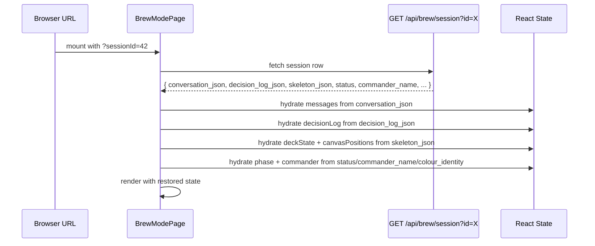

# Design Document: Brew Session Autosave

## Overview

This feature adds transparent background persistence to the brew page so that all session state — chat messages, decision log, deck cards, canvas positions, and phase/commander data — survives page navigations and browser refreshes without user action.

The design introduces three new pieces:
1. **`useBrewAutosave` hook** — a unified client-side watcher that observes all state slices, debounces changes, and flushes via a single PATCH call
2. **`PATCH /api/brew/session/[id]`** — a batch-update API route that accepts any subset of session fields and persists them atomically
3. **Session loader logic** — hydrates all React state slices from a URL-provided `sessionId` query parameter on mount

The approach consolidates the existing position-only persistence (`useCanvasPositions` → `POST /api/brew/positions`) into the unified autosave system, eliminating the separate positions endpoint as a write path (it remains for backward compat but the hook no longer uses it).

## Architecture

```mermaid
flowchart TD
    subgraph Client ["Brew Page (client)"]
        MS[messages useState]
        DL[session.decisionLog]
        DS[deckState useReducer]
        CP[canvasPositions]
        PH[session phase/commander]
    end

    subgraph Hook ["useBrewAutosave"]
        W[Watcher — compares prev vs current refs]
        DB[Debounce Timer (2000ms trailing-edge)]
        BT[Batch — dirty field accumulator]
        FL[Flush — sendBeacon on unload]
    end

    subgraph API ["Next.js API Route"]
        PATCH["PATCH /api/brew/session/[id]"]
    end

    subgraph DB2 ["Supabase"]
        ROW[brew_sessions row]
    end

    MS --> W
    DL --> W
    DS --> W
    CP --> W
    PH --> W

    W -->|field changed| BT
    BT -->|timer expires| DB
    DB -->|fires| PATCH
    FL -->|beforeunload| PATCH

    PATCH --> ROW
```

### Hydration Flow (Session Resume)



## Components and Interfaces

### 1. `useBrewAutosave` Hook

**Location:** `src/hooks/useBrewAutosave.ts`

```typescript
interface UseBrewAutosaveOptions {
  sessionId: number | null
  messages: ChatMessage[]
  decisionLog: DecisionLog
  deckState: DeckState
  phase: BrewPhaseV2
  commander: CommittedCommander | null
}

interface UseBrewAutosaveReturn {
  /** Whether a save is currently in-flight */
  isSaving: boolean
  /** Timestamp of last successful save (null if never saved) */
  lastSavedAt: number | null
  /** Force an immediate flush (e.g. before intentional navigation) */
  flush: () => Promise<void>
}
```

**Responsibilities:**
- Watches all state slices via `useRef` comparisons on each render
- Marks dirty fields in a `Set<DirtyField>` when a slice changes identity (referential inequality)
- Resets the 2000ms trailing-edge debounce timer on every dirty-marking
- On timer expiry, calls `PATCH /api/brew/session/[id]` with only the dirty fields serialized
- On `beforeunload` and Next.js route change (`routeChangeStart`), flushes pending writes via `navigator.sendBeacon` (falls back to synchronous `fetch` with `keepalive: true`)
- Retries once on 5xx/network failure after 5000ms using latest state
- Skips retry on 4xx

### 2. `PATCH /api/brew/session/[id]` API Route

**Location:** `src/app/api/brew/session/[id]/route.ts`

```typescript
// Request body — all fields optional (only dirty fields sent)
interface PatchSessionBody {
  conversation_json?: string    // JSON array of serialized messages
  decision_log_json?: string    // JSON object { strategy, parameters, constraints }
  skeleton_json?: string        // JSON object { cards, suggestions, canvasPositions, explorationArchive }
  status?: string               // 'exploring' | 'building'
  commander_name?: string | null
  colour_identity?: string | null
  path_type?: string | null
}

// Response
interface PatchSessionResponse {
  success: boolean
  updated_at: string
}
```

**Behavior:**
- Validates `id` path param as a positive integer
- Validates body — rejects empty body (no fields to update)
- For `skeleton_json`: performs a read-merge-write to preserve sibling fields not in the payload (e.g. updating canvasPositions without clobbering cards)
- Sets `updated_at` to current ISO timestamp
- Returns 200 on success, 400 on validation failure, 404 if session not found, 500 on DB error

### 3. Session Loader (within page component)

**Location:** Inline in `src/app/new-deck/page.tsx` (or extracted to `src/hooks/useSessionLoader.ts`)

```typescript
interface SessionLoaderResult {
  isLoading: boolean
  error: string | null
}
```

**Responsibilities:**
- On mount, reads `sessionId` from `searchParams`
- If present: fetches full session row via `GET /api/brew/session?id=X` (enhanced to return all fields)
- Hydrates each state slice with safe parsing (malformed JSON → empty defaults)
- If `status === 'building'` and `commander_name` exists: reconstructs `CommittedCommander` with art URL from Scryfall
- Replaces URL with `sessionId` param using `history.replaceState` (no navigation)
- If no `sessionId` in URL: creates new session via existing `POST /api/brew/session`, then replaces URL

### 4. Serialization Helpers

**Location:** `src/lib/brew-autosave-serializers.ts`

```typescript
/** Serialize messages for persistence (caps at 500, trims content to 50k chars) */
function serializeMessages(messages: ChatMessage[]): string

/** Deserialize messages from JSON string (returns [] on failure) */
function deserializeMessages(json: string | null): ChatMessage[]

/** Serialize deck state excluding transient fields */
function serializeDeckState(deckState: DeckState): string

/** Deserialize deck state from skeleton_json (returns initialDeckState on failure) */
function deserializeDeckState(json: string | null): DeckState

/** Serialize decision log */
function serializeDecisionLog(log: DecisionLog): string

/** Deserialize decision log (returns empty log on failure) */
function deserializeDecisionLog(json: string | null): DecisionLog
```

## Data Models

### Persisted Message Shape (within `conversation_json`)

```typescript
interface PersistedMessage {
  role: 'user' | 'assistant'
  content: string          // max 50,000 characters
  timestamp: string        // ISO 8601
  cost: number             // USD spent, 0 if N/A
}
```

### Persisted Skeleton Shape (within `skeleton_json`)

```typescript
interface PersistedSkeleton {
  cards: DeckCard[]
  suggestions: DeckCard[]
  canvasPositions: Record<string, CanvasCardPosition>
  explorationArchive: ArchivedItem[]
}
```

Note: `isGenerating` is excluded — always set to `false` on hydration.

### Dirty Field Tracking

```typescript
type DirtyField =
  | 'conversation_json'
  | 'decision_log_json'
  | 'skeleton_json'
  | 'phase_commander'  // maps to status + commander_name + colour_identity + path_type
```

### URL State

The session ID is stored as a query parameter: `/new-deck?sessionId=42`. This enables:
- Bookmark/share a session link
- Browser back/forward doesn't lose session context
- No new route needed — same page component handles both new and resumed sessions


## Correctness Properties

*A property is a characteristic or behavior that should hold true across all valid executions of a system — essentially, a formal statement about what the system should do. Properties serve as the bridge between human-readable specifications and machine-verifiable correctness guarantees.*

### Property 1: Message Serialization Round-Trip

*For any* array of ChatMessage objects (with role in ["user", "assistant"], content up to 50,000 characters, numeric timestamp, and numeric cost), serializing via `serializeMessages` then deserializing via `deserializeMessages` SHALL produce an array of messages where each entry has role, content, timestamp (as ISO 8601 string), and cost fields matching the original input values.

**Validates: Requirements 1.2, 1.3**

### Property 2: Decision Log Serialization Round-Trip

*For any* valid DecisionLog object (containing strategy, parameters, and constraints arrays of DecisionEntry objects with id, key, value, sourceQuote, and timestamp fields), serializing via `serializeDecisionLog` then deserializing via `deserializeDecisionLog` SHALL produce an equivalent DecisionLog with all entries preserved in order.

**Validates: Requirements 2.2, 2.4**

### Property 3: Deck State Serialization Round-Trip (isGenerating Exclusion)

*For any* valid DeckState object (containing cards, suggestions, canvasPositions, and explorationArchive), serializing via `serializeDeckState` then deserializing via `deserializeDeckState` SHALL produce a DeckState where cards, suggestions, canvasPositions, and explorationArchive are equal to the original input AND isGenerating is always `false` regardless of its value in the input.

**Validates: Requirements 3.2, 3.4, 4.2, 4.4**

### Property 4: Malformed Input Resilience

*For any* string that is not valid JSON (including null, empty string, partial JSON, random bytes, and strings containing valid JSON of an incorrect shape), `deserializeMessages` SHALL return an empty array, `deserializeDecisionLog` SHALL return `{ strategy: [], parameters: [], constraints: [] }`, and `deserializeDeckState` SHALL return the default empty DeckState.

**Validates: Requirements 1.4, 2.3, 3.3**

### Property 5: Message Cap Preserves Most Recent

*For any* array of ChatMessage objects with length N > 500, `serializeMessages` SHALL produce a JSON string that, when parsed, contains exactly 500 entries corresponding to the last 500 messages from the original array (indices N-500 through N-1) in their original order.

**Validates: Requirements 1.5**

### Property 6: Debounce Batches Dirty Fields Into Single Write

*For any* sequence of state changes across one or more tracked fields (messages, decisionLog, deckState, phase/commander) occurring within a 2000ms window, the autosave service SHALL produce exactly one API call containing all fields that changed during that window, fired only after 2000ms of inactivity following the last change.

**Validates: Requirements 1.1, 2.1, 3.1, 6.1, 6.2, 6.4**

### Property 7: Skeleton Merge Preserves Sibling Fields

*For any* existing skeleton_json object containing cards, suggestions, canvasPositions, and explorationArchive fields, when a PATCH request updates only the canvasPositions field, the resulting skeleton_json SHALL contain the original cards, suggestions, and explorationArchive values unchanged alongside the new canvasPositions value.

**Validates: Requirements 4.3**

### Property 8: Phase Transition Serialization

*For any* valid CommittedCommander object (with non-empty name and colourIdentity array), when the session transitions from 'exploring' to 'building', the autosave service SHALL persist status='building', commander_name equal to the commander's name, colour_identity equal to the joined colour identity, and path_type reflecting the commit path. Hydrating from these persisted values SHALL reconstruct a session in 'building' phase with matching commander data.

**Validates: Requirements 5.1, 5.2**

### Property 9: Recovery After Failed Save

*For any* state S at which a persistence write fails (after retry exhaustion), when a subsequent state change S' occurs, the autosave service SHALL schedule a new persistence attempt using the full current state S' (not the previously failed state S), ensuring no stale data is written.

**Validates: Requirements 8.4**

## Error Handling

### Network Failures (5xx / Timeout / Connection Refused)

- **Strategy:** Single retry after 5000ms delay
- **Retry payload:** Always uses latest current state at retry time (not the originally failed snapshot) — this prevents stale overwrites if the user continued interacting during the 5s wait
- **After retry exhaustion:** Log `console.warn` with the error, mark the save as failed internally, and resume normal operation. The next state change will trigger a fresh save attempt with full current state
- **No user disruption:** UI remains fully interactive. No modals, toasts, or disabled controls

### Client Errors (4xx)

- **Strategy:** No retry — 4xx indicates a request the server will never accept (bad session ID, malformed body)
- **Handling:** Log `console.warn`, skip the write, continue operating. The most likely cause is a deleted/expired session — the next state change will attempt again with the same session ID, and if it still 404s, the user has effectively lost persistence for that session (acceptable for MVP)

### Malformed Hydration Data

- **Strategy:** Every deserializer uses a try/catch with a fallback to the relevant default state
- **No error surfacing:** If `conversation_json` is corrupt, messages start empty — the user sees a clean slate rather than an error screen
- **Console logging:** A `console.warn` is emitted for debugging but not surfaced to the UI

### Flush on Unload

- **Primary transport:** `navigator.sendBeacon` (non-blocking, survives page unload)
- **Payload:** JSON body identical to normal PATCH request
- **Fallback:** If sendBeacon is unavailable, use `fetch` with `keepalive: true`
- **Limitation:** sendBeacon has a ~64KB payload limit. If the serialized state exceeds this (unlikely for typical sessions but possible with very long conversations), the flush is dropped silently. The state will be recovered from the last successful save.

### Concurrent Save Conflicts

- **Strategy:** Last-write-wins at the field level. The API always overwrites the field value — no optimistic concurrency control
- **Rationale:** Single-user sessions (no collaborative editing), and the client always sends latest state. A user can only have one tab with a given session open — if they have two, last-write-wins is acceptable

## Testing Strategy

### Unit Tests (Example-Based)

Unit tests cover specific scenarios, integration points, and edge cases:

- **Session loader hydration:** Mount with known session data, verify each state slice is populated correctly
- **Commander reconstruction:** Test that `status=building` + valid `commander_name` produces correct CommittedCommander
- **Commander reconstruction failure:** Test that failed Scryfall lookup falls back to exploring phase
- **Flush on beforeunload:** Simulate event, verify sendBeacon called with correct payload
- **Retry on 5xx:** Mock failed request, advance timer, verify retry fires with latest state
- **No retry on 4xx:** Mock 400 response, verify no retry scheduled
- **Loading state during hydration:** Verify loading indicator shows while fetch is in-flight
- **URL replacement:** Verify `history.replaceState` called with correct sessionId param

### Property-Based Tests

Property tests use [fast-check](https://github.com/dubzzz/fast-check) (already available in the project's test ecosystem via Vitest) to verify universal correctness properties across generated inputs. Each test runs a minimum of 100 iterations.

| Property | Test File | Generator Strategy |
|----------|-----------|-------------------|
| P1: Message round-trip | `brew-autosave-serializers.property.test.ts` | Arbitrary arrays of `{ role: oneof('user','assistant'), content: string(0..50000), timestamp: nat(), cost: float() }` |
| P2: Decision log round-trip | `brew-autosave-serializers.property.test.ts` | Arbitrary DecisionLog with random entries per section |
| P3: Deck state round-trip | `brew-autosave-serializers.property.test.ts` | Arbitrary DeckState with random cards, positions, archive items |
| P4: Malformed input resilience | `brew-autosave-serializers.property.test.ts` | Arbitrary strings (unicode, partial JSON, null bytes) |
| P5: Message cap | `brew-autosave-serializers.property.test.ts` | Arrays of length 1–1000, verify tail-500 preservation |
| P6: Debounce batching | `useBrewAutosave.property.test.ts` | Random sequences of field changes with random inter-change delays |
| P7: Skeleton merge | `brew-session-patch.property.test.ts` | Random skeleton objects + random position updates |
| P8: Phase transition | `useBrewAutosave.property.test.ts` | Random CommittedCommander objects |
| P9: Recovery after failure | `useBrewAutosave.property.test.ts` | Random state pairs (failed state, subsequent state) |

**Tag format:** Each property test includes a comment: `// Feature: brew-session-autosave, Property {N}: {title}`

**Configuration:** `numRuns: 100` minimum per property (fast-check default is 100, which satisfies the requirement).

### Integration Tests

- **Full autosave cycle:** Render brew page, change messages + deck state, advance timers, verify single PATCH call with correct payload
- **Session resume end-to-end:** Create session via API, persist data, re-mount page with sessionId in URL, verify full state restoration
- **Positions consolidated:** Verify that position changes flow through the unified autosave hook (not the legacy positions endpoint)
