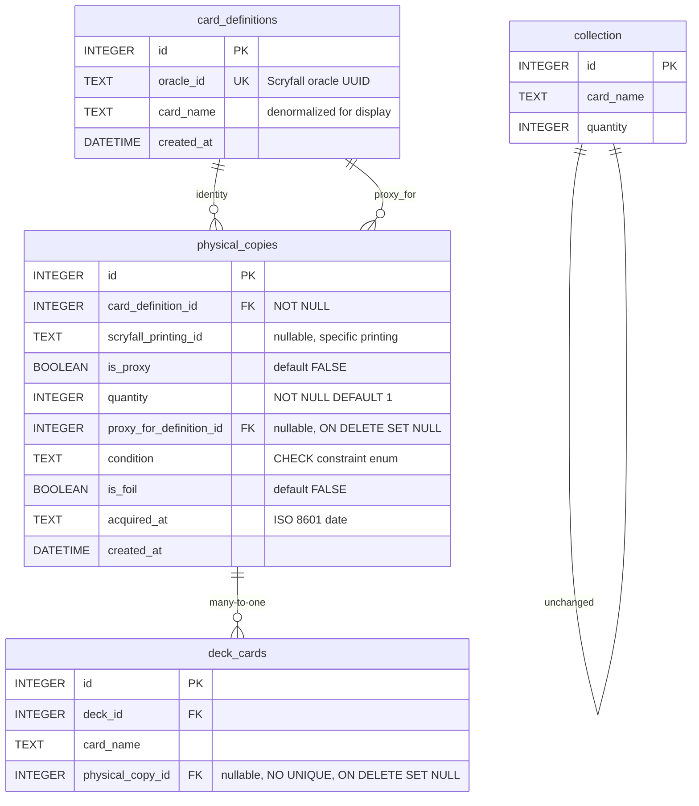

# Design Document: Card Identity & Physical Copies (v2 — Printing Group Model)

## Overview

This feature introduces a two-layer data model beneath the existing aggregate ownership system:

1. **card_definitions** — Stable card identity keyed by Scryfall `oracle_id`. One row per logical card across all printings.
2. **physical_copies** — A **printing-group** table. Each row represents a distinct combination of `(card_definition_id, scryfall_printing_id, is_foil, is_proxy)` with a `quantity` column tracking how many physical cards exist in that group.
3. **deck_cards.physical_copy_id** — Optional FK linking a deck slot to a printing group. **Many-to-one**: multiple deck slots can reference the same printing group.

The design is purely additive. No existing tables are modified destructively. The `collection` table remains the source of truth for fungible bulk. The allocation resolver (`computeAllocations`) continues operating unchanged.

### Key Differences from Original Design (v1)

| Aspect | v1 (Per-Object) | v2 (Printing Group) |
|--------|-----------------|---------------------|
| `physical_copies` semantics | One row per individual card | One row per distinct printing group |
| Quantity tracking | Implicit (row count) | Explicit `quantity` column |
| Deck linkage | One-to-one (UNIQUE on physical_copy_id) | Many-to-one (no UNIQUE constraint) |
| Availability enforcement | Database UNIQUE constraint | Computed via COUNT queries |
| Governing Rule | Reject undistinguished cards | All imported cards get rows |
| Proxy creation | One row per proxy | One row per card with quantity |

### What's Already Built (Tasks 1–3, 6)

Migration 023 and `card-identity-store.ts` were implemented against the v1 model. They are functional but need adjustment:

- **Migration 023** created `card_definitions`, `physical_copies` (without `quantity`), and `deck_cards.physical_copy_id` (WITH a UNIQUE constraint)
- **`card-identity-store.ts`** has the original per-object functions including Governing Rule validation and UNIQUE-constraint-aware linkage
- A **follow-up migration (026)** will bring the schema to v2 state
- The **store module** will be updated with upsert semantics, in-use count queries, and removal of Governing Rule rejection

### Design Goals

- **Additive only** — No existing column removals, no type changes, no behavioral changes to existing queries.
- **Reversible** — A down-migration can cleanly drop the new tables and column.
- **Printing-group upsert** — Identical printings collapse to one row; quantity tracks count.
- **Computed availability** — In-use counts derived via COUNT queries, never stored.
- **Proxy separation** — Collection view excludes proxies; separate Proxies tab.

## Architecture



### Layer Interaction

| Layer | Source of Truth | Changed by This Feature |
|-------|----------------|------------------------|
| Aggregate ownership | `collection.quantity` | ❌ No |
| Deck composition | `deck_cards` rows | ✅ New nullable column (no UNIQUE) |
| Allocation decisions | `deck_allocations` | ❌ No |
| Card identity | `card_definitions` (NEW) | ✅ New table |
| Printing-group tracking | `physical_copies` (NEW) | ✅ New table with quantity |
| In-use counts | Computed via COUNT | ✅ New queries (never stored) |

### Existing Systems Left Untouched

- `proxy_allocations` table — preserved as-is
- `deck_allocations` table — no schema changes
- `deck_priority` table — no changes
- `shared_cards` view — continues to read `deck_cards` and `collection` only
- `computeAllocations()` — reads `demandMap`, `supplyMap`, `deckPriority`, `overrides`; none change shape

## Components and Interfaces

### Updated Data Access Module: `src/lib/card-identity-store.ts`

```typescript
// Card Definition CRUD (unchanged from v1)
function ensureCardDefinition(db: Database, oracleId: string, cardName: string): number
function getCardDefinitionByOracleId(db: Database, oracleId: string): CardDefinition | null
function getCardDefinitionById(db: Database, id: number): CardDefinition | null

// Physical Copy — Printing Group CRUD (v2: upsert semantics)
function upsertPhysicalCopy(db: Database, params: UpsertPhysicalCopyParams): PhysicalCopy
function getPhysicalCopy(db: Database, id: number): PhysicalCopy | null
function deletePhysicalCopy(db: Database, id: number): void
function listUnassignedPhysicalCopies(db: Database): PhysicalCopy[]
function listPhysicalCopiesForDefinition(db: Database, cardDefinitionId: number): PhysicalCopy[]
function findPrintingGroup(db: Database, params: PrintingGroupKey): PhysicalCopy | null

// Deck Linkage (v2: no UNIQUE enforcement)
function linkPhysicalCopyToDeckCard(db: Database, physicalCopyId: number, deckCardId: number): void | CardIdentityError
function unlinkPhysicalCopyFromDeckCard(db: Database, deckCardId: number): void

// Validation (v2: Governing Rule REMOVED)
function validateCardMatch(db: Database, physicalCopyId: number, deckCardId: number): boolean

// Computed In-Use Counts (NEW in v2)
function getCardLevelInUseCount(db: Database, cardDefinitionId: number): number
function getSubgroupInUseCount(db: Database, physicalCopyId: number): number
function getCollectionRollup(db: Database): CollectionRollupRow[]
function getProxyRollup(db: Database): ProxyRollupRow[]

// Collection Import (NEW in v2)
function importCollectionCard(db: Database, params: CollectionImportParams): PhysicalCopy
```

### Type Definitions (v2)

```typescript
interface CardDefinition {
  id: number
  oracleId: string        // Scryfall oracle_id (UUID)
  cardName: string        // denormalized display name
  createdAt: string
}

interface PhysicalCopy {
  id: number
  cardDefinitionId: number
  scryfallPrintingId: string | null
  isProxy: boolean
  quantity: number         // NEW: count of physical cards in this group
  proxyForDefinitionId: number | null
  condition: PhysicalCondition | null
  isFoil: boolean
  acquiredAt: string | null
  createdAt: string
}

type PhysicalCondition =
  | 'near_mint'
  | 'lightly_played'
  | 'moderately_played'
  | 'heavily_played'
  | 'damaged'

/** Key for the printing-group unique index */
interface PrintingGroupKey {
  cardDefinitionId: number
  scryfallPrintingId: string | null
  isFoil: boolean
  isProxy: boolean
}

interface UpsertPhysicalCopyParams {
  cardDefinitionId: number
  scryfallPrintingId?: string | null
  isProxy?: boolean
  proxyForDefinitionId?: number | null
  condition?: PhysicalCondition | null
  isFoil?: boolean
  quantity?: number        // defaults to 1; increments on upsert
  acquiredAt?: string | null
}

interface CollectionImportParams {
  oracleId: string
  cardName: string
  scryfallPrintingId: string
  isFoil: boolean
  quantity: number
}

interface CollectionRollupRow {
  cardDefinitionId: number
  cardName: string
  ownedQuantity: number   // SUM of non-proxy physical_copies.quantity
  inUseCount: number      // COUNT of deck_cards referencing this card's physical_copies
}

interface ProxyRollupRow {
  cardDefinitionId: number
  cardName: string
  proxyQuantity: number   // SUM of proxy physical_copies.quantity
  inUseCount: number      // COUNT of deck_cards referencing this card's proxy physical_copies
}

// Error types (v2: GOVERNING_RULE_VIOLATION removed)
type CardIdentityErrorCode =
  | 'CARD_MISMATCH'
  | 'INVALID_PRINTING'

interface CardIdentityError {
  error: CardIdentityErrorCode
  message: string
}
```

### Migration Files

| File | Purpose |
|------|---------|
| `db/migrations/023-card-identity-physical-copies.sql` | Original schema (already applied) |
| `db/migrations/026-physical-copies-v2.sql` | Follow-up: add quantity, add unique index, drop UNIQUE on deck_cards.physical_copy_id |
| `db/down/026-physical-copies-v2-down.sql` | Reverse the v2 changes |

## Data Models

### Table: `card_definitions` (unchanged from v1)

| Column | Type | Constraints | Notes |
|--------|------|-------------|-------|
| `id` | INTEGER | PRIMARY KEY | Auto-increment |
| `oracle_id` | TEXT(36) | NOT NULL, UNIQUE | Scryfall oracle UUID |
| `card_name` | TEXT(256) | NOT NULL | Denormalized for display/search |
| `created_at` | DATETIME | DEFAULT CURRENT_TIMESTAMP | Audit trail |

**Indexes:**
- UNIQUE on `oracle_id` (implicit)
- Index on `card_name` for search

### Table: `physical_copies` (v2 — Printing Group)

| Column | Type | Constraints | Notes |
|--------|------|-------------|-------|
| `id` | INTEGER | PRIMARY KEY | Auto-increment |
| `card_definition_id` | INTEGER | NOT NULL, FK → card_definitions(id) | The logical card |
| `scryfall_printing_id` | TEXT(36) | nullable | Specific printing UUID; NULL for proxies |
| `is_proxy` | BOOLEAN | NOT NULL, DEFAULT FALSE | Whether this group is proxies |
| `quantity` | INTEGER | NOT NULL, DEFAULT 1 | **NEW**: count of physical cards in group |
| `proxy_for_definition_id` | INTEGER | nullable, FK → card_definitions(id) ON DELETE SET NULL | What card this proxy represents |
| `condition` | TEXT | nullable, CHECK enum | Physical condition |
| `is_foil` | BOOLEAN | NOT NULL, DEFAULT FALSE | Foil status |
| `acquired_at` | TEXT | nullable | ISO 8601 date string |
| `created_at` | DATETIME | DEFAULT CURRENT_TIMESTAMP | Audit trail |

**CHECK constraint on `condition`:**
```sql
CHECK (condition IS NULL OR condition IN (
  'near_mint', 'lightly_played', 'moderately_played',
  'heavily_played', 'damaged'
))
```

**Indexes:**
- `idx_physical_copies_card_definition_id` on `card_definition_id`
- `idx_physical_copies_is_proxy` on `is_proxy`
- **`idx_physical_copies_group` UNIQUE** on `(card_definition_id, scryfall_printing_id, is_foil, is_proxy)` — the printing-group upsert key

**Printing-Group Rule:**
- For proxies: `scryfall_printing_id` is always NULL → one proxy row per card_definition
- For real cards: one row per distinct `(card_definition_id, printing, foil)` combination
- Quantity tracks how many physical cards match that group

### Altered Table: `deck_cards` (v2)

| New Column | Type | Constraints | Notes |
|------------|------|-------------|-------|
| `physical_copy_id` | INTEGER | nullable, FK → physical_copies(id) ON DELETE SET NULL | Links slot to a printing group |

**NO UNIQUE constraint on `physical_copy_id`** — multiple deck_cards rows can reference the same printing group. This enables the many-to-one relationship where e.g. 4 deck slots in different decks all point to the same "Sol Ring (C21, non-foil)" printing group.

### Follow-Up Migration: `db/migrations/026-physical-copies-v2.sql`

```sql
BEGIN;

-- 1. Add quantity column with default 1
ALTER TABLE physical_copies ADD COLUMN quantity INTEGER NOT NULL DEFAULT 1;

-- 2. Add the printing-group unique index
CREATE UNIQUE INDEX IF NOT EXISTS idx_physical_copies_group
  ON physical_copies(card_definition_id, scryfall_printing_id, is_foil, is_proxy);

-- 3. Drop the UNIQUE constraint on deck_cards.physical_copy_id
-- SQLite requires rebuilding the index (cannot ALTER INDEX)
DROP INDEX IF EXISTS idx_deck_cards_physical_copy_id;

-- 4. Create a non-unique index for FK lookups (replacing the unique one)
CREATE INDEX IF NOT EXISTS idx_deck_cards_physical_copy_id
  ON deck_cards(physical_copy_id) WHERE physical_copy_id IS NOT NULL;

COMMIT;
```

### Down-Migration: `db/down/026-physical-copies-v2-down.sql`

```sql
BEGIN;

-- 1. Drop the non-unique index
DROP INDEX IF EXISTS idx_deck_cards_physical_copy_id;

-- 2. Restore the unique index
CREATE UNIQUE INDEX IF NOT EXISTS idx_deck_cards_physical_copy_id
  ON deck_cards(physical_copy_id) WHERE physical_copy_id IS NOT NULL;

-- 3. Drop the printing-group unique index
DROP INDEX IF EXISTS idx_physical_copies_group;

-- 4. Remove quantity column (SQLite table rebuild)
CREATE TABLE physical_copies_backup AS SELECT
  id, card_definition_id, scryfall_printing_id, is_proxy,
  proxy_for_definition_id, condition, is_foil, acquired_at, created_at
FROM physical_copies;

DROP TABLE physical_copies;

ALTER TABLE physical_copies_backup RENAME TO physical_copies;

-- Recreate indexes on physical_copies
CREATE INDEX IF NOT EXISTS idx_physical_copies_card_definition_id ON physical_copies(card_definition_id);
CREATE INDEX IF NOT EXISTS idx_physical_copies_is_proxy ON physical_copies(is_proxy);

COMMIT;
```

### Upsert SQL Pattern

The core upsert for printing-group management:

```sql
INSERT INTO physical_copies (card_definition_id, scryfall_printing_id, is_foil, is_proxy, quantity, proxy_for_definition_id, condition, acquired_at)
VALUES (?, ?, ?, ?, ?, ?, ?, ?)
ON CONFLICT (card_definition_id, scryfall_printing_id, is_foil, is_proxy)
DO UPDATE SET quantity = physical_copies.quantity + excluded.quantity
RETURNING *;
```

### Computed In-Use Count Queries

**Card-level in-use count** (for Collection rollup):
```sql
SELECT COUNT(dc.id)
FROM deck_cards dc
JOIN physical_copies pc ON dc.physical_copy_id = pc.id
WHERE pc.card_definition_id = :card_definition_id
```

**Subgroup-level in-use count** (for expanded printing detail):
```sql
SELECT COUNT(dc.id)
FROM deck_cards dc
WHERE dc.physical_copy_id = :physical_copy_id
```

**Full Collection rollup query** (default view, proxies excluded):
```sql
SELECT
  cd.id AS card_definition_id,
  cd.card_name,
  SUM(CASE WHEN pc.is_proxy = 0 THEN pc.quantity ELSE 0 END) AS owned_quantity,
  (SELECT COUNT(*) FROM deck_cards dc
   JOIN physical_copies pc2 ON dc.physical_copy_id = pc2.id
   WHERE pc2.card_definition_id = cd.id) AS in_use_count
FROM card_definitions cd
JOIN physical_copies pc ON pc.card_definition_id = cd.id
WHERE pc.is_proxy = 0
GROUP BY cd.id, cd.card_name
```

**Proxy tab rollup query**:
```sql
SELECT
  cd.id AS card_definition_id,
  cd.card_name,
  SUM(pc.quantity) AS proxy_quantity,
  (SELECT COUNT(*) FROM deck_cards dc
   JOIN physical_copies pc2 ON dc.physical_copy_id = pc2.id
   WHERE pc2.card_definition_id = cd.id AND pc2.is_proxy = 1) AS in_use_count
FROM card_definitions cd
JOIN physical_copies pc ON pc.card_definition_id = cd.id
WHERE pc.is_proxy = 1
GROUP BY cd.id, cd.card_name
```

### Migration Backfill Logic (from 023 — already applied)

The original migration 023 already performed:
1. **card_definitions backfill** from DISTINCT scryfall_id/card_name across `deck_cards` and `collection`
2. **physical_copies backfill** for `deck_cards` rows with `ownership_status = 'proxy'`
3. **deck_cards.physical_copy_id linkage** for proxy rows

Migration 026 (v2) adds `quantity` and the unique index on top of the existing data. All existing physical_copies rows get `quantity = 1` (the DEFAULT), which is correct since the original migration created one row per proxy deck slot.

**Post-migration 026 consolidation** (optional, can run as part of collection import): If multiple physical_copies rows exist for the same printing group (from the per-object backfill), the collection import upsert will naturally consolidate them on next sync. No immediate data migration needed since the unique index uses `IF NOT EXISTS` and existing rows don't violate it (each proxy had a unique combination due to the per-slot creation pattern).

## Correctness Properties

*A property is a characteristic or behavior that should hold true across all valid executions of a system — essentially, a formal statement about what the system should do. Properties serve as the bridge between human-readable specifications and machine-verifiable correctness guarantees.*

### Property 1: Card Definition Idempotence

*For any* valid oracle_id and card_name pair, calling `ensureCardDefinition` any number of times with the same oracle_id SHALL always return the same integer id and SHALL never create more than one row in card_definitions for that oracle_id.

**Validates: Requirements 1.1, 1.2, 1.3**

### Property 2: Printing-Group Upsert Quantity Accumulation

*For any* sequence of upsert operations targeting the same printing-group key `(card_definition_id, scryfall_printing_id, is_foil, is_proxy)`, the system SHALL maintain exactly one row for that key, and the final `quantity` value SHALL equal the sum of all individual upsert quantities.

**Validates: Requirements 2.2, 3.1, 4.3, 8.2**

### Property 3: Condition Constraint Enforcement

*For any* string value provided as the `condition` field during physical copy creation, the system SHALL accept the value if and only if it is one of the valid enum values ('near_mint', 'lightly_played', 'moderately_played', 'heavily_played', 'damaged') or NULL.

**Validates: Requirements 2.5**

### Property 4: Proxy-For Cascade (ON DELETE SET NULL)

*For any* physical copy with a non-null `proxy_for_definition_id`, deleting the referenced card_definition SHALL set `proxy_for_definition_id` to NULL on the physical copy without deleting the physical copy itself.

**Validates: Requirements 2.8**

### Property 5: Unassigned Copy Persistence

*For any* set of physical copies with no deck_cards row referencing them, all such copies SHALL appear in unassigned query results and SHALL continue to exist in the physical_copies table indefinitely.

**Validates: Requirements 3.2**

### Property 6: Many-to-One Deck Linkage

*For any* physical_copy row and any number N of compatible deck_cards rows (matching card identity), linking all N deck_cards to the same physical_copy SHALL succeed — no unique constraint prevents the many-to-one relationship.

**Validates: Requirements 3.5, 5.5**

### Property 7: Deck Card Cascade (ON DELETE SET NULL)

*For any* deck_cards row with a non-null `physical_copy_id`, deleting the referenced physical_copy SHALL set `physical_copy_id` to NULL on the deck_card without deleting the deck_card itself.

**Validates: Requirements 5.3**

### Property 8: Linkage Preserves Existing Columns

*For any* deck_cards row with existing `ownership_status` and `proxy_of_deck_id` values, linking or unlinking a physical copy SHALL not modify those column values.

**Validates: Requirements 5.4, 5.7**

### Property 9: Quantity Immutable During Linkage

*For any* physical_copy row with quantity Q, linking or unlinking deck_cards rows to/from that physical_copy SHALL leave quantity unchanged at Q.

**Validates: Requirements 5.8**

### Property 10: Card Match Validation

*For any* physical_copy and deck_cards row where the physical_copy's `card_definition_id` does not match the card represented by the deck_card's `card_name`, linking SHALL be rejected with a CARD_MISMATCH error.

**Validates: Requirements 5.6**

### Property 11: Unlinking Preserves Physical Copy

*For any* linked deck_card/physical_copy pair, setting `physical_copy_id` to NULL on the deck_card SHALL leave the physical_copy record unchanged and present in the table.

**Validates: Requirements 5.7**

### Property 12: Computed In-Use Count Correctness

*For any* configuration of physical_copies and deck_cards linkages, the card-level in-use count (COUNT of deck_cards referencing any physical_copy for that card_definition) SHALL equal the sum of subgroup-level in-use counts (COUNT of deck_cards referencing each individual physical_copy row) for the same card_definition.

**Validates: Requirements 9.1, 9.2, 9.5, 9.6**

### Property 13: Proxy Separation Completeness

*For any* dataset of physical_copies rows, the Collection view query (WHERE is_proxy = 0) and the Proxy tab query (WHERE is_proxy = 1) SHALL form a complete partition — every physical_copies row appears in exactly one of the two result sets, and no row appears in both.

**Validates: Requirements 10.1, 10.2, 10.3, 10.4**

### Property 14: Undistinguished Cards Accepted

*For any* valid card_definition_id and valid scryfall_printing_id, creating a physical_copy with `is_proxy = FALSE`, `is_foil = FALSE`, and a non-null `scryfall_printing_id` SHALL succeed — the previous Governing Rule rejection is removed.

**Validates: Requirements 8.3**

### Property 15: Linkage Replacement Semantics

*For any* deck_cards row with an existing non-NULL physical_copy_id, linking to a different (compatible) physical_copy SHALL replace the old reference with the new one. The previously-referenced physical_copy SHALL continue to exist.

**Validates: Requirements 3.4**

## Error Handling

### Database Constraint Violations

| Scenario | Constraint | Response |
|----------|-----------|----------|
| Duplicate oracle_id insert | UNIQUE on card_definitions.oracle_id | `ensureCardDefinition` uses INSERT OR IGNORE + SELECT — no error surfaced |
| NULL card_definition_id on physical_copy | NOT NULL constraint | SQLite throws SQLITE_CONSTRAINT; data access layer returns descriptive error |
| Invalid condition value | CHECK constraint | SQLite throws SQLITE_CONSTRAINT_CHECK; layer returns "invalid condition" error |
| Duplicate printing-group insert (bypassing upsert) | UNIQUE on group index | SQLite throws SQLITE_CONSTRAINT_UNIQUE; upsert function handles via ON CONFLICT |
| FK violation (invalid card_definition_id) | FOREIGN KEY constraint | SQLite throws SQLITE_CONSTRAINT_FOREIGNKEY; layer returns "card definition not found" |

### Application-Level Validation Errors

| Scenario | Check | Response |
|----------|-------|----------|
| Card mismatch on linkage | `physical_copy.card_definition_id` vs `deck_card.card_name` resolved definition | Reject before UPDATE; return `{ error: 'CARD_MISMATCH', message: '...' }` |
| Invalid Scryfall printing_id | External API validation (future) | Reject before INSERT; return `{ error: 'INVALID_PRINTING', message: '...' }` |

**Removed from v2:** The `GOVERNING_RULE_VIOLATION` error code is removed. All cards with a valid `scryfall_printing_id` get physical_copies rows regardless of proxy/foil status.

### Migration Error Handling

Both migration 023 and 026 wrap statements in `BEGIN/COMMIT`. If any statement fails, the transaction rolls back. The migration is not recorded in `_migrations`, leaving the database in pre-migration state.

### Error Propagation Strategy

```
SQLite constraint error
  → caught by card-identity-store.ts
  → mapped to typed error object { error: string, message: string }
  → returned to API route handler
  → serialized as JSON response with appropriate HTTP status (400/409/422)
```

## Testing Strategy

### Property-Based Tests (fast-check)

The project uses TypeScript with Vitest. Property-based tests use **fast-check** (`fc`) which is already installed.

**Configuration:**
- Minimum 100 iterations per property (`numRuns: 100`)
- Each test tagged with the design property it validates
- Tag format: `Feature: card-identity-physical-copies, Property {N}: {title}`

**Test file:** `src/lib/__tests__/card-identity-store.property.test.ts`

Properties 1–15 are tested against an in-memory SQLite database (`:memory:`) with migrations 023 + 026 applied. This keeps tests fast and isolated.

**Key testing patterns:**
- Properties 1–5, 10–11, 14–15: Pure data-layer tests (insert/query/validate)
- Property 6: Multiple linkages to same physical_copy (the key v2 behavioral change)
- Property 7–9: Cascade and immutability invariants
- Property 12: Arithmetic invariant (subgroup sums = card-level total)
- Property 13: Partition completeness (proxy/non-proxy exhaustive split)

### Unit Tests (example-based)

**Test file:** `src/lib/__tests__/card-identity-store.test.ts`

- Schema verification (tables exist, columns correct, no UNIQUE on physical_copy_id)
- Default values: is_proxy defaults to FALSE, is_foil defaults to FALSE, quantity defaults to 1
- Upsert workflow: import same printing twice → quantity = 2
- Proxy creation workflow: create proxy → one row with scryfall_printing_id = NULL
- Collection import workflow: 10 cards across 6 printings → 6 rows, quantities sum to 10
- In-use count queries: set up known linkages, verify computed counts
- Attention state: in-use > owned → still returns (not an error)
- Collection rollup excludes proxies; Proxy tab includes only proxies
- Edge case: card_name at exactly 256 characters
- Edge case: physical_copy with all optional fields NULL

### Integration Tests

**Test file:** `src/lib/__tests__/card-identity-migration.integration.test.ts`

- Migration 023 + 026 roundtrip (up/down for both)
- shared_cards view returns identical results pre/post migration
- computeAllocations produces identical output pre/post migration
- Backfill creates correct physical_copies for proxy rows
- Collection table unchanged after migration
- proxy_allocations table unchanged
- deck_cards.ownership_status and proxy_of_deck_id preserved
- Transactional rollback on migration error

### Test Dependencies

- `vitest` — test runner (already installed)
- `fast-check` — property-based testing library (already installed)
- `better-sqlite3` — in-memory DB for isolated tests (already installed)

### Store Module Update Summary

The existing `card-identity-store.ts` needs these changes for v2:

1. **Remove** `validateGoverningRule` function and `GOVERNING_RULE_VIOLATION` error code
2. **Replace** `createPhysicalCopy` with `upsertPhysicalCopy` using ON CONFLICT DO UPDATE
3. **Update** `linkPhysicalCopyToDeckCard` to remove try/catch for UNIQUE constraint errors (no longer applicable)
4. **Add** `quantity` field to `PhysicalCopy` interface and `mapRowToPhysicalCopy`
5. **Add** `findPrintingGroup`, `getCardLevelInUseCount`, `getSubgroupInUseCount`, `getCollectionRollup`, `getProxyRollup`, `importCollectionCard` functions
6. **Update** `listUnassignedPhysicalCopies` — "unassigned" now means no deck_cards rows reference it at all (not just one-to-one)
