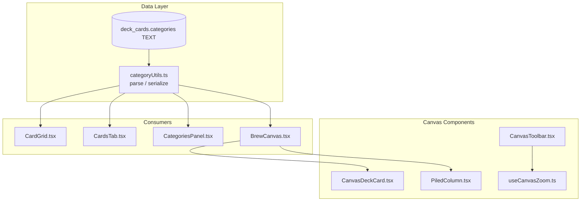
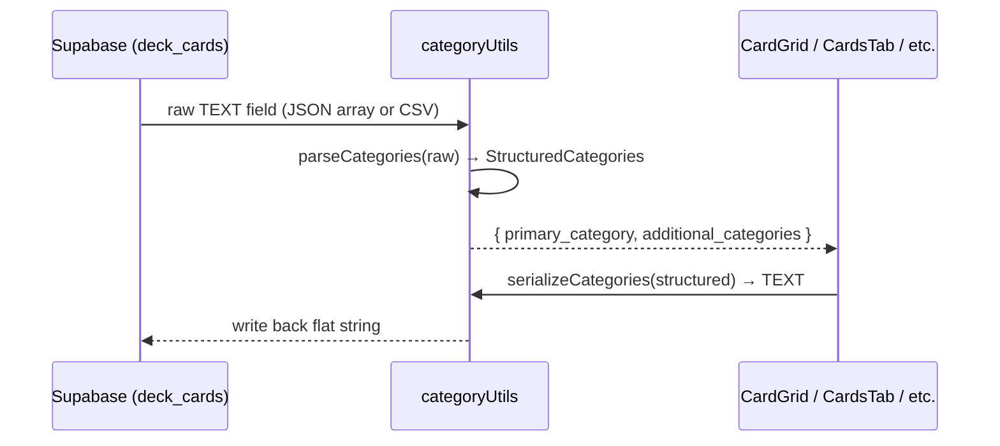

# Design Document: Cards Tab Workshop — Phase 0 Prerequisites

## Overview

Phase 0 addresses three blocking prerequisites that must land before any Cards Tab & Workshop feature work can begin. These are: (1) unifying the category data model across all consumers onto the brew-v2 structured type, (2) wiring the already-built CanvasDeckCard and PiledColumn components into BrewCanvas, and (3) exposing the existing `clearOverride()` zoom density reset through a visible toolbar control.

## Architecture



## Main Algorithm/Workflow



## Components and Interfaces

### Component 1: Category Utility (`src/lib/categoryUtils.ts`)

**Purpose**: Single source of truth for converting between the flat database representation and the structured app-layer type.

**Interface**:
```typescript
import type { DeckCard } from '@/lib/brew-v2-types'

interface StructuredCategories {
  primary_category: string
  additional_categories: string[]
}

/** Parse flat DB text into structured type. Handles JSON arrays, CSV, and null. */
function parseCategories(raw: string | null | undefined): StructuredCategories

/** Serialize structured categories back to flat text for DB storage. */
function serializeCategories(structured: StructuredCategories): string

/** Enforce the 3-category hard cap (1 primary + max 2 secondary). Truncates silently. */
function enforceCategoryCap(structured: StructuredCategories): StructuredCategories

/** Parse and cap in one call — convenience for read paths. */
function parseCategoriesCapped(raw: string | null | undefined): StructuredCategories
```

**Responsibilities**:
- Parse JSON array strings (`'["Ramp","Draw"]'`)
- Parse comma-separated strings (`'Ramp, Draw'`)
- Handle null/undefined → default `{ primary_category: 'Other', additional_categories: [] }`
- Strip Archidekt position markers (`(top)`, `(bottom)`)
- Enforce hard cap of 3 total categories
- Serialize back to JSON array format for DB writes

### Component 2: BrewCanvas Integration (wiring CanvasDeckCard + PiledColumn)

**Purpose**: Replace inline placeholder divs in BrewCanvas.tsx Phase 2 rendering with real component imports.

**Interface** (no new interfaces — uses existing props):
```typescript
// Already defined in CanvasDeckCard.tsx
interface CanvasDeckCardProps { /* ... existing ... */ }

// Already defined in PiledColumn.tsx
interface PiledColumnProps { /* ... existing ... */ }
```

**Responsibilities**:
- Import CanvasDeckCard and PiledColumn into BrewCanvas.tsx
- Replace the inline `<div>` placeholder in free-form mode with `<CanvasDeckCard />`
- Replace the inline `<div>` placeholder in piled mode with `<PiledColumn />`
- Pass correct props from existing BrewCanvas state/callbacks

### Component 3: Auto-Reset Toolbar Control

**Purpose**: Expose the `clearOverride()` function from useCanvasZoom as a visible UI control in CanvasToolbar.

**Interface**:
```typescript
// Extended CanvasToolbar props
interface CanvasToolbarProps {
  // ... existing props ...
  onClearViewOverride: () => void  // NEW — calls clearOverride()
}
```

**Responsibilities**:
- Add "Auto" button/segment in the density section of CanvasToolbar
- Visually indicate when auto mode is active (highlighted/selected state)
- When user picks Card or Name manually, Auto appears deselected
- Clicking Auto calls `onClearViewOverride` → re-engages zoom-threshold auto-switching

## Data Models

### StructuredCategories (canonical app-layer type)

```typescript
interface StructuredCategories {
  primary_category: string           // Always present, non-empty
  additional_categories: string[]    // 0–2 entries (hard cap)
}
```

**Validation Rules**:
- `primary_category` must be a non-empty trimmed string
- `additional_categories.length` must be ≤ 2
- Total categories (1 + additional_categories.length) must be ≤ 3
- No duplicate categories across primary + additional

### Database representation (unchanged)

```
deck_cards.categories: TEXT
-- Stores JSON array: '["Ramp","Draw"]'
-- Legacy: may contain comma-separated: 'Ramp, Draw'
-- Null/empty: treated as 'Other'
```

## Key Functions with Formal Specifications

### Function: parseCategories()

```typescript
function parseCategories(raw: string | null | undefined): StructuredCategories
```

**Preconditions:**
- `raw` may be null, undefined, empty string, JSON array string, or CSV string

**Postconditions:**
- Returns a valid `StructuredCategories` object
- `primary_category` is always a non-empty trimmed string
- Position markers `(top)` / `(bottom)` are stripped from all category strings
- If input is null/undefined/empty → returns `{ primary_category: 'Other', additional_categories: [] }`
- Categories "Maybeboard" and "Sideboard" are preserved as-is (filtering is consumer responsibility)

### Function: enforceCategoryCap()

```typescript
function enforceCategoryCap(structured: StructuredCategories): StructuredCategories
```

**Preconditions:**
- `structured` is a valid StructuredCategories (primary_category is non-empty)

**Postconditions:**
- `additional_categories.length` ≤ 2
- If input has > 2 additional categories, excess are silently truncated (first 2 kept)
- `primary_category` is unchanged

### Function: serializeCategories()

```typescript
function serializeCategories(structured: StructuredCategories): string
```

**Preconditions:**
- `structured` is a valid StructuredCategories
- `primary_category` is non-empty

**Postconditions:**
- Returns a JSON array string (e.g., `'["Ramp","Draw"]'`)
- Primary category is always first in the array
- Additional categories follow in order

## Example Usage

```typescript
// Reading from DB
const raw = deckCard.categories // '["Ramp","Draw","Removal"]'
const structured = parseCategoriesCapped(raw)
// → { primary_category: 'Ramp', additional_categories: ['Draw', 'Removal'] }

// Writing to DB
const text = serializeCategories(structured)
// → '["Ramp","Draw","Removal"]'

// Enforcing cap on write
const tooMany = { primary_category: 'Ramp', additional_categories: ['Draw', 'Removal', 'Finisher'] }
const capped = enforceCategoryCap(tooMany)
// → { primary_category: 'Ramp', additional_categories: ['Draw', 'Removal'] }

// Legacy CSV input
const legacy = parseCategoriesCapped('Ramp, Draw (top)')
// → { primary_category: 'Ramp', additional_categories: ['Draw'] }
```

## Correctness Properties

*A property is a characteristic or behavior that should hold true across all valid executions of a system — essentially, a formal statement about what the system should do. Properties serve as the bridge between human-readable specifications and machine-verifiable correctness guarantees.*

### Property 1: Category round-trip preservation

*For any* valid StructuredCategories value with ≤ 3 total categories, serializing then parsing SHALL produce an equivalent StructuredCategories object.

**Validates: Requirements 1.5, 1.6**

### Property 2: Category cap enforcement is idempotent

*For any* StructuredCategories value (regardless of additional_categories length), applying enforceCategoryCap twice SHALL produce the same result as applying it once.

**Validates: Requirements 2.1, 2.2**

### Property 3: Parsed output always satisfies the cap invariant

*For any* string input (valid JSON, CSV, null, undefined, empty, or arbitrary text), parseCategoriesCapped SHALL return a StructuredCategories where `additional_categories.length ≤ 2`.

**Validates: Requirements 2.1, 2.3**

### Property 4: Primary category is never empty after parse

*For any* string input (including null, undefined, empty string, malformed JSON), parseCategories SHALL return a StructuredCategories where `primary_category` is a non-empty trimmed string.

**Validates: Requirements 1.1, 1.2, 1.4**

### Property 5: Position markers are always stripped

*For any* input string containing `(top)` or `(bottom)` markers, parseCategories SHALL return a StructuredCategories where neither `primary_category` nor any entry in `additional_categories` contains those markers.

**Validates: Requirements 1.3**

### Property 6: Auto mode re-engagement via clearOverride

*For any* sequence of manual view selections followed by clearOverride(), the effectiveView SHALL equal the zoom-threshold-derived value (autoViewForZoom(currentZoom)), not the last manual selection.

**Validates: Requirements 4.1, 4.2, 5.1, 5.2, 5.3**

## Error Handling

### Error Scenario 1: Malformed JSON in categories field

**Condition**: `deck_cards.categories` contains invalid JSON that doesn't parse
**Response**: Fall through to CSV parsing; if that also fails, return `{ primary_category: 'Other', additional_categories: [] }`
**Recovery**: Graceful degradation — card still renders with "Other" category

### Error Scenario 2: Categories field is null/undefined

**Condition**: Card was inserted without a categories value
**Response**: Return default `{ primary_category: 'Other', additional_categories: [] }`
**Recovery**: No action needed — this is a supported state

## Testing Strategy

### Unit Testing Approach

- Test `parseCategories` with: valid JSON arrays, CSV strings, null, undefined, empty string, malformed JSON, strings with position markers
- Test `enforceCategoryCap` with: 0, 1, 2, 3, 4+ additional categories
- Test `serializeCategories` with: various valid StructuredCategories inputs
- Test CanvasToolbar Auto button renders and calls `onClearViewOverride`

### Property-Based Testing Approach

**Property Test Library**: fast-check

- Round-trip property: serialize → parse produces equivalent value
- Cap idempotence: enforceCategoryCap(enforceCategoryCap(x)) === enforceCategoryCap(x)
- Output invariant: parseCategoriesCapped always returns ≤ 2 additional categories
- Primary non-empty: parseCategories never returns empty primary_category

### Integration Testing Approach

- BrewCanvas renders CanvasDeckCard in free-form mode (not placeholder divs)
- BrewCanvas renders PiledColumn in piled mode (not placeholder divs)
- CanvasToolbar Auto button toggles auto-switch behavior through useCanvasZoom
- CardGrid renders cards using the utility function (backward compat with existing data)

## Dependencies

- `fast-check` — property-based testing library (dev dependency)
- Existing: `@tanstack/react-query`, `lucide-react`, Vitest, Testing Library
- No new runtime dependencies required
