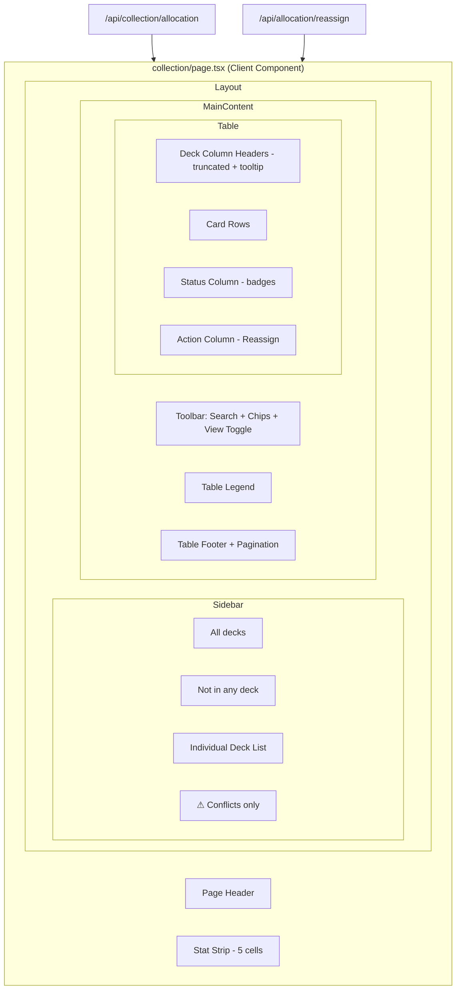
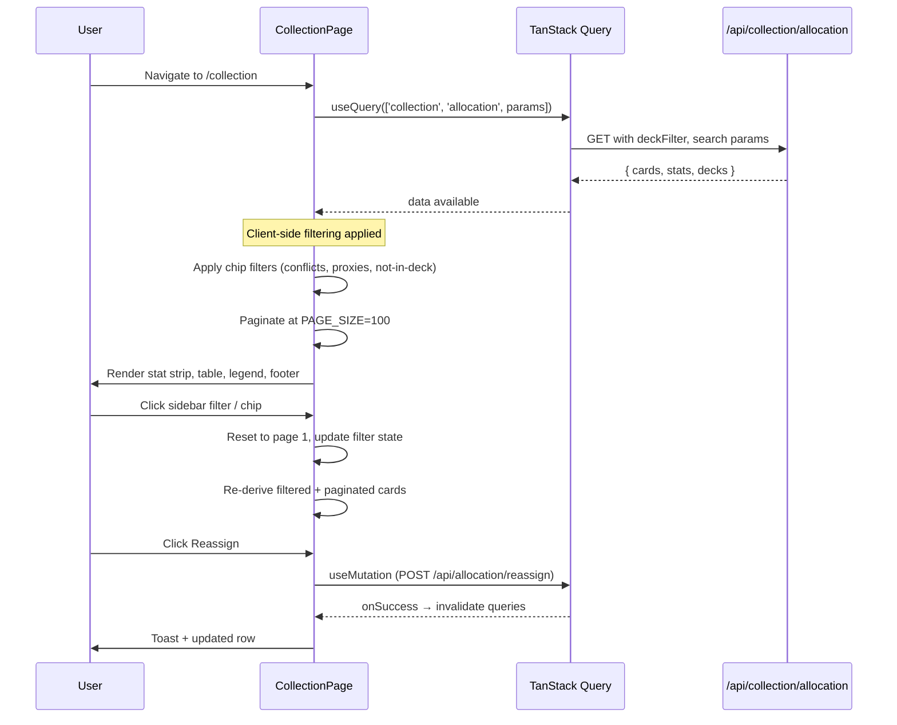

# Design Document: Collection Allocation Expansion

## Overview

This feature extends the existing Allocation Tab in the Collection View with UX refinements that close the gap between the current implementation and the authoritative oracle-ui-spec.md design. The existing `AllocationTab.tsx` component and the collection `page.tsx` already implement a baseline allocation table with sidebar filtering, pagination, and reassign functionality. This spec adds or refines: a stat strip above the tab content, a "Not in any deck" sidebar filter, enhanced "Conflicts only" shortcut styling, table pagination at 100 rows, a legend, deck column header truncation with hover tooltips, contextual status badges, and toolbar filter chips.

**Key constraint:** This is a UI-only feature. All data is already served by existing APIs (`/api/collection/allocation`, `/api/allocation/reassign`, `/api/decks`). No backend changes are required.

**Design decision:** Rather than creating entirely new components, this spec extends and refines the existing `collection/page.tsx` implementation which already has most structures in place. The primary work involves normalising PAGE_SIZE to 100, formalising the StatCell/FilterChip/StatusBadge/LegendItem sub-components with proper interfaces, and ensuring all requirements are met with the correct styling and interaction patterns.

## Architecture

### High-Level Design



### Data Flow



### Component Extension Strategy

The collection page is a single `'use client'` page component with inline sub-components. The expansion work follows the same pattern:

1. **No new files** — all changes extend `the-oracle/src/app/collection/page.tsx`
2. **Sub-components refined** — `StatCell`, `SidebarItem`, `FilterChip`, `DeckDot`, `StatusBadge`, `LegendItem`, `PageButton` already exist inline
3. **Constants updated** — `PAGE_SIZE` changes from 50 → 100
4. **Filter state** already uses `useState` booleans — pattern continues
5. **Tooltip behaviour** — deck column headers use `title` attribute (native browser tooltip); upgrade to Radix tooltip for consistent 300ms timing

## Components and Interfaces

### StatCell

```typescript
interface StatCellProps {
  value: number
  label: string
  variant?: 'teal' | 'amber'  // Controls the value color
}
```

- Renders a flex-1 cell with right-border divider
- Value styled in teal (#1D9E75) for "Cards owned", amber (#EF9F27) for "Conflicts"
- Label in muted text (10px uppercase)
- Five cells in fixed order: Cards owned, In a deck, Not in any deck, Conflicts, Proxies running

### SidebarItem

```typescript
interface SidebarItemProps {
  children: React.ReactNode
  active: boolean
  onClick: () => void
  count?: number
}
```

- Active state: teal right-border accent + teal text + tinted background
- Count displayed right-aligned in muted 10px text
- Order: All decks → Not in any deck → [divider] → deck list → [divider] → Conflicts only

### FilterChip

```typescript
interface FilterChipProps {
  children: React.ReactNode
  active: boolean
  variant?: 'amber' | 'teal'
  onClick: () => void
}
```

- Chips: Conflicts (amber, warning icon), Proxies (teal, half-circle icon), Not in deck (neutral)
- Active: filled background with coloured border
- Inactive: outlined with muted text
- Chip filters intersect (AND) with sidebar filter

### StatusBadge

```typescript
interface StatusBadgeProps {
  origCount: number
  proxyCount: number
  isConflict: boolean
  totalDemand: number  // 0 = not in any deck
}
```

Badge states:
| Condition | Display | Style |
|-----------|---------|-------|
| 1 original, 0 proxies | "● Original" | teal |
| 0 originals, in filtered deck as proxy | "◐ Proxy" | amber |
| 1+ original + 1+ proxy | "◐ 1 orig · N proxy" | amber |
| Multiple owned copies (basics) | "● Multiple copies" | teal |
| Not in any deck (totalDemand === 0) | "● Not in a deck" | muted |

### DeckColumnHeader (enhanced)

```typescript
// Using Radix Tooltip for controlled delay
<Tooltip delayDuration={300}>
  <TooltipTrigger asChild>
    <th>{abbreviate(deck.name, 8)}</th>
  </TooltipTrigger>
  <TooltipContent>{deck.name}</TooltipContent>
</Tooltip>
```

- Truncates at 8 characters with ellipsis
- Tooltip shows full name on hover with 300ms delay
- Uses existing Radix Tooltip component from `@/components/ui/tooltip`

### LegendItem

```typescript
interface LegendItemProps {
  children: React.ReactNode
  variant: 'original' | 'proxy'
}
```

- 18×18px (size-[18px]) rounded (rounded-[4px]) filled squares
- Teal square + "O" + "Original in this deck"
- Amber square + "P" + "Proxy in this deck"
- Warning triangle icon + "Allocation conflict"

### Pagination Controls

```typescript
// Footer displays:
// "Showing [N] of [Total] cards" + "[N] conflicts · [N] proxies"
// Page navigation: prev/next arrows + numbered page buttons
```

## Data Models

### API Response (existing — no changes)

```typescript
interface AllocationResponse {
  cards: AllocationRow[]
  stats: CollectionStats
  decks: DeckInfo[]
}

interface AllocationRow {
  cardName: string
  typeLine: string | null
  isConflict: boolean
  decks: AllocationDeck[]
  ownedCopies: number
  totalDemand: number
}

interface CollectionStats {
  totalOwned: number
  inADeck: number
  notInDeck: number
  conflicts: number
  proxiesRunning: number
}

interface DeckInfo {
  id: number
  name: string
  cardCount: number
}

interface AllocationDeck {
  deckId: number
  deckName: string
  status: 'original' | 'proxy' | null
}
```

### Client-Side Filter State

```typescript
// All filter state lives in the page component
const [searchInput, setSearchInput] = useState('')
const [deckFilter, setDeckFilter] = useState<number | null>(null)
const [showConflictsOnly, setShowConflictsOnly] = useState(false)
const [showProxiesOnly, setShowProxiesOnly] = useState(false)
const [showNotInDeck, setShowNotInDeck] = useState(false)
const [currentPage, setCurrentPage] = useState(1)
const [viewMode, setViewMode] = useState<'table' | 'grid'>('table')
```

### Filter Logic (pure functions)

```typescript
function filterCards(
  cards: AllocationRow[],
  filters: { conflicts: boolean; proxies: boolean; notInDeck: boolean }
): AllocationRow[] {
  let result = cards
  if (filters.conflicts) {
    result = result.filter((c) => c.isConflict)
  }
  if (filters.proxies) {
    result = result.filter((c) => c.decks.some((d) => d.status === 'proxy'))
  }
  if (filters.notInDeck) {
    result = result.filter((c) => c.totalDemand === 0)
  }
  return result
}

function paginateCards(cards: AllocationRow[], page: number, pageSize: number): AllocationRow[] {
  return cards.slice((page - 1) * pageSize, page * pageSize)
}

function abbreviate(name: string, max: number = 8): string {
  if (name.length <= max) return name
  return name.slice(0, max - 1) + '…'
}

function getPaginationRange(current: number, total: number): (number | '...')[] {
  if (total <= 5) return Array.from({ length: total }, (_, i) => i + 1)
  const pages: (number | '...')[] = [1]
  if (current > 3) pages.push('...')
  const start = Math.max(2, current - 1)
  const end = Math.min(total - 1, current + 1)
  for (let i = start; i <= end; i++) pages.push(i)
  if (current < total - 2) pages.push('...')
  pages.push(total)
  return pages
}

function determineStatus(
  card: { isConflict: boolean; totalDemand: number; ownedCopies: number; decks: { status: string | null }[] }
): { label: string; variant: 'teal' | 'amber' | 'muted' } {
  const origCount = card.decks.filter((d) => d.status === 'original').length
  const proxyCount = card.decks.filter((d) => d.status === 'proxy').length

  if (card.totalDemand === 0) return { label: '● Not in a deck', variant: 'muted' }
  if (card.isConflict || proxyCount > 0) return { label: `◐ ${origCount} orig · ${proxyCount} proxy`, variant: 'amber' }
  if (origCount > 1) return { label: '● Multiple copies', variant: 'teal' }
  return { label: '● Original', variant: 'teal' }
}
```


## Correctness Properties

*A property is a characteristic or behavior that should hold true across all valid executions of a system — essentially, a formal statement about what the system should do. Properties serve as the bridge between human-readable specifications and machine-verifiable correctness guarantees.*

### Property 1: Filter composition correctness

*For any* array of AllocationRow objects and *for any* combination of active filter flags (conflicts, proxies, notInDeck), the `filterCards` function SHALL return only cards that satisfy ALL active predicates simultaneously. Specifically:
- If `conflicts` is active, every returned card has `isConflict === true`
- If `proxies` is active, every returned card has at least one deck entry with `status === 'proxy'`
- If `notInDeck` is active, every returned card has `totalDemand === 0`
- If multiple flags are active, the result is the intersection (all predicates hold on each returned card)
- If no flags are active, all cards are returned unchanged

**Validates: Requirements 2.3, 3.3, 8.4, 8.6**

### Property 2: Deck name abbreviation

*For any* string input and *for any* max length parameter (≥ 2), the `abbreviate` function SHALL:
- Return the input unchanged if its length is ≤ max
- Return a string of exactly `max` characters ending in '…' if the input length exceeds max
- Never return a string longer than `max` characters

**Validates: Requirements 4.1**

### Property 3: Pagination bounds

*For any* array of cards, *for any* page number ≥ 1, and page size = 100, the `paginateCards` function SHALL:
- Return at most `pageSize` items
- Return items from index `(page - 1) * pageSize` to `page * pageSize - 1`
- Return an empty array when `page` exceeds `Math.ceil(cards.length / pageSize)`
- Return all remaining items (possibly fewer than pageSize) on the last valid page

**Validates: Requirements 5.1**

### Property 4: Status badge determination

*For any* AllocationRow, the `determineStatus` function SHALL produce the correct label and variant:
- If `totalDemand === 0` → label contains "Not in a deck", variant is 'muted'
- If `isConflict === true` OR proxy count > 0 → label contains orig and proxy counts, variant is 'amber'
- If orig count > 1 and not a conflict → label contains "Multiple copies", variant is 'teal'
- If orig count === 1 and proxy count === 0 → label contains "Original", variant is 'teal'
- The function is total (produces a result for every valid input)

**Validates: Requirements 7.2, 7.4, 7.5, 7.6**

## Error Handling

| Scenario | Handling |
|----------|----------|
| `/api/collection/allocation` fails | TanStack Query error state → centered error message with retry prompt |
| `/api/allocation/reassign` fails | `onError` callback → toast notification with error message, row unchanged |
| Empty allocation data | Empty state message: "No cards found." centered in table body |
| No decks returned | Sidebar shows only "All decks" and "Conflicts only"; table shows no deck columns |
| Stats undefined before data loads | Default to 0 for all stat values via nullish coalescing |
| Search returns no results | Same empty state message; filters remain visible for adjustment |
| Page exceeds valid range | `Math.max(1, ...)` and `Math.min(totalPages, ...)` guards on navigation |

### Error Recovery Patterns

- **Network failure:** TanStack Query retries 3 times by default. After exhaustion, shows error state with manual retry button.
- **Stale cache:** `staleTime: 5 * 60 * 1000` prevents unnecessary refetches. Cache invalidated on reassign success.
- **Mutation optimistic update:** Not used — we wait for server confirmation to avoid inconsistent state in a multi-user scenario.

## Testing Strategy

### Unit Tests (example-based)

Focus areas:
- **Component rendering:** StatStrip renders 5 cells in order, Legend renders 3 entries, Sidebar renders items in correct order
- **Conditional rendering:** Conflict row shows amber background + warning icon + reassign button; clean row does not
- **Styling correctness:** Teal/amber colours applied to correct elements
- **State transitions:** Filter change resets page to 1; chip toggle updates active state

### Property-Based Tests

**Library:** [fast-check](https://github.com/dubzzz/fast-check) (already available in the project's test tooling ecosystem)

**Configuration:** Minimum 100 iterations per property test.

| Property | Test | Tag |
|----------|------|-----|
| Property 1 | Generate random AllocationRow arrays + random filter flag combinations → verify filterCards output | Feature: collection-allocation-expansion, Property 1: Filter composition correctness |
| Property 2 | Generate random strings (0–200 chars) + random max values (2–20) → verify abbreviate output | Feature: collection-allocation-expansion, Property 2: Deck name abbreviation |
| Property 3 | Generate random arrays (0–500 items) + random page numbers (1–10) → verify paginateCards output | Feature: collection-allocation-expansion, Property 3: Pagination bounds |
| Property 4 | Generate random card state objects (varying orig/proxy/demand counts) → verify determineStatus output | Feature: collection-allocation-expansion, Property 4: Status badge determination |

### Integration Tests

- **Reassign mutation:** Mock API, trigger reassign, verify POST body and cache invalidation
- **Search debounce:** Type in search, verify API called after 300ms debounce
- **Query params:** Changing deckFilter triggers new query with correct params

### What's NOT tested with PBT

- DOM structure and ordering (example tests)
- CSS styling (visual regression / snapshot tests)
- Hover interactions (integration tests with Testing Library)
- Tooltip timing (verify prop value, not actual timing)
- Toast notifications (mock and verify call)
