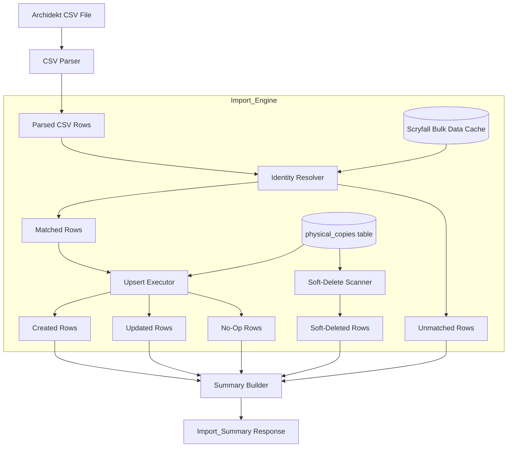
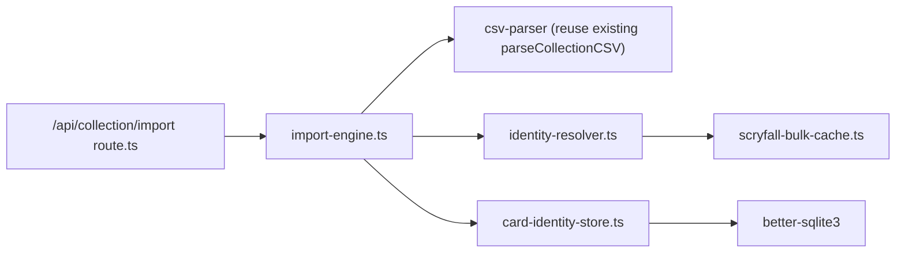

# Design Document: Collection CSV Upsert

## Overview

This feature replaces the current destructive collection import (DELETE + INSERT on `collection` table) with an upsert-based import engine that writes directly to the `physical_copies` table. The current `applyCollectionImport` function wipes and rebuilds the collection table on every run — this risks orphaning `deck_cards.physical_copy_id` references and cannot represent per-printing state (condition, foil) correctly.

The new Import_Engine reads an Archidekt CSV export, resolves each row to a `scryfall_printing_id` (primary key: direct Scryfall ID; fallback: set_code + collector_number), maps finish to is_foil, resolves oracle_id for card_definition linkage, then executes an upsert against `physical_copies`. Rows absent from the CSV are soft-deleted (quantity = 0) rather than hard-deleted, preserving all `deck_cards.physical_copy_id` FK references.

### Key Design Decisions

1. **Authoritative overwrite, not delta.** The CSV quantity is the truth — we SET quantity, not INCREMENT it. This differs from the existing `upsertPhysicalCopy` (which increments). The import engine uses a dedicated SQL pattern.
2. **Scryfall bulk data for resolution, never per-card API calls.** All identity resolution (printing validation, oracle_id lookup) uses locally-cached Scryfall bulk data downloaded once before the import batch.
3. **Soft-delete preserves deck references.** Setting quantity = 0 instead of deleting means `deck_cards.physical_copy_id` foreign keys remain valid. The allocation resolver already handles quantity = 0 as "not available."
4. **Collection table remains unchanged.** The existing `collection` table continues to exist and be written by the legacy import path. The Import_Engine writes to `physical_copies` exclusively. Future work may deprecate the collection table.
5. **Single transaction for atomicity.** The entire upsert batch (creates, updates, soft-deletes) runs in one SQLite transaction. Any error rolls back everything.
6. **No proxy row modification.** The import engine scopes exclusively to `is_proxy = FALSE, game = 'paper'` rows. Proxy rows and digital rows are invisible to the import.

## Architecture



### Pipeline Stages

| Stage | Input | Output | Side Effects |
|-------|-------|--------|-------------|
| 1. CSV Parser | Raw CSV string | `ParsedCSVRow[]` | None |
| 2. Identity Resolver | `ParsedCSVRow[]` + Scryfall bulk data | `ResolvedRow[]` + `UnmatchedRow[]` | None (pure) |
| 3. Upsert Executor | `ResolvedRow[]` + DB state | Created/Updated/Unchanged counts | DB writes (INSERT/UPDATE) |
| 4. Soft-Delete Scanner | Set of matched printing-group keys + DB state | Soft-deleted count | DB writes (UPDATE quantity=0) |
| 5. Summary Builder | All stage outputs + timing | `ImportSummary` | None |

### Module Dependencies



## Components and Interfaces

### New Module: `src/lib/import-engine.ts`

The orchestrator that coordinates the full import pipeline.

```typescript
import type Database from 'better-sqlite3'

// ---------------------------------------------------------------------------
// Types
// ---------------------------------------------------------------------------

export interface ImportOptions {
  /** Path to CSV file, or raw CSV string */
  csvInput: string | Buffer
  /** Whether csvInput is a file path (true) or raw content (false) */
  isFilePath?: boolean
}

export interface ImportSummary {
  created: number
  updatedQuantity: number
  updatedCondition: number
  unchanged: number
  softDeleted: number
  excluded: number          // non-paper rows skipped
  unmatched: number
  unmatchedRows: UnmatchedRowDetail[]
  totalCsvRows: number
  totalWriteCount: number   // created + updatedQuantity + updatedCondition + softDeleted
  durationMs: number
}

export interface UnmatchedRowDetail {
  rowIndex: number
  cardName: string
  editionCode: string
  collectorNumber: string
  quantity: number
  reason: UnmatchedReason
}

export type UnmatchedReason =
  | 'invalid_scryfall_id'
  | 'missing_fallback_fields'
  | 'no_bulk_data_match'
  | 'oracle_id_resolution_failed'
  | 'invalid_quantity'

/**
 * Execute the full collection CSV upsert pipeline.
 * Runs atomically within a single SQLite transaction.
 */
export function executeCollectionImport(
  db: Database.Database,
  options: ImportOptions
): ImportSummary
```

### New Module: `src/lib/identity-resolver.ts`

Resolves CSV rows to printing identities using Scryfall bulk data.

```typescript
import type Database from 'better-sqlite3'

// ---------------------------------------------------------------------------
// Types
// ---------------------------------------------------------------------------

export interface ParsedCSVRow {
  rowIndex: number
  quantity: number
  name: string
  finish: string
  condition: string
  editionCode: string
  collectorNumber: string
  scryfallId: string
  scryfallOracleId: string
}

export interface ResolvedRow {
  rowIndex: number
  scryfallPrintingId: string
  oracleId: string
  cardName: string
  quantity: number
  isFoil: boolean
  condition: PhysicalCondition
}

export type PhysicalCondition =
  | 'near_mint'
  | 'lightly_played'
  | 'moderately_played'
  | 'heavily_played'
  | 'damaged'

export interface ResolutionResult {
  resolved: ResolvedRow[]
  unmatched: UnmatchedRowDetail[]
}

// ---------------------------------------------------------------------------
// Bulk Data Index
// ---------------------------------------------------------------------------

export interface ScryfallBulkIndex {
  /** Map from scryfall_id (printing UUID) → { oracle_id, card_name, set, collector_number } */
  byPrintingId: Map<string, ScryfallPrintingRecord>
  /** Map from "set_code|collector_number" → scryfall_id (first match) */
  bySetCollector: Map<string, string>
}

export interface ScryfallPrintingRecord {
  scryfallId: string
  oracleId: string
  cardName: string
  set: string
  collectorNumber: string
}

/**
 * Load Scryfall bulk data and build lookup indexes.
 * Downloads "default_cards" bulk data (all printings) from Scryfall if not cached,
 * or reads from a local cache file.
 */
export async function loadScryfallBulkIndex(): Promise<ScryfallBulkIndex>

/**
 * Resolve an array of parsed CSV rows against the bulk index.
 * Pure function (no DB access) — handles printing ID resolution, fallback
 * to set+collector, and oracle_id extraction.
 */
export function resolveIdentities(
  rows: ParsedCSVRow[],
  index: ScryfallBulkIndex
): ResolutionResult

/**
 * Map a CSV condition string to the physical_copies condition enum.
 * Case-insensitive, normalizes whitespace and underscores.
 * Returns 'near_mint' for unrecognized values.
 */
export function mapCondition(csvCondition: string): {
  condition: PhysicalCondition
  wasUnrecognized: boolean
}

/**
 * Map a CSV finish string to is_foil boolean.
 * "Normal" → false. Any other non-empty value → true. Empty → false.
 */
export function mapFinishToFoil(finish: string): boolean
```

### New Module: `src/lib/scryfall-bulk-cache.ts`

Manages downloading and caching the Scryfall bulk data file locally.

```typescript
/**
 * Scryfall bulk data cache manager.
 * Downloads the "default_cards" JSON (all printings, ~500MB) and caches
 * it locally. Re-downloads if the cache is older than 7 days.
 *
 * Cache location: data/scryfall-bulk-default-cards.json
 */

export interface BulkCacheOptions {
  /** Override cache directory (default: process.cwd()/data) */
  cacheDir?: string
  /** Max cache age in milliseconds (default: 7 days) */
  maxAgeMs?: number
}

/**
 * Ensure the bulk data file is present and fresh.
 * Returns the path to the cached file.
 */
export async function ensureBulkData(options?: BulkCacheOptions): Promise<string>

/**
 * Read and parse the bulk data file, building the index structures.
 * Streams the JSON file to avoid loading 500MB into memory at once.
 */
export function buildIndexFromFile(filePath: string): ScryfallBulkIndex
```

### Modified Module: `src/lib/card-identity-store.ts`

The existing store needs one new function for the import engine's authoritative-overwrite semantics:

```typescript
/**
 * Set the quantity and condition on a physical_copies row to exact values
 * (authoritative overwrite). Unlike upsertPhysicalCopy which INCREMENTS,
 * this SETS quantity to the provided value.
 *
 * Used by the Import_Engine for authoritative CSV sync.
 * Creates the row if it doesn't exist; updates if it does.
 */
export function setPhysicalCopyState(
  db: Database.Database,
  params: {
    cardDefinitionId: number
    scryfallPrintingId: string
    isFoil: boolean
    quantity: number
    condition: PhysicalCondition | null
  }
): { id: number; action: 'created' | 'updated_quantity' | 'updated_condition' | 'unchanged' }
```

### API Route: `src/app/api/collection/import/route.ts` (Modified)

The existing route is enhanced with a new `?mode=upsert` query parameter. When `mode=upsert`, it uses the new Import_Engine instead of the legacy DELETE+INSERT path.

```typescript
// Query params:
// ?apply=true       — execute the import (existing behavior preserved)
// ?mode=upsert      — use the new Import_Engine (writes to physical_copies)
// ?mode=legacy      — use the old DELETE+INSERT (writes to collection table)
// Default mode: 'upsert' (once migration is complete)

export async function POST(request: NextRequest): Promise<Response>
```

## Data Models

### Physical_Copies Table (existing, no schema changes)

The Import_Engine writes to the existing `physical_copies` table. No new columns or indexes are needed beyond what migration 026 already provides.

| Column | Used by Import_Engine | Notes |
|--------|----------------------|-------|
| `id` | Read (for matching) | Auto-increment PK |
| `card_definition_id` | Write (on create) | FK to card_definitions |
| `scryfall_printing_id` | Write (on create), Read (for matching) | The primary matching key |
| `is_proxy` | Filter (always FALSE) | Import never touches proxy rows |
| `quantity` | Write (set to CSV value or 0) | Authoritative overwrite |
| `condition` | Write (mapped from CSV) | Authoritative overwrite |
| `is_foil` | Write (on create), Read (for matching) | Part of printing-group key |
| `game` | Write ('paper'), Filter | Only paper rows in scope |
| `acquired_at` | Not used | Preserved on update |
| `created_at` | Not used | Preserved on update |

### Game Column Addition

The `physical_copies` table needs a `game` column. This is added via a new migration:

**Migration: `db/migrations/028-physical-copies-game-column.sql`**

```sql
BEGIN;

-- Add game column with default 'paper'
ALTER TABLE physical_copies ADD COLUMN game TEXT NOT NULL DEFAULT 'paper'
  CHECK (game IN ('paper', 'mtgo', 'arena'));

-- Index for import engine scope queries
CREATE INDEX IF NOT EXISTS idx_physical_copies_game
  ON physical_copies(game, is_proxy) WHERE is_proxy = 0;

COMMIT;
```

### Scryfall Bulk Data Index (In-Memory)

The bulk index is built in memory from the downloaded JSON file. It contains two lookup maps:

```typescript
// Structure in memory (~100MB for ~100k unique printings)
{
  byPrintingId: Map<string, {
    scryfallId: string,     // same as key — the printing UUID
    oracleId: string,       // oracle UUID for card_definition linkage
    cardName: string,       // for card_definition creation
    set: string,            // set code (e.g., "tla")
    collectorNumber: string // collector number
  }>,
  bySetCollector: Map<string, string>  // "tla|346" → scryfall_id
}
```

### Condition Mapping Table

| CSV Value | Mapped Enum | Notes |
|-----------|-------------|-------|
| `NM`, `Near Mint`, `near_mint` | `near_mint` | Default for unrecognized |
| `LP`, `Lightly Played`, `lightly_played` | `lightly_played` | |
| `MP`, `Moderately Played`, `moderately_played` | `moderately_played` | |
| `HP`, `Heavily Played`, `heavily_played` | `heavily_played` | |
| `D`, `Damaged`, `damaged` | `damaged` | |
| Empty, whitespace, unrecognized | `near_mint` | + warning in summary |

### Upsert SQL Pattern (Authoritative Overwrite)

```sql
-- Create or update a physical_copies row with exact quantity/condition
INSERT INTO physical_copies (card_definition_id, scryfall_printing_id, is_foil, is_proxy, quantity, condition, game)
VALUES (?, ?, ?, 0, ?, ?, 'paper')
ON CONFLICT (card_definition_id, scryfall_printing_id, is_foil, is_proxy)
DO UPDATE SET
  quantity = excluded.quantity,
  condition = excluded.condition
WHERE physical_copies.quantity != excluded.quantity
   OR physical_copies.condition IS NOT excluded.condition
RETURNING id,
  CASE
    WHEN changes() = 0 THEN 'unchanged'
    WHEN physical_copies.quantity != excluded.quantity THEN 'updated_quantity'
    ELSE 'updated_condition'
  END AS action;
```

Note: The actual implementation tracks action detection in TypeScript since SQLite's `changes()` inside RETURNING is limited. The executor compares pre-read state vs new state.

### Soft-Delete SQL Pattern

```sql
-- Set quantity = 0 for all paper, non-proxy rows NOT in the current import set
UPDATE physical_copies
SET quantity = 0
WHERE is_proxy = 0
  AND game = 'paper'
  AND quantity > 0
  AND id NOT IN (:matched_ids)
```

### Import Engine Transaction Flow

```sql
BEGIN;

-- Phase 1: Upsert all resolved rows (creates + updates)
-- For each resolved row:
INSERT INTO physical_copies (...) VALUES (...) ON CONFLICT DO UPDATE SET ...;

-- Phase 2: Soft-delete absent rows
UPDATE physical_copies SET quantity = 0
WHERE is_proxy = 0 AND game = 'paper' AND quantity > 0
  AND id NOT IN (:all_touched_ids);

-- Phase 3: Update sync_meta timestamp
INSERT INTO sync_meta (key, value, updated_at) VALUES ('last_physical_import', ?, ?)
ON CONFLICT(key) DO UPDATE SET value = excluded.value, updated_at = excluded.updated_at;

COMMIT;
```


## Correctness Properties

*A property is a characteristic or behavior that should hold true across all valid executions of a system — essentially, a formal statement about what the system should do. Properties serve as the bridge between human-readable specifications and machine-verifiable correctness guarantees.*

### Property 1: Printing Identity Direct Resolution

*For any* CSV row with a non-empty `Scryfall ID` value that exists in the Scryfall bulk index, the Import_Engine SHALL resolve that row to the same scryfall_printing_id as provided in the CSV — no transformation or re-mapping applied.

**Validates: Requirements 1.1**

### Property 2: Fallback Resolution Chain

*For any* CSV row where the `Scryfall ID` is either empty or does not match the bulk index, but the `Edition Code` and `Collector Number` pair resolves to a printing in the bulk index, the Import_Engine SHALL successfully resolve the row to the scryfall_printing_id found via the set+collector fallback.

**Validates: Requirements 1.2, 1.3**

### Property 3: Unresolvable Rows Never Create Physical Copies

*For any* CSV row where neither the `Scryfall ID` nor the `(Edition Code, Collector Number)` fallback resolves to a printing in the bulk index, the Import_Engine SHALL add the row to the unmatched list AND the number of physical_copies rows in the database SHALL not increase as a result of that row.

**Validates: Requirements 1.4, 2.6**

### Property 4: Unmatched Row Reporting Completeness

*For any* set of unresolvable CSV rows processed by the Import_Engine, every such row SHALL appear in the Import_Summary's unmatched list with the original card_name, edition_code, collector_number, quantity, and a reason indicating why resolution failed.

**Validates: Requirements 1.5, 10.2, 10.3**

### Property 5: Oracle ID Resolution Reuses Existing Card Definitions

*For any* CSV row whose resolved oracle_id already exists in the `card_definitions` table, the Import_Engine SHALL link the physical_copies row to that existing card_definition row — no duplicate card_definition row SHALL be created.

**Validates: Requirements 2.1, 2.3**

### Property 6: Oracle ID Resolution Creates Missing Card Definitions

*For any* CSV row whose resolved oracle_id does NOT exist in the `card_definitions` table, the Import_Engine SHALL create exactly one new card_definition row with that oracle_id and the card_name from the CSV, and link the physical_copies row to it.

**Validates: Requirements 2.4**

### Property 7: Finish-to-Foil Mapping

*For any* non-empty CSV Finish string that is not exactly `"Normal"`, the Import_Engine SHALL set is_foil = TRUE. For the exact string `"Normal"` or any empty/whitespace-only Finish value, is_foil SHALL be FALSE. Two CSV rows with the same scryfall_printing_id but different foil status SHALL produce two distinct physical_copies rows.

**Validates: Requirements 3.1, 3.2, 3.3, 3.4**

### Property 8: Authoritative Quantity Overwrite

*For any* CSV row that resolves to an existing physical_copies row, the Import_Engine SHALL set the row's quantity to exactly the CSV quantity value — not increment it, not delta it. After import, `physical_copies.quantity` SHALL equal the CSV `Quantity` column value for that printing group.

**Validates: Requirements 5.2**

### Property 9: No-Op Detection

*For any* CSV row that resolves to an existing physical_copies row where the quantity and condition already match the CSV values, the Import_Engine SHALL not execute a write for that row. When ALL resolved rows are no-ops AND no soft-deletes are needed, `totalWriteCount` SHALL be 0.

**Validates: Requirements 5.3, 7.1, 7.3**

### Property 10: Soft-Delete Scope

*For any* import operation, the set of rows soft-deleted (quantity set to 0) SHALL be exactly: rows where `is_proxy = FALSE` AND `game = 'paper'` AND `quantity > 0` before the import AND the row was NOT matched by any CSV row in the current import. Rows already at quantity = 0 SHALL not be written to. Rows created or updated during the current import SHALL never be soft-deleted.

**Validates: Requirements 6.1, 6.5, 7.4**

### Property 11: No Hard Deletes

*For any* import operation, the count of rows in `physical_copies` after the import SHALL be greater than or equal to the count before the import. No row is ever deleted.

**Validates: Requirements 6.2**

### Property 12: Soft-Deleted Row Reactivation

*For any* physical_copies row with quantity = 0 (previously soft-deleted) that matches a CSV row in a subsequent import, the Import_Engine SHALL update the existing row's quantity to the CSV value rather than creating a new row. The total number of rows for that printing group key SHALL remain exactly 1.

**Validates: Requirements 6.3**

### Property 13: Deck Isolation

*For any* import operation, the `deck_cards` and `decks` tables SHALL have identical content before and after the import. No INSERT, UPDATE, or DELETE is executed against either table. Specifically, `deck_cards.physical_copy_id` references to soft-deleted rows SHALL remain unchanged.

**Validates: Requirements 8.1, 8.2, 8.3**

### Property 14: Proxy Immutability

*For any* import operation and any physical_copies row where `is_proxy = TRUE`, that row's quantity, condition, and all other columns SHALL be identical before and after the import. The import engine SHALL not soft-delete, update, or otherwise modify proxy rows.

**Validates: Requirements 9.3, 9.4**

### Property 15: Import Summary Arithmetic

*For any* completed import operation, the Import_Summary SHALL satisfy: `totalWriteCount = created + updatedQuantity + updatedCondition + softDeleted`. Additionally, `created + updatedQuantity + updatedCondition + unchanged + unmatched` SHALL equal the number of resolved CSV rows (excluding those with invalid quantity).

**Validates: Requirements 7.2, 7.3, 10.1, 10.4**

### Property 16: Invalid Quantity Rejection

*For any* CSV row with a quantity value that is less than 1 or is not a valid integer, the Import_Engine SHALL add the row to the unmatched list with reason `'invalid_quantity'` and SHALL not create or modify any physical_copies row.

**Validates: Requirements 5.6**

### Property 17: Paper-Only and Non-Proxy Invariant

*For any* physical_copies row created or updated by the Import_Engine, `game` SHALL be `'paper'` and `is_proxy` SHALL be `FALSE`.

**Validates: Requirements 4.2, 5.7**

## Error Handling

### CSV Parse Errors

| Scenario | Response | Recovery |
|----------|----------|----------|
| Empty file (no header) | Throw `Error('CSV is empty — no header row found')` | 400 response, no DB changes |
| Missing required columns | Throw `Error('CSV missing required columns: ...')` | 400 response, list missing columns |
| Malformed row (wrong field count) | Skip row, add to unmatched | Continue processing |
| Non-UTF8 encoding | Attempt parsing, skip garbled rows | Continue processing |

### Identity Resolution Errors

| Scenario | Handling | User Visibility |
|----------|----------|-----------------|
| Scryfall ID not in bulk index | Fall back to set+collector | Transparent (no error) |
| Set+collector not in bulk index | Mark as unmatched | Reported in summary |
| Oracle ID not in CSV or bulk data | Mark as unmatched | Reported with reason |
| Bulk data file missing/corrupt | Fail entire import | 500 response, suggest re-download |

### Database Errors

| Scenario | Handling | Recovery |
|----------|----------|----------|
| FK violation (bad card_definition_id) | Should never happen (we ensure definitions first) | Transaction rollback |
| UNIQUE constraint violation | Should never happen (we use ON CONFLICT) | Transaction rollback |
| Disk full / WAL overflow | SQLite throws | Transaction rollback, 500 response |
| Concurrent write (SQLITE_BUSY) | Retry up to 3 times with exponential backoff | Fail with 503 if exhausted |

### Error Propagation Strategy

```
CSV Parse Error → ImportEngine catches → returns early with error
Resolution Error → adds to unmatched list → continues processing
DB Error → SQLite throws → transaction rolls back → 500 response

All errors preserve database consistency: either the full import succeeds
or zero changes are committed.
```

## Testing Strategy

### Property-Based Tests (fast-check)

The project uses TypeScript with Vitest. Property-based tests use **fast-check** (`fc`).

**Configuration:**
- Minimum 100 iterations per property (`numRuns: 100`)
- Each test tagged with the design property it validates
- Tag format: `Feature: collection-csv-upsert, Property {N}: {title}`

**Test file:** `src/lib/__tests__/import-engine.property.test.ts`

**Generator Strategy:**
- `arbitraryCSVRow`: Generates valid CSV rows with random quantities (1-99), random Scryfall UUIDs, random set codes (3 letters), random collector numbers
- `arbitraryScryfallBulkIndex`: Generates a mock bulk index with 50-200 printings
- `arbitraryExistingState`: Generates pre-populated physical_copies + card_definitions state
- Tests run against an in-memory SQLite database (`:memory:`) with migrations 001 + 023 + 026 + 027 + 028 applied

**Properties tested:**
- Properties 1-4: Identity resolution (resolver is a pure function — fast to test)
- Property 5-6: Card definition reuse/creation
- Property 7: Finish mapping (pure function)
- Property 8: Authoritative overwrite (key behavioral difference from existing upsert)
- Property 9: No-op detection
- Property 10: Soft-delete targeting
- Property 11: No hard deletes (count invariant)
- Property 12: Reactivation of soft-deleted rows
- Property 13: Deck isolation (snapshot before/after)
- Property 14: Proxy immutability (snapshot before/after)
- Property 15: Summary arithmetic
- Property 16: Invalid quantity rejection
- Property 17: Paper-only invariant

### Unit Tests (example-based)

**Test file:** `src/lib/__tests__/import-engine.test.ts`

- `mapCondition`: NM→near_mint, LP→lightly_played, garbage→near_mint+warning
- `mapFinishToFoil`: "Normal"→false, "Foil"→true, "Etched"→true, ""→false
- Full import of 5-row CSV: verify created=3, updated=1, soft-deleted=1
- Re-import of identical CSV: verify totalWriteCount=0
- Import with one invalid quantity (0): verify it's in unmatched
- Import with missing Scryfall ID + valid set+collector: verify fallback works
- Condition update without quantity change: verify updatedCondition count
- Soft-delete preserves deck_cards references
- Previously soft-deleted row reactivated by re-import
- Import_Summary includes durationMs > 0

### Integration Tests

**Test file:** `src/lib/__tests__/import-engine.integration.test.ts`

- Full pipeline with real Archidekt CSV format (first 10 rows of actual export)
- Scryfall bulk index loading from a test fixture file
- API route returns correct HTTP status codes (200, 400, 500)
- Transaction rollback on simulated DB failure
- Migration 028 applies and down-migrates cleanly
- Legacy `?mode=legacy` still works (backward compatibility)
- Concurrent import attempts (SQLITE_BUSY handling)

### Test Dependencies

- `vitest` — test runner (installed)
- `fast-check` — property-based testing library (installed)
- `better-sqlite3` — in-memory DB for isolated tests (installed)

### Performance Expectations

- 2,700 CSV rows (typical collection size) should complete in < 2 seconds
- Bulk index loading from cached file: < 5 seconds
- No per-card network requests during import
- Single SQLite transaction for all writes (WAL mode handles readers concurrently)
