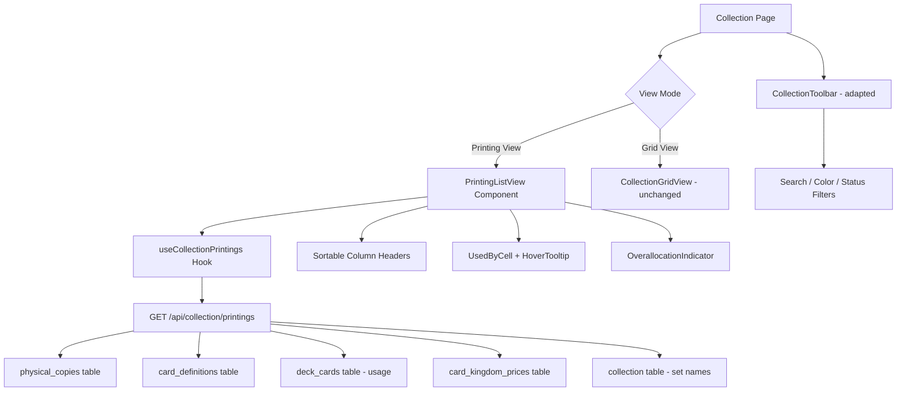

# Design Document: Collection Printing View

## Overview

This feature replaces the current card-level rollup view on the collection page with a flat printing-level view. Today, the collection page groups all printings of the same card into a single expandable row (via `useCollectionRollup` → `/api/collection/rollup`). The new view flattens this: each unique combination of card name + scryfall_printing_id + finish becomes its own top-level row, mirroring the UX of Archidekt and Moxfield.

Each row displays: Quantity, Name, Printing (set), Finish, Used By count (with hover tooltip showing deck names), and Card Kingdom Price. The page retains existing search, color identity, and status filtering — adapted to operate on printing-level rows instead of card-level rollup rows.

### Key Design Decisions

1. **New API endpoint** rather than modifying the rollup endpoint — the rollup endpoint serves other consumers (grid view, stats). A new `/api/collection/printings` endpoint returns the flat printing-level data with all columns pre-computed server-side.
2. **Client-side sorting and filtering** — the full dataset (≈2,700 entries) is small enough to sort/filter in the browser with excellent performance. This matches the existing pattern.
3. **TanStack Query caching** at 5-minute stale time — collection data only changes on sync, same as today.
4. **Reuse existing `card_kingdom_prices` lookup** via `getOwnedValuation()` for per-printing pricing, rather than the `getBulkPriceToAdd()` which computes cheapest-across-all-printings.
5. **Tooltip via Radix/shadcn HoverCard** — uses the project's existing UI library for accessible hover interactions with configurable delay.

## Architecture



### Data Flow

1. Page mounts → `useCollectionPrintings` hook fires TanStack Query
2. API returns flat array of `PrintingRow` objects with all display fields pre-computed
3. Client applies search/color/status filters (pure functions, same pattern as today)
4. Client applies sort (column header clicks toggle asc/desc)
5. Filtered+sorted array renders as flat table rows
6. Hover on Used By cell → 300ms delay → tooltip shows deck names

## Components and Interfaces

### New API Endpoint: `GET /api/collection/printings`

```typescript
// Response shape
interface PrintingRowResponse {
  id: number                    // physical_copies.id
  cardName: string              // card_definitions.card_name
  scryfallPrintingId: string    // physical_copies.scryfall_printing_id
  setCode: string               // from collection table
  setName: string               // from collection table (edition_name)
  isFoil: boolean               // physical_copies.is_foil
  quantity: number              // physical_copies.quantity
  colorIdentity: string[]       // card_definitions.color_identity (split)
  usedByCount: number           // count of distinct decks referencing this physical_copy
  usedByDecks: DeckReference[]  // deck names for tooltip
  price: number | null          // card_kingdom_prices.price_retail for this printing+foil
}

interface DeckReference {
  deckId: number
  deckName: string
}

interface CollectionPrintingsResponse {
  rows: PrintingRowResponse[]
  lastPriceRefresh: string | null
  isPriceStale: boolean
}
```

### New Hook: `useCollectionPrintings`

```typescript
function useCollectionPrintings() {
  return useQuery<CollectionPrintingsResponse>({
    queryKey: ['collection', 'printings'],
    queryFn: () => fetch('/api/collection/printings').then(r => r.json()),
    staleTime: 5 * 60 * 1000, // 5 min
  })
}
```

### New Component: `PrintingListView`

Replaces the current `CollectionListView` when the printing view is active. Renders a flat table with sortable column headers.

```typescript
interface PrintingListViewProps {
  rows: PrintingRowResponse[]
  sortField: PrintingSortField
  sortDirection: SortDirection
  onSort: (field: PrintingSortField) => void
}

type PrintingSortField = 'cardName' | 'quantity' | 'setCode' | 'price' | 'usedByCount'
```

### New Component: `UsedByCell`

Displays the used-by count with conditional overallocation styling and hover tooltip.

```typescript
interface UsedByCellProps {
  usedByCount: number
  quantity: number
  decks: DeckReference[]
}
```

### Adapted: `CollectionToolbar`

The toolbar's sort field options change for the printing view:
- Remove: `dateUpdated`, `dateAdded`, `rarity`
- Add: `setCode`, `usedByCount`
- Keep: `cardName`, `quantity`, `price`

### Adapted: `collection-filters.ts`

New type and filter functions for printing-level rows:

```typescript
interface PrintingCardRow {
  id: number
  cardName: string
  colorIdentity: string[]
  quantity: number
  usedByCount: number
  price: number | null
  setCode: string
  isFoil: boolean
}

type PrintingSortField = 'cardName' | 'quantity' | 'setCode' | 'price' | 'usedByCount'
```

The existing `filterBySearch`, `filterByColorIdentity`, and `filterByStatus` functions can be reused since `PrintingCardRow` satisfies the same shape constraints (has `cardName`, `colorIdentity`, computed status from `quantity`/`usedByCount`).

## Data Models

### Database Query Strategy

The API endpoint performs a single paginated query joining:

```sql
-- Core data: physical_copies + card_definitions
SELECT
  pc.id,
  pc.scryfall_printing_id,
  pc.is_foil,
  pc.quantity,
  cd.card_name,
  cd.color_identity
FROM physical_copies pc
JOIN card_definitions cd ON cd.id = pc.card_definition_id
WHERE pc.is_proxy = false AND pc.quantity > 0

-- Deck usage: count distinct decks per physical_copy
SELECT
  dc.physical_copy_id,
  dc.deck_id,
  d.name as deck_name
FROM deck_cards dc
JOIN decks d ON d.id = dc.deck_id
WHERE dc.physical_copy_id IS NOT NULL

-- Prices: lookup by scryfall_printing_id + is_foil
SELECT
  scryfall_printing_id,
  price_retail,
  is_foil
FROM card_kingdom_prices

-- Set info: from collection table
SELECT DISTINCT
  scryfall_id,
  set_code,
  edition_name
FROM collection
WHERE scryfall_id IS NOT NULL
```

### Overallocation Computation

```typescript
// Pure function — no side effects
function isOverallocated(quantity: number, usedByCount: number): boolean {
  return usedByCount > quantity
}
```

### Price Formatting

```typescript
function formatPrice(price: number | null): string {
  if (price === null) return '—'
  return price.toLocaleString('en-US', {
    style: 'currency',
    currency: 'USD',
    minimumFractionDigits: 2,
    maximumFractionDigits: 2,
  })
}
```

### Name Truncation

```typescript
function truncateName(name: string, maxLength: number = 40): string {
  if (name.length <= maxLength) return name
  return name.slice(0, maxLength) + '…'
}
```

### Tooltip Content

```typescript
function getTooltipContent(decks: DeckReference[]): {
  visibleDecks: string[]
  remainingCount: number
} {
  const sorted = [...decks].sort((a, b) => a.deckName.localeCompare(b.deckName))
  const visibleDecks = sorted.slice(0, 20).map(d => d.deckName)
  const remainingCount = Math.max(0, sorted.length - 20)
  return { visibleDecks, remainingCount }
}
```

## Correctness Properties

*A property is a characteristic or behavior that should hold true across all valid executions of a system — essentially, a formal statement about what the system should do. Properties serve as the bridge between human-readable specifications and machine-verifiable correctness guarantees.*

### Property 1: Row Grouping Correctness

*For any* set of physical_copies records, the transformation to printing rows SHALL produce exactly one row per unique combination of (card_name, scryfall_printing_id, is_foil), with the quantity field equal to the sum of quantities for that combination.

**Validates: Requirements 1.1, 1.2**

### Property 2: Name Truncation

*For any* string, the truncation function SHALL return the original string unchanged if its length is ≤ 40 characters, and SHALL return the first 40 characters followed by "…" if its length exceeds 40 characters.

**Validates: Requirements 2.3**

### Property 3: Used By Count Computation

*For any* physical_copy and set of deck_cards referencing it, the Used_By_Count SHALL equal the number of distinct deck_ids that reference that physical_copy.

**Validates: Requirements 2.6**

### Property 4: Tooltip Content Capping

*For any* list of deck references, the tooltip content function SHALL return at most 20 deck names sorted alphabetically, with a remaining count equal to max(0, total - 20).

**Validates: Requirements 3.3**

### Property 5: Overallocation Detection

*For any* pair of integers (quantity, usedByCount) where both are ≥ 0, the overallocation indicator SHALL be active if and only if usedByCount > quantity.

**Validates: Requirements 4.1, 4.2, 4.4**

### Property 6: Price Lookup Correctness

*For any* price map and (scryfall_printing_id, is_foil) key pair, the price lookup SHALL return the price_retail value matching that exact key, or null if no entry exists.

**Validates: Requirements 5.1**

### Property 7: Price Formatting

*For any* non-negative number, the price formatting function SHALL produce a string matching the pattern "$X.XX" for values < 1000 and "$X,XXX.XX" (with comma thousands separators) for values ≥ 1000. For null input, it SHALL return "—".

**Validates: Requirements 5.3, 5.4**

### Property 8: Sorting Correctness

*For any* list of printing rows and any sortable column (name, quantity, set code, price, used by), sorting SHALL produce a list where every adjacent pair satisfies the ordering constraint for that column and direction. For the price column, rows with null price SHALL appear last regardless of sort direction.

**Validates: Requirements 6.1, 6.2, 6.3, 6.4**

### Property 9: Search Filter Correctness

*For any* list of printing rows and any non-empty search query, the filtered result SHALL contain exactly those rows whose card name includes the query as a case-insensitive substring.

**Validates: Requirements 7.1**

### Property 10: Color Identity Filter Correctness

*For any* list of printing rows and any non-empty color selection: in "exact" mode, the result SHALL contain only rows whose color identity set equals the selected set; in "includes" mode, the result SHALL contain only rows whose color identity is a superset of the selected colors.

**Validates: Requirements 7.2**

### Property 11: Combined Filter AND Logic

*For any* list of printing rows and any combination of active filters (search, color identity, status), the combined filter result SHALL equal the intersection of each individual filter applied independently.

**Validates: Requirements 7.3**

## Error Handling

| Scenario | Handling |
|----------|----------|
| API returns 401 (unauthenticated) | Redirect to login — handled by existing `requireAuth()` |
| API returns 500 (server error) | Show error state with retry button (existing `ErrorState` component) |
| Network failure | TanStack Query retry (3 attempts with exponential backoff) |
| Empty collection | Show empty state: "No cards in your collection yet." |
| Filters match nothing | Show empty state: "No cards match your filters." |
| Missing scryfall_printing_id | Display row with "—" for price, blank for set info |
| Price data stale (>48h) | Show `PriceStaleIndicator` banner (existing component) |
| Fallback mode (physical_copies incomplete) | API falls back to collection table, same as existing rollup endpoint |

## Testing Strategy

### Property-Based Tests (Vitest + fast-check)

Each correctness property above gets a dedicated property-based test with minimum 100 iterations. The project already has `fast-check` installed.

Target functions:
- `groupPhysicalCopiesToPrintingRows()` — Property 1
- `truncateName()` — Property 2
- `computeUsedByCount()` — Property 3
- `getTooltipContent()` — Property 4
- `isOverallocated()` — Property 5
- `lookupPrice()` — Property 6
- `formatPrice()` — Property 7
- `sortPrintingRows()` — Property 8
- `filterBySearch()` — Property 9
- `filterByColorIdentity()` — Property 10
- Combined filter composition — Property 11

### Unit Tests (Vitest + Testing Library)

- Column header click toggles sort direction correctly
- Default sort is name ascending on load
- Hover tooltip appears after 300ms delay
- Hover tooltip hides on mouse leave
- Overallocation renders amber text + warning icon
- Price displays "$0.00" for zero-price, "—" for null
- Entries with no scryfall_id show "—" for price and empty set info

### Integration Tests

- API endpoint returns correct shape with authenticated request
- API endpoint returns 401 for unauthenticated request
- Allocation data change triggers UI update via query invalidation

### Configuration

- Property tests: minimum 100 iterations per property
- Each property test tagged: `Feature: collection-printing-view, Property {N}: {description}`
- Test runner: `vitest --run` (no watch mode)
- PBT library: `fast-check` (already in devDependencies)
