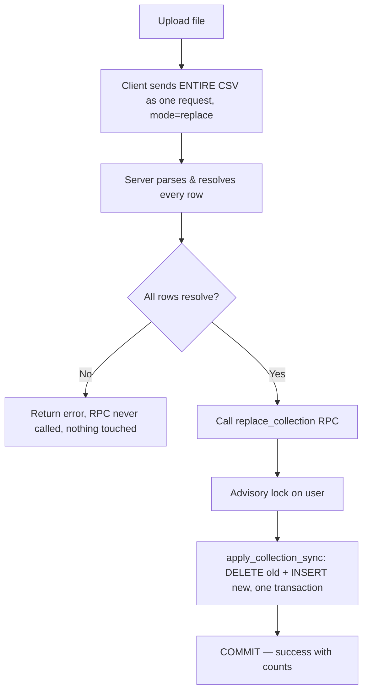

# Design: Collection Trust & Security

> Last updated: 2026-09-14
> Status: Draft
> Reference implementation: To be implemented

## Design Goals
1. **Eliminate data-loss risk** in collection replacement.
2. **Enforce isolation** at the database level before shared use.
3. **Minimal schema change** — preserve existing data and API contracts.
4. **Clear failure modes** — users understand what succeeded/failed and why.

## Design Principles for This Feature
| Principle | Application |
|-----------|-------------|
| **Atomic over incremental** | Collection replace must be all-or-nothing; no partial success states. |
| **Database-enforced over app-enforced** | Security boundary lives in RLS policies, not just application code. |
| **Explicit over implicit** | Document what Option A preserves (nothing) vs. Option B would preserve (manual edits). |
| **Fail closed** | Validation errors reject the entire import; security gaps reject the query. |

## Technical Design

### 1. Collection Replacement — Already Implemented (Corrected 2026-09-14)

**Correction:** Earlier drafts of this spec assumed replace-then-validate was still broken per TD-026. Tracing the actual code shows this has already been fixed and hosted-verified as part of the `collection-foundation` spec's atomic-boundary increment (see its delivery log, 2026-09-12/14 entries). TD-026 in the tech debt register is stale and should be marked resolved. **No new implementation work is needed for collection-replace safety itself.**

#### Actual Current Flow (Safe — Option A, already shipped)


#### Where this lives
- `src/lib/chunked-import-client.ts` — `chunkedImport()` sends the full CSV as one request for the default full-import path (chunking is reserved for `addOnly`/custom-endpoint use only). Comment in the file explicitly states the full-import request "must remain one server-side transaction... intentionally not split into an independent replace request followed by add requests."
- `src/lib/import-engine-v2.ts` — `executeInstanceLevelImport()` resolves every row; if any row fails, it returns an error *before* any RPC call (Stage 3f short-circuit). Only a fully-resolved row set reaches Stage 5.
- `supabase/migrations/20260912170000_atomic_collection_personal_scope.sql` — `replace_collection(uuid, jsonb)`: takes a per-user advisory transaction lock, delegates to `apply_collection_sync()`.
- `supabase/migrations/20260912162000_atomic_collection_boundary.sql` — `apply_collection_sync()`: single-transaction DELETE removed copies + INSERT new rows, `SECURITY DEFINER`, service-role only.
- `src/components/collection/CollectionImportButton.tsx` — the only caller of `chunkedImport()`, invoked with no `apiUrl`/`addOnly`, so it always takes the safe single-request path.

#### What remains genuinely open
- **Progress reporting is coarse.** The current UI shows "chunk 1/1" — i.e., 0% until the entire request completes, then 100%. There's no visibility into validation progress or row-by-row processing during that single request. This is real, user-visible work (see Progress Reporting section below).
- **No dry-run/preview.** Open question, not yet decided.
- **Manual per-copy edits don't survive replace** (documented limitation of Option A, unchanged).

#### Tables Affected
- `user_cards` — Oracle-level ownership
- `user_copies` — Physical copies
- (Indirectly) `deck_cards` — Allocations become unlinked; handled by existing reconciliation.

#### API Changes (revised — streaming, no new endpoint)
- **No new route.** `POST /api/collection/import?mode=replace` (and the `add`/`sync` modes, for consistency) now returns `Content-Type: application/x-ndjson` and streams progress + a terminal `done`/`error` line, instead of returning one JSON object after the entire operation completes.
- No `GET /status` endpoint — nothing to poll, no job ID.
- Non-streaming callers unaffected in practice: any caller that just does `await res.json()` on today's route would break against an NDJSON body, but the only caller of the full-CSV replace path is `chunkedImport()`, which is being updated in the same change. `route.test.ts`'s legacy-mode tests are already failing on the current baseline (unrelated `mode=legacy` behavior that no longer exists) and are not exercising this path.

#### Progress Reporting — Streaming, not polling (revised 2026-09-14)

**Correction:** The polling design above was abandoned before implementation. This app deploys to Vercel (serverless — confirmed via `vercel.json` cron config), where a `POST` that starts a job and a later `GET .../status?jobId=...` poll are not guaranteed to hit the same function instance. An in-memory job map would silently lose state; a durable `import_jobs` table would fix that but is exactly the kind of new staging infrastructure `convention-personal-app-scope` says to defer unless required.

**Chosen approach: single streaming HTTP response, no second request, no job table (Option B).** The existing `POST /api/collection/import?mode=replace` route stays a single request/response, but the response body becomes a stream of newline-delimited JSON (NDJSON) events instead of one JSON object returned at the end. Progress happens inside the same connection as validation/resolution/replace, so there's nothing to poll and no cross-instance state problem.

**Protocol (one JSON object per line, `\n`-terminated):**
```
{"type":"progress","phase":"validating"|"resolving"|"replacing","processed":<n>,"total":<n>}
{"type":"done","summary":{"inserted":<n>,"skipped":<n>,"removed":<n>,"sourceTag":"...","errors":[...],"durationMs":<n>,"replaced":true}}
{"type":"error","message":"...","isCsvParseError":<bool>}
```
- Exactly one terminal line (`done` or `error`) per stream; `done` and `error` are mutually exclusive.
- The HTTP status is always 200 for a started stream — errors (including CSV parse errors) are reported as an in-stream `error` event, not an HTTP 4xx/5xx, because headers are already sent by the time an error can occur deep in resolution. This is a standard trade-off for streamed responses.

**Where progress hooks are added:**
- `executeInstanceLevelImport()` gains an optional `onProgress?: (processed: number, total: number, phase: string) => void` parameter.
- Called once immediately after CSV parsing with `(0, totalRows, 'validating')`.
- Called incrementally during row resolution (Stage 3), most usefully during the sequential Scryfall-API-resolution fallback loop (the only genuinely slow, per-row part — most Archidekt/Moxfield exports already carry `oracle_id`+`scryfall_id` and resolve instantly in bulk, so this loop is typically empty and the whole operation completes in well under a second; the hook still fires for large collections needing API fallback).
- Called once with `(total, total, 'replacing')` immediately before the `replace_collection` RPC call.
- The route wraps all of this in a `ReadableStream`, translating each `onProgress` call into a `progress` NDJSON line, and emits the terminal `done`/`error` line itself.

**Client side:** `chunked-import-client.ts`'s single-full-CSV-request path (used whenever `addOnly` is false and no custom `apiUrl` is given — i.e., every use from `CollectionImportButton` today) switches from `fetch().then(r => r.json())` to reading `response.body` as a stream, decoding NDJSON lines, and calling the existing `onProgress` callback per line. The public `ChunkProgress`/`ChunkedImportSummary` shapes and the `CollectionImportButton` UI are unchanged — today's code already renders `rowsProcessed`/`totalRows` correctly, it just currently only ever receives one progress update (at 100%, right before completion) because the underlying request is a single opaque `await`. This fix makes that same callback fire multiple times with real numbers instead of a single update at the end.
- Chunked/`addOnly`/custom-`apiUrl` paths are unchanged — they keep the existing per-chunk `fetch().json()` behavior, since those chunks are already fast and chunk-level progress is adequate there.

#### Limitations (Documented)
- Manual per-copy edits (storage location, notes, purchase price, missing flags) do not survive.
- Deck allocations are cleared; must be re-established via Built-deck reconciliation.
- This is Option A (validate-then-swap), not Option B (true diffing).

### 2. Row Level Security (RLS)

#### Current State
- Tables have RLS disabled (`ALTER TABLE ... DISABLE ROW LEVEL SECURITY`).
- Access control implemented in app code via `WHERE user_id = ...` clauses.
- No database-level isolation.

#### Target State
- Enable RLS on all user-owned tables.
- Add policies that enforce `user_id = auth.uid()` for `SELECT`, `INSERT`, `UPDATE`, `DELETE`.
- Service role (`service_role`) bypasses RLS for administrative operations.

#### Tables Requiring RLS
| Table | Policy Type | Notes |
|-------|-------------|-------|
| `user_cards` | `USING (user_id = auth.uid())` | All operations |
| `user_copies` | `USING (user_id = auth.uid())` | All operations |
| `decks` | `USING (user_id = auth.uid())` | All operations |
| `deck_cards` | `USING (user_id = auth.uid())` | Inherits from deck owner |

#### Service Role Exemptions
- Collection replacement RPC needs to delete/insert across users.
- Migration functions need to read/write all rows.
- Use `SECURITY DEFINER` functions with `SET search_path = ...` and explicit `user_id` parameters.

#### Testing Strategy
- Create two test users in seeded database.
- Run queries as each user, verify they see only their own data.
- Attempt cross-user access via raw SQL (should fail).
- Verify service-role operations still work.

## Architecture Decisions & Alternatives

| Decision | Chosen | Alternative | Rationale |
|----------|--------|-------------|-----------|
| **Validation before any delete** | Yes | Validate as we go | Eliminates data-loss window entirely. |
| **Single transaction for swap** | Yes | Multiple transactions | Guarantees atomic all-or-nothing outcome. |
| **RLS for all user tables** | Yes | App-code only | Database-level guarantee is stronger defense. |
| **Service-role exemptions** | Yes | No exemptions | Required for administrative operations like collection replace. |
| **Option A (validate-then-swap)** | Yes | Option B (true diffing) | Fixes critical risk now; manual-edit preservation deferred. |

## Implementation Sequence

### Phase 1: Collection Replace Safety
1. Write validation logic that reads entire file into memory, checks all rows.
2. Create `replace_user_collection()` RPC with transaction wrapping delete+insert.
3. Add `/api/collection/replace` endpoint calling RPC.
4. Test with small file, malformed file, large file (~2,500 cards).
5. Document limitations (manual edits don't survive).

### Phase 2: Row Level Security
1. Audit current `user_id` FK consistency across all tables.
2. Write migration enabling RLS + policies.
3. Test with two accounts verifying isolation.
4. Update any service-role functions to use `SECURITY DEFINER`.
5. Verify existing flows still work for single user.

## Open Questions
1. **Dry-run mode** — Should we implement a preview that shows what would change? (Nice-to-have)
2. **Missing flag preservation** — Could we preserve just the "missing" status as a special case? (Trade-off: complicates simple swap)
3. **Validation error reporting** — How detailed should error messages be? (Line numbers, specific cards)

## Accessibility Notes
- Error messages must be clear and actionable.
- Loading states during validation should indicate progress for large files.
- Success/error feedback must be perceivable by screen readers.

---

*Authored: 2026-09-14 by Delivery Lead (Gene)*
*Status: Draft*