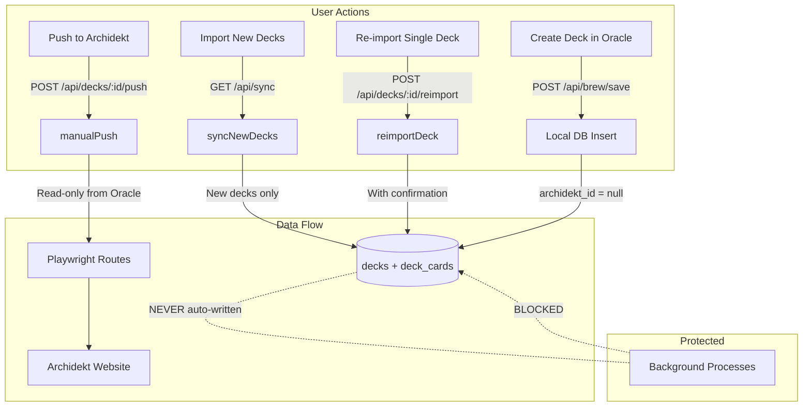
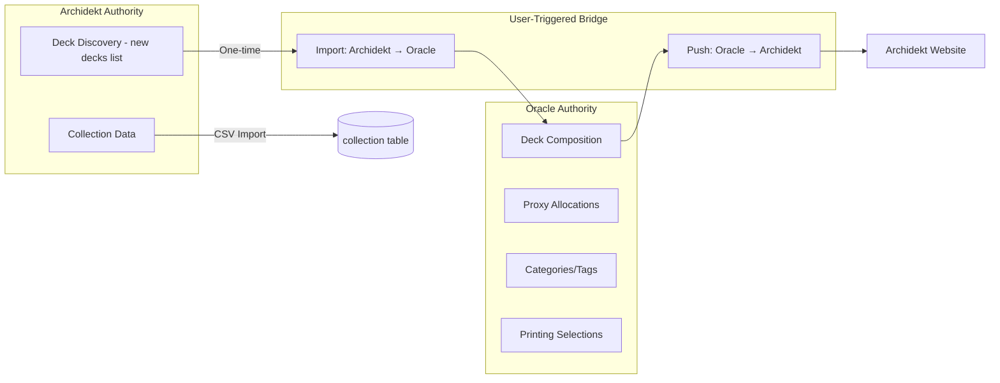

# Design Document: Deck Authority Split

## Overview

This design establishes Oracle as the sole source of truth for deck contents after import, while Archidekt retains authority only over collection data. The core change is semantic: `syncAllDecks` becomes an "import new decks only" operation, `syncDeck`/`reconcileDeck` become explicit user-triggered re-imports, and all Playwright write-back automation becomes manual-only.

The design is conservative — it modifies behavior of existing functions rather than replacing infrastructure. The database schema is unchanged; only the code paths that write to `deck_cards` for previously-imported decks are gated behind explicit user action.

**Key decisions:**
- AutoSync is removed entirely (no remaining useful trigger after deck sync removal)
- `GET /api/sync` changes from "sync all decks" to "import new decks + sync collection"
- `POST /api/sync/full` (reconcileDeck-based) becomes `POST /api/decks/[id]/reimport` with confirmation
- A new `POST /api/decks/[id]/push` route orchestrates Manual Push via existing Playwright routes
- Oracle-native decks get a `null` archidekt_id, distinguishing them from imported decks

## Architecture



### Authority Boundaries



## Components and Interfaces

### Modified: `src/lib/sync.ts`

The `syncAllDecks` function is replaced by `syncNewDecksOnly`:

```typescript
// NEW: Only imports decks that don't already exist in Oracle
export async function syncNewDecksOnly(): Promise<SyncResult> {
  ensureDb()
  const archidektDecks = await fetchUserDecks()
  const existingIds = new Set(
    (db.prepare('SELECT id FROM decks').all() as { id: number }[]).map(r => r.id)
  )

  const newDecks = archidektDecks.filter(d => !existingIds.has(d.id))
  const results = { imported: 0, errors: [] as string[] }

  for (const summary of newDecks) {
    try {
      const deck = await fetchDeck(summary.id)
      importDeck(deck)  // renamed from syncDeck for clarity
      results.imported++
    } catch (err) {
      results.errors.push(`${summary.name}: ${err instanceof Error ? err.message : String(err)}`)
    }
  }

  // Collection sync continues as before
  try {
    await syncCollection()
  } catch (err) {
    results.errors.push(`Collection: ${err instanceof Error ? err.message : String(err)}`)
  }

  return results
}

// RENAMED: syncDeck → importDeck (same logic, clearer intent)
export function importDeck(deck: ArchidektDeckFull): void { /* existing syncDeck body */ }

// REMOVED: syncAllDecks (replaced by syncNewDecksOnly)
```

### Modified: `src/lib/sync-engine.ts`

The `runSyncCycle` function is modified to skip reconciliation for existing decks:

```typescript
export async function runSyncCycle(
  db: Database.Database,
  trigger: SyncCycleResult['trigger'],
  fetcher: ArchidektFetcher,
  deckIds?: number[]  // When provided, this is an explicit re-import (user-triggered)
): Promise<SyncCycleResult> {
  // If deckIds provided → explicit re-import (user chose this)
  // If no deckIds → only process new decks (discovery mode)
  // NEVER auto-reconcile existing decks
}
```

### Removed: `src/components/AutoSync.tsx`

The component is deleted entirely. After deck trigger removal, it has no remaining purpose — collection staleness is handled by the existing CSV import workflow, not by timed client-side checks.

**Rationale:** The AutoSync component's sole function was to call `GET /api/sync` when data was stale (>30 min). Once that route stops touching deck data, AutoSync only triggers collection sync from the Archidekt API. But collection sync is already handled by the CSV import workflow (`data/check-delta.ts`). Adding a second automatic collection pathway contradicts Requirement 7.2.

### New: `POST /api/decks/[id]/reimport/route.ts`

Explicit re-import of a single deck from Archidekt, with confirmation requirement:

```typescript
interface ReimportRequest {
  confirmed: boolean  // Must be true — UI shows warning first
}

// Returns 409 if confirmed !== true (forces UI to show warning)
// On success: fetches deck from Archidekt, clears deck_cards, re-inserts
// On failure: returns error, leaves existing data unchanged
```

### New: `POST /api/decks/[id]/push/route.ts`

Manual Push orchestration route:

```typescript
interface PushResponse {
  success: boolean
  action: 'created' | 'updated'
  error?: string
}

// Logic:
// 1. Load deck from Oracle DB
// 2. If deck has archidekt_id (numeric, from `decks.id` for imported decks):
//    → Call existing /api/archidekt/write-tags with current proxy tags
// 3. If deck has no archidekt_id (Oracle-native, `decks.id` is local auto-increment):
//    → Call existing /api/archidekt/create-deck with full card list
// 4. Return result to caller
```

### New: `src/components/PushToArchidekt.tsx`

Client component for the deck detail page:

```typescript
// Button: "Push to Archidekt" (or "Create on Archidekt" for Oracle-native decks)
// States: idle → loading → success/error
// Uses useMutation from TanStack Query
// Invalidates ['decks', deckId] on success
```

### Modified: `GET /api/sync/route.ts`

```typescript
// BEFORE: calls syncAllDecks() — syncs ALL decks from Archidekt
// AFTER:  calls syncNewDecksOnly() — only imports new decks + collection
```

### Modified: `POST /api/sync/full/route.ts`

This route currently calls `runSyncCycle` which reconciles existing decks. Post-change:

```typescript
// BEFORE: Reconciles all decks (Archidekt wins on conflict)
// AFTER:  Only processes explicitly-provided deckIds as re-imports
//         If no deckIds provided → error (must be explicit)
//         Or: repurposed as collection-only sync
```

### Deck ID Strategy for Oracle-Native Decks

Currently, `decks.id` stores the Archidekt deck ID (integer from Archidekt's API). Oracle-native decks need a different approach:

- Add a `source` column to `decks`: `'archidekt' | 'oracle'`
- Oracle-native decks use SQLite auto-increment IDs (negative range or UUID to avoid collision with Archidekt IDs)
- **Simpler approach:** Use a `archidekt_id` nullable column. If null → Oracle-native. The existing `id` column becomes Oracle's local ID for all decks.

The brew/save route already creates decks with auto-increment IDs and no Archidekt reference. This pattern extends naturally.

## Data Models

### No Schema Changes Required

The existing schema supports the authority split without modification:

```sql
-- decks table (unchanged)
CREATE TABLE decks (
  id INTEGER PRIMARY KEY,          -- Archidekt ID for imported, auto-increment for native
  name TEXT,
  commander_name TEXT,
  commander_scryfall_id TEXT,
  colour_identity TEXT,
  card_count INTEGER,
  last_synced_at TEXT,              -- NULL for Oracle-native decks (never synced)
  raw_json TEXT,                    -- NULL for Oracle-native decks
  status TEXT,                      -- 'active', 'draft' (from brew system)
  deck_type TEXT                    -- 'Precon Mod', etc.
);

-- deck_cards table (unchanged)
CREATE TABLE deck_cards (
  deck_id INTEGER,
  card_name TEXT,
  scryfall_id TEXT,
  set_code TEXT,
  quantity INTEGER,
  categories TEXT,
  tags TEXT,
  is_commander INTEGER
);
```

**Oracle-native deck detection:** A deck is Oracle-native if `last_synced_at IS NULL AND raw_json IS NULL`. This distinguishes it from imported decks without requiring schema changes.

### Identifying Import-Eligible vs Protected Decks

```sql
-- Decks that have been imported (protected from auto-overwrite)
SELECT id FROM decks WHERE last_synced_at IS NOT NULL;

-- Decks on Archidekt but not yet imported (eligible for auto-import)
-- Computed by comparing fetchUserDecks() result against existing IDs
```

## Correctness Properties

*A property is a characteristic or behavior that should hold true across all valid executions of a system — essentially, a formal statement about what the system should do. Properties serve as the bridge between human-readable specifications and machine-verifiable correctness guarantees.*

### Property 1: Import Faithfulness

*For any* valid ArchidektDeckFull payload, after `importDeck` completes successfully, the `deck_cards` rows for that deck SHALL exactly match the cards in the payload (same card names, quantities, categories, and is_commander flags).

**Validates: Requirements 1.1**

### Property 2: Sync Cycle Deck Protection

*For any* set of previously-imported decks with arbitrary `deck_cards` content, when `syncNewDecksOnly` or the modified `GET /api/sync` route executes, the `deck_cards` rows for those decks SHALL be byte-for-byte identical before and after the sync operation.

**Validates: Requirements 1.2, 1.4, 2.1, 2.4, 6.1, 6.2, 6.4**

### Property 3: Failed Import Atomicity

*For any* deck state in Oracle's database, if `importDeck` or `reimportDeck` throws an error (network failure, API error, malformed response), the `decks` and `deck_cards` table content SHALL be identical to the state before the call.

**Validates: Requirements 1.5**

### Property 4: Deck Creation Isolation

*For any* valid deck creation payload (via brew/save or manual creation), the creation flow SHALL insert rows into `decks` and `deck_cards` without invoking `fetchDeck`, `fetchUserDecks`, `updateProxyTags`, or `createDeck` from the Archidekt client or Playwright modules.

**Validates: Requirements 5.1, 5.4**

### Property 5: Failed Push Safety

*For any* deck state in Oracle's database, if `POST /api/decks/[id]/push` fails (Playwright error, auth failure, network error), the `decks` and `deck_cards` table content SHALL be identical to the state before the push was attempted.

**Validates: Requirements 3.5**

### Property 6: Collection-Deck Isolation

*For any* collection CSV content and any existing deck state, after `syncCollection` or CSV import completes, the `decks` and `deck_cards` tables SHALL be identical to their state before the collection operation.

**Validates: Requirements 7.3, 7.4**

## Error Handling

### Import Failures

| Scenario | Behavior |
|----------|----------|
| Archidekt API returns 4xx/5xx | Return error to caller, no DB changes |
| Network timeout | Return error to caller, no DB changes |
| Malformed API response (missing cards array) | Return error to caller, no DB changes |
| Partial import (some cards fail to parse) | Transaction rollback — all or nothing |

All import operations use SQLite transactions. On any error within the transaction, the entire operation rolls back, preserving the previous state.

### Push Failures

| Scenario | Behavior |
|----------|----------|
| Playwright browser launch fails | Return 502 with error message, Oracle data unchanged |
| Archidekt authentication expired | Return 502 with "Authentication failed" message |
| Archidekt site unavailable | Return 502 with "Archidekt unavailable" message |
| Partial tag write (some succeed, some fail) | Return partial success report to user |

Push operations are read-only from Oracle's perspective — they read deck state and push to Archidekt. Oracle data is never modified during a push.

### Re-import Confirmation

The re-import endpoint requires `confirmed: true` in the request body. If not provided:
- Returns 409 Conflict with `{ requiresConfirmation: true, warning: "Re-importing will overwrite local edits..." }`
- The UI uses this to show a confirmation dialog before retrying with `confirmed: true`

## Testing Strategy

### Property-Based Tests (fast-check)

The project will use **fast-check** for property-based testing in TypeScript/Node.js. Each property test runs a minimum of 100 iterations.

**Configuration:**
```typescript
import fc from 'fast-check'

// Arbitraries for deck generation
const deckCardArb = fc.record({
  card_name: fc.string({ minLength: 1, maxLength: 50 }),
  quantity: fc.integer({ min: 1, max: 4 }),
  categories: fc.array(fc.string()),
  is_commander: fc.boolean(),
})

const archidektDeckArb = fc.record({
  id: fc.integer({ min: 1 }),
  name: fc.string({ minLength: 1 }),
  cards: fc.array(deckCardArb, { minLength: 1, maxLength: 100 }),
})
```

**Tests:**
- Feature: deck-authority-split, Property 1: Import faithfulness
- Feature: deck-authority-split, Property 2: Sync cycle deck protection
- Feature: deck-authority-split, Property 3: Failed import atomicity
- Feature: deck-authority-split, Property 4: Deck creation isolation
- Feature: deck-authority-split, Property 5: Failed push safety
- Feature: deck-authority-split, Property 6: Collection-deck isolation

Each test uses an in-memory SQLite database (`:memory:`) for fast iterations.

### Unit Tests (Vitest)

- `syncNewDecksOnly` correctly identifies and imports only new decks
- `importDeck` correctly maps Archidekt response to DB rows
- Re-import endpoint rejects unconfirmed requests with 409
- Push route selects create-deck vs write-tags based on deck source
- PushToArchidekt component renders correct button text for imported vs native decks
- PushToArchidekt component shows loading/success/error states

### Integration Tests

- Full sync cycle with mocked Archidekt API preserves existing deck data
- Brew save → deck creation → push to Archidekt end-to-end flow
- Re-import with confirmation overwrites deck_cards correctly
- Collection import via CSV doesn't affect deck tables

### Code Audit Checklist

Paths that must be verified to NOT write deck_cards for existing decks:
1. `GET /api/sync` — must only import new decks
2. `POST /api/sync/full` — must require explicit deckIds or be removed
3. AutoSync.tsx — must be deleted
4. Any `useEffect` or background timer that calls sync endpoints
5. Allocation routes — must not trigger Archidekt fetch as side effect
6. Brew commit/save — must not auto-push to Archidekt
