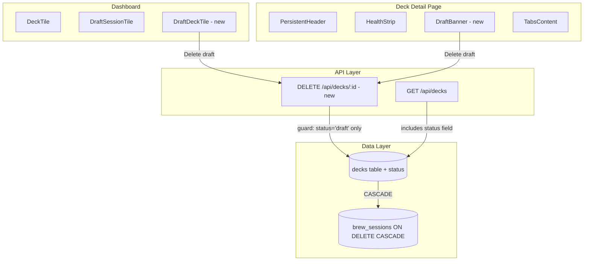

# Design Document: Draft Deck Management

## Overview

Draft Deck Management adds lifecycle management to draft decks produced by Brew Mode. The feature introduces a `status` column to the `decks` table (`'active'` | `'draft'`), cascade-delete semantics for `brew_sessions`, draft-specific tile hover actions with inline confirmation UX, deletion guards for active decks, and a persistent draft banner on the deck detail page.

The core architectural change is small: one column addition, one FK constraint change, one new API endpoint, and component-level conditional rendering. No new tables, no new pages, no external API changes.

## Architecture



**Key design decisions:**

1. **Single `status` column** (not a separate `draft_decks` table) — keeps the schema flat, avoids JOINs on the dashboard query, and lets existing deck detail pages work without routing changes.
2. **FK change to ON DELETE CASCADE** — currently `brew_sessions.deck_id` uses `ON DELETE SET NULL`. We change this to `ON DELETE CASCADE` so draft deletion is atomic. SQLite doesn't support `ALTER CONSTRAINT`, so we rebuild via migration.
3. **Inline confirmation** (not modal) — keeps the interaction contextual and lightweight. The tile/banner replaces its own content rather than spawning a new DOM layer.
4. **No soft-delete** — drafts are disposable by nature. Hard delete keeps the schema simple and avoids "trash" management complexity.

## Components and Interfaces

### Component Tree (Dashboard)

```
DashboardPage
├── DraftDeckTile (new — replaces DraftSessionTile for decks with status='draft')
│   ├── Normal state: art, name, Draft badge, colour bars
│   ├── Hover state: "Continue brewing" + "Delete draft" buttons
│   └── Confirmation state: inline delete confirmation
├── DeckTile (unchanged — active decks only)
└── DraftSessionTile (unchanged — sessions without a deck_id yet)
```

### Component Tree (Deck Detail)

```
DeckViewPage
├── PersistentHeader
├── HealthStrip
├── DraftBanner (new — conditionally rendered when deck.status='draft')
│   ├── Normal state: ⚠ text, card count, "Continue brewing →", "Delete draft"
│   └── Confirmation state: inline delete confirmation (full-width)
└── Tabs (Cards, Analysis, Combos, Upgrade, Strategy)
```

### New Component: `DraftDeckTile`

```typescript
export interface DraftDeckTileProps {
  id: number
  name: string
  commanderName: string
  commanderScryfallId: string
  colourIdentity: string[]
  cardCount?: number
  brewSessionId?: number | null
}

// States: 'idle' | 'hover' | 'confirming'
```

This component extends the visual foundation of `DeckTile` (same card art, colour bars, layout) but replaces hover actions with draft-specific ones and adds an inline confirmation state. It does NOT reuse `DeckTile` via composition because the hover behavior and state machine are fundamentally different.

### New Component: `DraftBanner`

```typescript
export interface DraftBannerProps {
  deckId: number
  deckName: string
  cardCount: number
  brewSessionId?: number | null
  onDeleted: () => void  // callback to navigate to dashboard after deletion
}

// States: 'info' | 'confirming'
```

### New Component: `InlineDeleteConfirmation`

Shared between `DraftDeckTile` and `DraftBanner` — a renderless pattern (children render prop or slot) that manages confirm/cancel state.

```typescript
export interface InlineDeleteConfirmationProps {
  deckName: string
  onConfirm: () => void
  onCancel: () => void
  isDeleting: boolean
}
```

### Modified: `GET /api/decks` response

The existing endpoint returns `decks` and `draftSessions`. With this feature:
- `decks` array gains a `status` field (`'active' | 'draft'`)
- Draft decks (status='draft') appear in the `decks` array with their status
- `draftSessions` continues to show sessions that haven't yet created a deck record

### New: `DELETE /api/decks/:id`

```typescript
// DELETE /api/decks/[id]/route.ts

interface DeleteResponse {
  success: true
}

interface DeleteErrorResponse {
  error: string
}

// Returns 200 on success, 403 if deck is active, 404 if not found
```

## Data Models

### Migration: Add `status` column + FK change

```sql
-- 017-deck-status.sql

-- Add status column with CHECK constraint
ALTER TABLE decks ADD COLUMN status TEXT NOT NULL DEFAULT 'active'
  CHECK(status IN ('active', 'draft'));

-- Rebuild brew_sessions to change FK from ON DELETE SET NULL to ON DELETE CASCADE
-- SQLite doesn't support ALTER CONSTRAINT, so we recreate the table

CREATE TABLE brew_sessions_new (
  id INTEGER PRIMARY KEY AUTOINCREMENT,
  deck_id INTEGER REFERENCES decks(id) ON DELETE CASCADE,
  status TEXT NOT NULL DEFAULT 'selecting'
    CHECK(status IN ('selecting', 'investigating', 'confirming', 'generating', 'refining', 'saving', 'complete', 'abandoned')),
  path_type TEXT CHECK(path_type IN ('commander', 'concept')),
  commander_name TEXT,
  colour_identity TEXT,
  concept_description TEXT,
  brief_json TEXT,
  skeleton_json TEXT,
  refinement_history_json TEXT DEFAULT '[]',
  conversation_json TEXT DEFAULT '[]',
  created_at TEXT NOT NULL DEFAULT (datetime('now')),
  updated_at TEXT NOT NULL DEFAULT (datetime('now'))
);

INSERT INTO brew_sessions_new SELECT * FROM brew_sessions;

DROP TABLE brew_sessions;

ALTER TABLE brew_sessions_new RENAME TO brew_sessions;

CREATE INDEX IF NOT EXISTS idx_brew_sessions_status ON brew_sessions(status);
CREATE INDEX IF NOT EXISTS idx_brew_sessions_updated ON brew_sessions(updated_at DESC);
```

### Updated type: Deck row

```typescript
interface DeckRow {
  id: number
  name: string
  commander_name: string | null
  commander_scryfall_id: string | null
  colour_identity: string | null
  card_count: number | null
  last_synced_at: string | null
  deck_type: string | null
  status: 'active' | 'draft'  // NEW
}
```

## Correctness Properties

*A property is a characteristic or behavior that should hold true across all valid executions of a system — essentially, a formal statement about what the system should do. Properties serve as the bridge between human-readable specifications and machine-verifiable correctness guarantees.*

### Property 1: Status constraint validity

*For any* string value `s`, inserting or updating a deck's `status` to `s` should succeed if and only if `s` is `'active'` or `'draft'`. All other values must be rejected by the database.

**Validates: Requirements 1.1**

### Property 2: Cascade cleanup on delete

*For any* draft deck with one or more associated `brew_sessions` records, deleting that deck from the `decks` table should result in zero `brew_sessions` records referencing the deleted deck's ID.

**Validates: Requirements 1.5, 7.2**

### Property 3: Delete guard — only draft decks are deletable

*For any* deck record, the `DELETE /api/decks/:id` operation should succeed (return 200) if and only if the deck's status is `'draft'`. For any deck with status `'active'`, the operation must return 403 with the message "Active decks are managed in Archidekt. Remove it there and sync to remove it here."

**Validates: Requirements 5.1, 5.2, 5.3**

## Error Handling

| Scenario | Behaviour |
|----------|-----------|
| DELETE called on non-existent deck | 404 `{ error: "Deck not found" }` |
| DELETE called on active deck | 403 `{ error: "Active decks are managed in Archidekt. Remove it there and sync to remove it here." }` |
| DELETE called on draft deck | 200 `{ success: true }` — deck + cascade-deleted brew_sessions removed |
| Network failure during delete mutation | TanStack Query `onError` — tile/banner stays in confirmation state, toast or inline error |
| Invalid status value at DB layer | SQLite CHECK constraint rejects — caught in migration/insert logic |

No partial states: deletion is a single `DELETE FROM decks WHERE id = ? AND status = 'draft'` — if the row doesn't match, nothing happens and the API returns the appropriate error code.

## Testing Strategy

### Unit Tests (example-based)

| Component/Layer | Tests |
|----------------|-------|
| `DraftDeckTile` | Renders dashed border, Draft badge, no health pips; hover shows correct actions; confirmation state shows deck name; cancel restores state |
| `DraftBanner` | Renders all elements (icon, text, buttons); confirmation transition; post-delete navigation |
| `InlineDeleteConfirmation` | Renders deck name in text; Delete button has destructive styling; Cancel calls onCancel |
| `DELETE /api/decks/:id` | Returns 404 for missing ID; returns 403 for active deck; returns 200 for draft deck |
| Migration | Status defaults to 'active'; CHECK constraint rejects invalid values |

### Property Tests (fast-check, minimum 100 iterations)

| Property | Strategy |
|----------|----------|
| Property 1: Status constraint | Generate random strings (including 'active', 'draft', edge cases like '', null, 'ACTIVE', 'Draft'). Insert into an in-memory SQLite DB. Assert success iff value ∈ {'active', 'draft'}. |
| Property 2: Cascade cleanup | Generate a random number of brew_sessions (1–10) linked to a draft deck. Delete the deck. Assert `SELECT count(*) FROM brew_sessions WHERE deck_id = ?` returns 0. |
| Property 3: Delete guard | Generate a deck with random status ∈ {'active', 'draft'}. Call the delete handler logic. Assert success iff status = 'draft'; assert 403 response iff status = 'active'. |

**Library:** `fast-check` (already available in the project's test infrastructure based on existing `.property.test.ts` files)

**Configuration:** Each property test runs with `{ numRuns: 100 }` minimum.

**Tag format:** `Feature: draft-deck-management, Property {N}: {description}`

### Integration Tests

| Scenario | Coverage |
|----------|----------|
| Full deletion flow from dashboard | Create draft deck → render dashboard → hover tile → click delete → confirm → verify tile removed, brew_sessions cleaned, no Archidekt/Notion calls |
| Full deletion flow from detail page | Navigate to draft deck detail → click Delete draft on banner → confirm → verify redirect to dashboard |
| Active deck protection | Navigate to active deck → verify no delete action anywhere in UI |

### What is NOT property-tested

- Visual styling (dashed borders, colours, badge rendering) — use snapshot/example tests
- Navigation behaviour — use example-based integration tests
- TanStack Query cache invalidation — use example-based tests with mock query client
