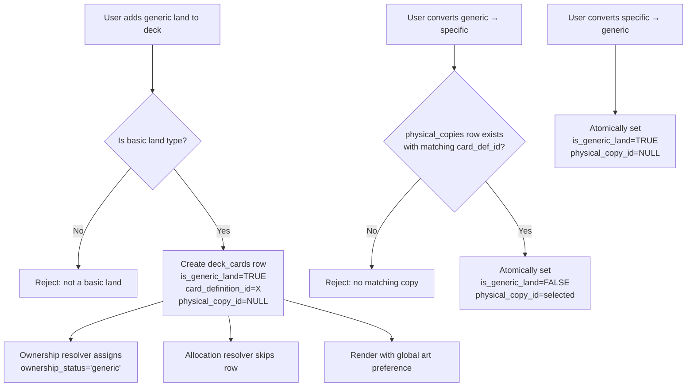

# Design Document: Generic Basic Lands

## Overview

This feature introduces a "generic land slot" concept — a `deck_cards` row that represents "a basic land of this type" without referencing any physical copy or participating in the ownership/allocation system. Generic slots are restricted to the six basic land types (Plains, Island, Swamp, Mountain, Forest, Wastes) and render with a user-chosen global art preference.

The design is additive to the existing schema. It extends `deck_cards` with two columns (`card_definition_id`, `is_generic_land`), creates a small `generic_land_preferences` table (6 rows, seeded at migration time), and modifies two existing code paths (`buildAllocationInput`, `denormaliseOwnership`) to skip generic land rows.

### Key Design Decisions

1. **Generic slots are outside the ownership system entirely.** They don't reference `physical_copies`, don't participate in allocation, and get a 'generic' ownership status that is neutral (no warnings).
2. **Global art preference, not per-deck.** One printing choice per basic type applies everywhere. Simpler UX, smaller table, no per-deck configuration burden.
3. **Conversion is in-place.** Converting generic↔specific toggles fields on the same `deck_cards` row (preserving PK). No row deletion/creation during conversion.
4. **CSV import governs physical_copies.** Oracle never creates `physical_copies` rows for owned cards. Conversion to specific can only reference existing rows.
5. **Migration depends on 023 (card_definitions table).** The `card_definition_id` FK on both new columns references `card_definitions(id)`. Does not depend on migration 026 (printing-group v2) for base functionality.

## Architecture

```mermaid
erDiagram
    card_definitions {
        INTEGER id PK
        TEXT oracle_id UK
        TEXT card_name
    }

    deck_cards {
        INTEGER id PK
        INTEGER deck_id FK
        TEXT card_name
        INTEGER card_definition_id FK "NEW - nullable"
        BOOLEAN is_generic_land "NEW - default FALSE"
        INTEGER physical_copy_id FK "nullable"
        TEXT ownership_status "extended CHECK"
    }

    generic_land_preferences {
        INTEGER card_definition_id PK_FK "one of 6 basic types"
        TEXT scryfall_printing_id "Scryfall printing UUID"
        DATETIME updated_at
    }

    physical_copies {
        INTEGER id PK
        INTEGER card_definition_id FK
        TEXT scryfall_printing_id
        INTEGER quantity
    }

    card_definitions ||--o{ deck_cards : "card_definition_id"
    card_definitions ||--o| generic_land_preferences : "1:1 per basic type"
    physical_copies ||--o{ deck_cards : "physical_copy_id (NULL for generic)"
    card_definitions ||--o{ physical_copies : "identity"
```

### System Flow: Generic Land Lifecycle



### Layer Interaction

| Layer | Source of Truth | Changed by This Feature |
|-------|----------------|------------------------|
| Aggregate ownership | `collection.quantity` | ❌ No |
| Deck composition | `deck_cards` rows | ✅ New columns + generic slot rows |
| Allocation decisions | `deck_allocations` via `buildAllocationInput` | ✅ Filter excludes generic rows |
| Ownership resolution | `denormaliseOwnership` | ✅ New 'generic' status path |
| Card identity | `card_definitions` | ❌ No (reads only) |
| Art preferences | `generic_land_preferences` (NEW) | ✅ New table |

## Components and Interfaces

### New Data Access Module: `src/lib/generic-land-store.ts`

```typescript
import type Database from 'better-sqlite3'

// ---------------------------------------------------------------------------
// Constants
// ---------------------------------------------------------------------------

export const BASIC_LAND_TYPES = [
  'Plains', 'Island', 'Swamp', 'Mountain', 'Forest', 'Wastes'
] as const

export type BasicLandType = typeof BASIC_LAND_TYPES[number]

// ---------------------------------------------------------------------------
// Types
// ---------------------------------------------------------------------------

export interface GenericLandPreference {
  cardDefinitionId: number
  cardName: string            // denormalized from card_definitions
  scryfallPrintingId: string
  updatedAt: string
}

export interface CreateGenericLandSlotParams {
  deckId: number
  cardDefinitionId: number    // must reference a basic land type
}

export interface ConvertToSpecificParams {
  deckCardId: number
  physicalCopyId: number
}

export interface ConvertToGenericParams {
  deckCardId: number
}

export type GenericLandErrorCode =
  | 'NOT_BASIC_LAND'
  | 'PHYSICAL_COPY_SET'
  | 'NO_MATCHING_COPY'
  | 'CARD_MISMATCH'
  | 'NOT_GENERIC_SLOT'
  | 'INVALID_PRINTING'

export interface GenericLandError {
  error: GenericLandErrorCode
  message: string
}

// ---------------------------------------------------------------------------
// Validation
// ---------------------------------------------------------------------------

/**
 * Check whether a card_definition_id maps to one of the six basic land types.
 */
export function isBasicLandDefinition(db: Database.Database, cardDefinitionId: number): boolean

/**
 * Validate that a card_name is one of the six basic land types (case-sensitive).
 */
export function isBasicLandType(cardName: string): cardName is BasicLandType

// ---------------------------------------------------------------------------
// Generic Land Slot CRUD
// ---------------------------------------------------------------------------

/**
 * Create a generic land slot in a deck.
 * Validates that card_definition_id references a basic land type.
 * Creates a deck_cards row with is_generic_land=TRUE, physical_copy_id=NULL.
 */
export function createGenericLandSlot(
  db: Database.Database,
  params: CreateGenericLandSlotParams
): number | GenericLandError  // returns deck_cards.id on success

/**
 * Remove a generic land slot from a deck.
 * Deletes the deck_cards row. No side effects on other tables.
 */
export function removeGenericLandSlot(db: Database.Database, deckCardId: number): void

// ---------------------------------------------------------------------------
// Conversion
// ---------------------------------------------------------------------------

/**
 * Convert a generic land slot to a specific printing.
 * Atomically sets physical_copy_id and is_generic_land=FALSE.
 * Validates: physical_copies row exists with matching card_definition_id.
 * Does NOT create physical_copies rows.
 */
export function convertToSpecific(
  db: Database.Database,
  params: ConvertToSpecificParams
): void | GenericLandError

/**
 * Convert a specific printing back to a generic land slot.
 * Atomically sets is_generic_land=TRUE and physical_copy_id=NULL.
 * Does NOT modify the previously-referenced physical_copies row.
 */
export function convertToGeneric(
  db: Database.Database,
  params: ConvertToGenericParams
): void | GenericLandError

/**
 * List physical_copies rows eligible as conversion targets for a generic slot.
 * Returns rows where card_definition_id matches the slot's card_definition_id.
 */
export function listConversionTargets(
  db: Database.Database,
  deckCardId: number
): Array<{ id: number; scryfallPrintingId: string | null; isProxy: boolean; isFoil: boolean; quantity: number }>

// ---------------------------------------------------------------------------
// Preferences CRUD
// ---------------------------------------------------------------------------

/**
 * Get all 6 generic land art preferences.
 */
export function getAllPreferences(db: Database.Database): GenericLandPreference[]

/**
 * Get the preference for a specific basic land type.
 */
export function getPreference(db: Database.Database, cardDefinitionId: number): GenericLandPreference | null

/**
 * Update the art preference for a basic land type.
 */
export function updatePreference(
  db: Database.Database,
  cardDefinitionId: number,
  scryfallPrintingId: string
): void | GenericLandError
```

### Modified Module: `src/lib/allocation-store.ts`

The `buildAllocationInput` function's demand query changes from:

```sql
SELECT card_name, deck_id FROM deck_cards
```

to:

```sql
SELECT card_name, deck_id FROM deck_cards WHERE is_generic_land = FALSE
```

This is the only change to this module. Generic land rows simply don't enter the demand map.

### Modified Module: `src/lib/ownership-resolver.ts`

The `denormaliseOwnership` function adds an early-exit path:

```typescript
// Before processing allocations, mark all generic land rows
const markGeneric = db.prepare(`
  UPDATE deck_cards SET ownership_status = 'generic', proxy_of_deck_id = NULL
  WHERE is_generic_land = TRUE AND ownership_status IS NOT 'generic'
`)
markGeneric.run()
```

Additionally, the "mark unallocated as not_owned" loop must exclude generic rows:

```sql
SELECT card_name, deck_id FROM deck_cards WHERE is_generic_land = FALSE
```

### API Routes

| Route | Method | Purpose |
|-------|--------|---------|
| `/api/decks/[deckId]/generic-lands` | POST | Add generic land slot |
| `/api/decks/[deckId]/generic-lands/[id]` | DELETE | Remove generic land slot |
| `/api/decks/[deckId]/generic-lands/[id]/convert-to-specific` | POST | Convert to specific printing |
| `/api/decks/[deckId]/generic-lands/[id]/convert-to-generic` | POST | Convert back to generic |
| `/api/settings/generic-land-preferences` | GET | Get all 6 preferences |
| `/api/settings/generic-land-preferences/[cardDefinitionId]` | PUT | Update preference |

### React Components

| Component | Location | Purpose |
|-----------|----------|---------|
| `GenericLandBadge` | `src/components/generic-land-badge.tsx` | Visual indicator overlay on generic slots |
| `GenericLandArtSettings` | `src/components/settings/generic-land-art-settings.tsx` | 6-row preference management UI |
| `ScryfallPrintingPicker` | `src/components/settings/scryfall-printing-picker.tsx` | Search + select Scryfall art |

## Data Models

### New Table: `generic_land_preferences`

| Column | Type | Constraints | Notes |
|--------|------|-------------|-------|
| `card_definition_id` | INTEGER | PRIMARY KEY, FK → card_definitions(id) | One of the 6 basic land definitions |
| `scryfall_printing_id` | TEXT | NOT NULL | Scryfall printing UUID for art display |
| `updated_at` | DATETIME | DEFAULT CURRENT_TIMESTAMP | Last preference change |

Exactly 6 rows, seeded during migration.

### Altered Table: `deck_cards`

| New Column | Type | Constraints | Notes |
|------------|------|-------------|-------|
| `card_definition_id` | INTEGER | nullable, FK → card_definitions(id) | Logical card identity for generic slots |
| `is_generic_land` | BOOLEAN | NOT NULL DEFAULT FALSE | Marks generic land slots |

### Extended CHECK Constraint: `deck_cards.ownership_status`

The existing CHECK from migration 012:
```sql
CHECK (ownership_status IN ('original', 'proxy', 'not_owned'))
```

Extended to:
```sql
CHECK (ownership_status IS NULL OR ownership_status IN ('original', 'proxy', 'not_owned', 'generic'))
```

### Migration: `db/migrations/027-generic-basic-lands.sql`

```sql
BEGIN;

-- 1. Add card_definition_id to deck_cards (nullable FK)
ALTER TABLE deck_cards ADD COLUMN card_definition_id INTEGER
  REFERENCES card_definitions(id) ON DELETE SET NULL;

-- 2. Add is_generic_land flag
ALTER TABLE deck_cards ADD COLUMN is_generic_land BOOLEAN NOT NULL DEFAULT FALSE;

-- 3. Extend ownership_status CHECK constraint
-- SQLite cannot ALTER CHECK constraints, so we rebuild via index/trigger approach.
-- The practical approach: the existing CHECK allows NULL (it was added via ALTER TABLE
-- which in SQLite doesn't enforce CHECK on existing rows). We add a trigger to
-- enforce the extended set on INSERT/UPDATE.
CREATE TRIGGER IF NOT EXISTS trg_deck_cards_ownership_status_check
BEFORE UPDATE OF ownership_status ON deck_cards
WHEN NEW.ownership_status IS NOT NULL
  AND NEW.ownership_status NOT IN ('original', 'proxy', 'not_owned', 'generic')
BEGIN
  SELECT RAISE(ABORT, 'ownership_status must be original, proxy, not_owned, or generic');
END;

CREATE TRIGGER IF NOT EXISTS trg_deck_cards_ownership_status_check_insert
BEFORE INSERT ON deck_cards
WHEN NEW.ownership_status IS NOT NULL
  AND NEW.ownership_status NOT IN ('original', 'proxy', 'not_owned', 'generic')
BEGIN
  SELECT RAISE(ABORT, 'ownership_status must be original, proxy, not_owned, or generic');
END;

-- 4. Create generic_land_preferences table
CREATE TABLE IF NOT EXISTS generic_land_preferences (
  card_definition_id INTEGER PRIMARY KEY REFERENCES card_definitions(id),
  scryfall_printing_id TEXT NOT NULL,
  updated_at DATETIME DEFAULT CURRENT_TIMESTAMP
);

-- 5. Seed default preferences for the 6 basic types
-- Uses well-known Scryfall printing IDs for default basic land art
-- (Alpha basics as sensible defaults)
INSERT OR IGNORE INTO generic_land_preferences (card_definition_id, scryfall_printing_id)
SELECT cd.id, CASE cd.card_name
  WHEN 'Plains'   THEN 'bbd4b127-0a28-4f02-8e5e-e4a101e3acbc'
  WHEN 'Island'   THEN '2b201e16-8a04-4b06-9e52-72f7bcba49b8'
  WHEN 'Swamp'    THEN '4c5fb18b-c11e-4ab9-a230-2fbc8bbf22fe'
  WHEN 'Mountain' THEN 'a3a0c832-d9d6-425a-9a7a-2bf60c3ce604'
  WHEN 'Forest'   THEN '5cf3db8f-0126-44f5-bff1-9c74f7e5e0c1'
  WHEN 'Wastes'   THEN '9cc070d3-4b83-4684-9caf-063e5c473a77'
END
FROM card_definitions cd
WHERE cd.card_name IN ('Plains', 'Island', 'Swamp', 'Mountain', 'Forest', 'Wastes');

-- 6. Index for quick lookup of generic land slots per deck
CREATE INDEX IF NOT EXISTS idx_deck_cards_generic_land
  ON deck_cards(deck_id, is_generic_land) WHERE is_generic_land = TRUE;

-- 7. Index on card_definition_id for FK lookups
CREATE INDEX IF NOT EXISTS idx_deck_cards_card_definition_id
  ON deck_cards(card_definition_id) WHERE card_definition_id IS NOT NULL;

COMMIT;
```

### Down-Migration: `db/down/027-generic-basic-lands-down.sql`

```sql
BEGIN;

DROP TABLE IF EXISTS generic_land_preferences;

DROP INDEX IF EXISTS idx_deck_cards_generic_land;
DROP INDEX IF EXISTS idx_deck_cards_card_definition_id;

DROP TRIGGER IF EXISTS trg_deck_cards_ownership_status_check;
DROP TRIGGER IF EXISTS trg_deck_cards_ownership_status_check_insert;

-- SQLite cannot DROP COLUMN prior to 3.35.0; for safety, rebuild table
-- omitting the new columns. In practice, if SQLite >= 3.35:
-- ALTER TABLE deck_cards DROP COLUMN card_definition_id;
-- ALTER TABLE deck_cards DROP COLUMN is_generic_land;

COMMIT;
```

### Prerequisite Data: Basic Land card_definitions

The migration depends on `card_definitions` rows existing for the six basic types. These are guaranteed to exist if:
1. Migration 023 ran (which backfills from `deck_cards` and `collection`), OR
2. A collection import has run (which calls `ensureCardDefinition` for every card)

If by chance no basic land exists in the user's decks or collection, the `INSERT OR IGNORE INTO generic_land_preferences` will insert 0 rows for that type. A startup check in the app should ensure all 6 exist, creating them with known oracle_ids if needed:

| Land | Oracle ID |
|------|-----------|
| Plains | bc71ebf6-2056-41f7-be35-b2e5c34afa99 |
| Island | b2c6aa39-2d2a-459c-a555-fb48ba993373 |
| Swamp | 56719f6a-1a6c-4c0a-8d21-18f7d7350b68 |
| Mountain | a3a2fa84-0571-4b52-9c12-34714b9efb01 |
| Forest | 5ff23790-07e8-4e56-b61e-3ef37e5207c5 |
| Wastes | fea89547-1a50-4ae4-9824-955306d0f1d4 |

## Correctness Properties

*A property is a characteristic or behavior that should hold true across all valid executions of a system — essentially, a formal statement about what the system should do. Properties serve as the bridge between human-readable specifications and machine-verifiable correctness guarantees.*

### Property 1: Allocation Exclusion

*For any* set of `deck_cards` rows where some have `is_generic_land = TRUE`, the `demandMap` produced by `buildAllocationInput` SHALL contain zero entries originating from generic land rows — generic slots never participate in allocation resolution.

**Validates: Requirements 1.2, 3.6**

### Property 2: Basic Land Type Restriction

*For any* `card_definition_id` value, `createGenericLandSlot` SHALL succeed if and only if the referenced `card_definitions.card_name` is one of the six values: Plains, Island, Swamp, Mountain, Forest, Wastes. All other card_definition_ids SHALL be rejected with a `NOT_BASIC_LAND` error.

**Validates: Requirements 1.4, 2.1, 2.2**

### Property 3: Generic–Physical Mutual Exclusion

*For any* `deck_cards` row where `is_generic_land = TRUE`, the `physical_copy_id` column SHALL be NULL. Any attempt to set `physical_copy_id` to a non-NULL value while `is_generic_land = TRUE` SHALL be rejected, and any attempt to set `is_generic_land = TRUE` while `physical_copy_id` is non-NULL SHALL be rejected.

**Validates: Requirements 1.3, 1.6**

### Property 4: Ownership Resolver Generic Status

*For any* deck configuration containing generic land rows, after `denormaliseOwnership` executes, every `deck_cards` row with `is_generic_land = TRUE` SHALL have `ownership_status = 'generic'` and `proxy_of_deck_id = NULL`. No generic land row SHALL have status 'original', 'proxy', or 'not_owned'.

**Validates: Requirements 3.1, 3.2**

### Property 5: Conversion Round-Trip

*For any* generic land slot that is converted to a specific printing (via `convertToSpecific`) and then converted back (via `convertToGeneric`), the deck_cards row SHALL return to state `is_generic_land = TRUE`, `physical_copy_id = NULL`, and retain the original `card_definition_id`. The row's primary key SHALL be unchanged through both conversions. The previously-referenced `physical_copies` row SHALL have identical `quantity` and all other column values before and after the round-trip.

**Validates: Requirements 5.1, 5.4**

### Property 6: Conversion Requires Existing Matching Copy

*For any* generic land slot and any `physical_copy_id` target, `convertToSpecific` SHALL succeed if and only if a `physical_copies` row with that id exists AND its `card_definition_id` matches the slot's `card_definition_id`. If no such row exists, the conversion SHALL be rejected AND zero new rows SHALL be created in `physical_copies`.

**Validates: Requirements 5.2, 5.3**

### Property 7: Conversion Preserves Unrelated Columns

*For any* conversion operation (generic→specific or specific→generic), the `deck_cards` row's `ownership_status` and `proxy_of_deck_id` values SHALL be unchanged by the conversion function itself (ownership resolution is a separate downstream step).

**Validates: Requirements 5.5**

### Property 8: Preference Update Persistence

*For any* valid `card_definition_id` (one of the six basic types) and any non-empty `scryfall_printing_id` string, calling `updatePreference` followed by `getPreference` SHALL return the newly set `scryfall_printing_id`. The previous value SHALL no longer be returned.

**Validates: Requirements 6.2**

## Error Handling

### Application-Level Errors (from `generic-land-store.ts`)

| Scenario | Error Code | Message |
|----------|-----------|---------|
| Creating generic slot for non-basic card | `NOT_BASIC_LAND` | "Only basic land types support generic slots: Plains, Island, Swamp, Mountain, Forest, Wastes" |
| Setting physical_copy_id on generic row | `PHYSICAL_COPY_SET` | "Generic lands cannot reference physical copies — clear is_generic_land first" |
| Conversion target doesn't exist | `NO_MATCHING_COPY` | "No physical_copies row found with that id" |
| Conversion target has wrong card_definition_id | `CARD_MISMATCH` | "Physical copy belongs to a different card definition" |
| Converting a non-generic row to generic | `NOT_GENERIC_SLOT` | "Row is not currently a generic land slot" (for convertToGeneric when is_generic_land already FALSE and physical_copy_id needs clearing) |
| Invalid printing for preference | `INVALID_PRINTING` | "The provided scryfall_printing_id is not a valid printing of this basic land type" |

### Database Constraint Violations

| Scenario | Constraint | Response |
|----------|-----------|----------|
| is_generic_land=TRUE with physical_copy_id set | Application-enforced (trigger could be added) | Rejected before UPDATE in store function |
| ownership_status not in allowed set | Trigger `trg_deck_cards_ownership_status_check` | SQLite RAISE(ABORT) |
| card_definition_id FK violation | FOREIGN KEY constraint | SQLite SQLITE_CONSTRAINT_FOREIGNKEY |
| generic_land_preferences PK violation | PRIMARY KEY on card_definition_id | Not possible — only 6 rows, updates via UPSERT |

### Error Propagation

```
Store validation error → { error: GenericLandErrorCode, message: string }
  → API route handler maps to HTTP 400/422
  → Client displays toast with message
```

## Testing Strategy

### Property-Based Tests (fast-check)

**Test file:** `src/lib/__tests__/generic-land-store.property.test.ts`

The project uses Vitest with **fast-check** for property-based testing.

**Configuration:**
- Minimum 100 iterations per property (`numRuns: 100`)
- Each test tagged with the design property it validates
- Tag format: `Feature: generic-basic-lands, Property {N}: {title}`
- Tests run against an in-memory SQLite database (`:memory:`) with migrations 001 + 012 + 023 + 026 + 027 applied

**Properties tested:**
- Property 1: Generate random deck_cards configurations, verify demandMap excludes generic rows
- Property 2: Generate random card_definition_ids (basic and non-basic), verify restriction
- Property 3: Generate attempts to violate mutual exclusion, verify all rejected
- Property 4: Generate mixed deck configurations, run denormaliseOwnership, verify status
- Property 5: Generate generic slots + valid physical_copies, do round-trip conversion, verify state
- Property 6: Generate conversion attempts with matching/non-matching/missing targets
- Property 7: Generate conversions with pre-set ownership columns, verify preservation
- Property 8: Generate random printing IDs, verify persistence round-trip

### Unit Tests (example-based)

**Test file:** `src/lib/__tests__/generic-land-store.test.ts`

- Migration 027 applies cleanly (table exists, 6 preference rows seeded)
- `isBasicLandType` returns true for all 6 types, false for "Breeding Pool", "Snow-Covered Forest"
- Creating generic slot with valid basic land type succeeds
- Creating generic slot with "Lightning Bolt" card_definition fails
- Conversion to specific with matching physical_copy succeeds
- Conversion to specific with proxy physical_copy succeeds (5.6)
- Conversion back to generic preserves card_definition_id
- Removal of generic slot doesn't affect generic_land_preferences
- `getAllPreferences` returns exactly 6 rows after migration
- `updatePreference` with valid printing updates correctly
- `listConversionTargets` returns only rows with matching card_definition_id

### Integration Tests

**Test file:** `src/lib/__tests__/generic-land-integration.test.ts`

- Full ownership pipeline: `resolveOwnership` with generic land rows → 'generic' status, not 'not_owned'
- `buildAllocationInput` excludes generic land rows from demandMap
- Deck health check queries don't flag generic slots as "not owned"
- `getCardLevelInUseCount` / `getSubgroupInUseCount` don't count generic land rows
- Settings API: GET preferences → PUT preference → GET returns updated value

### Test Dependencies

- `vitest` — test runner (installed)
- `fast-check` — property-based testing (installed)
- `better-sqlite3` — in-memory DB for isolated tests (installed)
