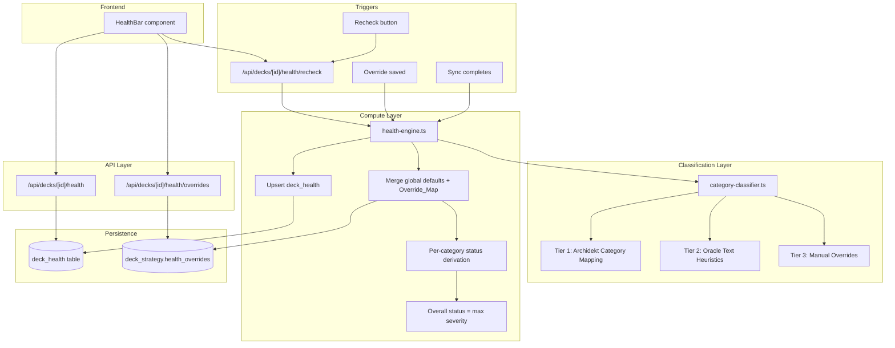

# Design Document: Monitor Mode

## Overview

Monitor Mode adds a deck health monitoring system to The Oracle. It evaluates each Commander deck's structural completeness by classifying every card into functional categories (Ramp, Draw, Removal, Interaction, Finisher, etc.) and comparing actual counts against configurable target thresholds.

The system has three layers:

1. **Category Classifier** — A three-tier pipeline (Archidekt category mapping → oracle text heuristics → manual overrides) that assigns each non-land card a single functional role.
2. **Health Engine** — Computes per-category health status (green/amber/red) by comparing actual counts against the applicable threshold set (global defaults merged with per-deck overrides). Triggered automatically after sync and on-demand via recheck.
3. **Health Bar UI** — A persistent pill strip between the deck header and tabs, showing colour-coded category health with a single contextual note for the most severe issue.

The system follows established patterns: compute logic in `src/lib/` → SQLite persistence → Next.js API routes → TanStack Query in client components.

## Architecture



### Data Flow

1. **Classification**: Card list from `deck_cards` → Category Classifier assigns one functional role per non-land card using the three-tier pipeline
2. **Health computation**: Classified counts per category → compared against merged threshold set → per-category status (green/amber/red) → overall status = most severe category
3. **Persistence**: Full result JSON + overall status + timestamp upserted into `deck_health`
4. **Display**: HealthBar fetches from `/api/decks/[id]/health` → renders pill strip + contextual note

## Components and Interfaces

### Migration: `db/migrations/012-deck-health.sql`

```sql
-- Health results table
CREATE TABLE IF NOT EXISTS deck_health (
  deck_id INTEGER PRIMARY KEY REFERENCES decks(id) ON DELETE CASCADE,
  result_json TEXT NOT NULL,          -- JSON: per-category { status, actual, min, max }
  overall_status TEXT NOT NULL CHECK(overall_status IN ('green', 'amber', 'red')),
  computed_at DATETIME NOT NULL DEFAULT CURRENT_TIMESTAMP
);

-- Threshold overrides column on deck_strategy
ALTER TABLE deck_strategy ADD COLUMN health_overrides TEXT;  -- nullable JSON
```

### Module: `src/lib/category-classifier.ts`

```typescript
// ---------------------------------------------------------------------------
// Types
// ---------------------------------------------------------------------------

export type FunctionalCategory =
  | 'Ramp'
  | 'Draw'
  | 'Removal'
  | 'Interaction'
  | 'Finisher'
  | 'Board Wipe'
  | 'Recursion'
  | 'Tutor'
  | 'Protection'
  | 'Other'

export interface CardClassification {
  cardName: string
  category: FunctionalCategory
  source: 'archidekt' | 'heuristic' | 'override'
}

export interface ManualOverrideEntry {
  cardName: string
  deckId: number
  category: FunctionalCategory
}

/** Known Archidekt category strings that map to functional roles */
export const ARCHIDEKT_CATEGORY_MAP: Record<string, FunctionalCategory> = {
  'Ramp': 'Ramp',
  'Mana': 'Ramp',
  'Draw': 'Draw',
  'Card Draw': 'Draw',
  'Card Advantage': 'Draw',
  'Removal': 'Removal',
  'Single Target Removal': 'Removal',
  'Interaction': 'Interaction',
  'Counterspell': 'Interaction',
  'Counter': 'Interaction',
  'Protection': 'Protection',
  'Board Wipe': 'Board Wipe',
  'Wrath': 'Board Wipe',
  'Finisher': 'Finisher',
  'Win Condition': 'Finisher',
  'Win Con': 'Finisher',
  'Recursion': 'Recursion',
  'Graveyard': 'Recursion',
  'Tutor': 'Tutor',
}

// ---------------------------------------------------------------------------
// Core Functions
// ---------------------------------------------------------------------------

/**
 * Classify a single card using the three-tier pipeline.
 *
 * Priority: manual override > Archidekt mapping > oracle text heuristic
 */
export function classifyCard(
  cardName: string,
  archidektCategories: string | null,
  oracleText: string | null,
  typeLine: string | null,
  overrides: Map<string, FunctionalCategory>
): CardClassification

/**
 * Classify all non-land cards in a deck.
 */
export function classifyDeck(
  cards: Array<{
    cardName: string
    categories: string | null
    oracleText: string | null
    typeLine: string | null
    isLand: boolean
  }>,
  overrides: Map<string, FunctionalCategory>
): CardClassification[]

/**
 * Tier 1: Map an Archidekt category string to a FunctionalCategory.
 * Returns null if no mapping exists.
 */
export function mapArchidektCategory(
  rawCategories: string | null
): FunctionalCategory | null

/**
 * Tier 2: Infer a FunctionalCategory from oracle text and type line.
 * Returns 'Other' if no heuristic matches.
 */
export function inferFromOracleText(
  oracleText: string | null,
  typeLine: string | null
): FunctionalCategory
```

### Module: `src/lib/health-engine.ts`

```typescript
// ---------------------------------------------------------------------------
// Types
// ---------------------------------------------------------------------------

export type HealthStatus = 'green' | 'amber' | 'red'

export interface CategoryHealth {
  category: string
  status: HealthStatus
  actual: number
  min: number
  max: number
}

export interface HealthResult {
  deckId: number
  categories: CategoryHealth[]
  overallStatus: HealthStatus
  computedAt: string  // ISO timestamp
}

export interface ThresholdEntry {
  min: number
  max: number
}

export interface ThresholdSet {
  [category: string]: ThresholdEntry
}

export interface OverrideMap {
  thresholds?: Partial<ThresholdSet>
  amber_margin?: number
}

// ---------------------------------------------------------------------------
// Constants
// ---------------------------------------------------------------------------

export const DEFAULT_AMBER_MARGIN = 1

export const DEFAULT_THRESHOLDS: ThresholdSet = {
  Ramp: { min: 10, max: 12 },
  Draw: { min: 10, max: 12 },
  Removal: { min: 6, max: 10 },
  Interaction: { min: 3, max: 5 },
  Finisher: { min: 4, max: 6 },
  'Board Wipe': { min: 2, max: 4 },
  Recursion: { min: 2, max: 5 },
  Tutor: { min: 2, max: 5 },
  Protection: { min: 2, max: 4 },
}

// ---------------------------------------------------------------------------
// Core Functions
// ---------------------------------------------------------------------------

/**
 * Compute health for a single deck.
 * 1. Classify all cards
 * 2. Count cards per category
 * 3. Merge global thresholds with per-deck overrides
 * 4. Derive per-category status
 * 5. Derive overall status
 */
export function computeHealth(
  cards: Array<{
    cardName: string
    categories: string | null
    oracleText: string | null
    typeLine: string | null
    isLand: boolean
  }>,
  overrides: Map<string, FunctionalCategory>,
  healthOverrides: OverrideMap | null
): HealthResult

/**
 * Merge global default thresholds with per-deck overrides.
 * Override values take precedence for specified categories.
 */
export function mergeThresholds(
  defaults: ThresholdSet,
  overrides: OverrideMap | null
): { thresholds: ThresholdSet; amberMargin: number }

/**
 * Determine Health_Status for a single category.
 *
 * - green: actual is within [min, max]
 * - amber: actual is within amber_margin of [min, max] boundary but outside range
 * - red: actual is further than amber_margin from the range
 */
export function deriveStatus(
  actual: number,
  min: number,
  max: number,
  amberMargin: number
): HealthStatus

/**
 * Derive overall deck health from per-category statuses.
 * Returns the most severe status across all categories.
 * Severity ordering: red > amber > green.
 */
export function deriveOverallStatus(categories: CategoryHealth[]): HealthStatus

/**
 * Select the most severe violation for the contextual note.
 *
 * Priority: red > amber. Among equal severity, the category
 * furthest from its target range wins.
 */
export function selectMostSevereViolation(
  categories: CategoryHealth[]
): CategoryHealth | null

/**
 * Generate a plain-language contextual note for a violation.
 * Includes category name, actual count, and expected range.
 */
export function formatContextualNote(violation: CategoryHealth): string
```

### Module: `src/lib/health-store.ts`

```typescript
import type Database from 'better-sqlite3'
import type { HealthResult } from './health-engine'

/**
 * Upsert a health result into the deck_health table.
 * Replaces any previous result for the same deck.
 */
export function upsertHealthResult(db: Database.Database, result: HealthResult): void

/**
 * Read the stored health result for a deck.
 * Returns null if no result exists.
 */
export function getHealthResult(db: Database.Database, deckId: number): HealthResult | null

/**
 * Read health overrides from deck_strategy for a deck.
 * Returns null if no overrides are configured.
 */
export function getHealthOverrides(db: Database.Database, deckId: number): import('./health-engine').OverrideMap | null

/**
 * Save health overrides to deck_strategy for a deck.
 */
export function saveHealthOverrides(
  db: Database.Database,
  deckId: number,
  overrides: import('./health-engine').OverrideMap
): void

/**
 * Remove health overrides for a deck (revert to global defaults).
 */
export function clearHealthOverrides(db: Database.Database, deckId: number): void
```

### API Routes

#### `src/app/api/decks/[id]/health/route.ts`

```typescript
export async function GET(
  request: NextRequest,
  { params }: { params: Promise<{ id: string }> }
): Promise<Response>
// Returns: HealthResult | 400 (invalid ID) | 404 (no health data)
```

#### `src/app/api/decks/[id]/health/recheck/route.ts`

```typescript
export async function POST(
  request: NextRequest,
  { params }: { params: Promise<{ id: string }> }
): Promise<Response>
// Triggers recomputation, upserts result, returns updated HealthResult
// Returns: HealthResult | 400 | 404
```

#### `src/app/api/decks/[id]/health/overrides/route.ts`

```typescript
export async function GET(
  request: NextRequest,
  { params }: { params: Promise<{ id: string }> }
): Promise<Response>
// Returns: { overrides: OverrideMap | null } | 400 | 404

export async function PUT(
  request: NextRequest,
  { params }: { params: Promise<{ id: string }> }
): Promise<Response>
// Accepts: OverrideMap
// Saves overrides, triggers recomputation, returns updated HealthResult
// Returns: HealthResult | 400 | 404

export async function DELETE(
  request: NextRequest,
  { params }: { params: Promise<{ id: string }> }
): Promise<Response>
// Clears overrides, triggers recomputation, returns updated HealthResult
// Returns: HealthResult | 400 | 404
```

### UI Component: `src/components/HealthBar.tsx`

```typescript
interface HealthBarProps {
  deckId: number
}

// Query key: ['decks', deckId, 'health']
// staleTime: 5 * 60 * 1000
// Renders: pill strip + contextual note + recheck button
// States: loading | error | healthy (all green) | issues (amber/red present)
```

**Visual spec:**
- Container: full-width bar between deck header and tab strip, subtle border-b
- Pills: inline-flex row of rounded badges, each showing category name + count
  - Green: `bg-emerald-500/15 text-emerald-700`
  - Amber: `bg-amber-500/15 text-amber-700`
  - Red: `bg-red-500/15 text-red-700`
- Contextual note: single-line text below the pills, only shown when issues exist
- Recheck button: icon button (RefreshCw) at the right end of the pill row

**Interactions:**
- Click pill → smooth scroll to corresponding category section (using `scrollIntoView`)
- Click recheck → POST to `/health/recheck`, show loading spinner on button, invalidate query on completion

## Data Models

### `deck_health` Table

| Column | Type | Constraints | Notes |
|--------|------|-------------|-------|
| deck_id | INTEGER | PK, FK → decks(id) ON DELETE CASCADE | One row per deck |
| result_json | TEXT | NOT NULL | JSON array of CategoryHealth objects |
| overall_status | TEXT | NOT NULL, CHECK('green','amber','red') | Derived from max severity |
| computed_at | DATETIME | NOT NULL, DEFAULT CURRENT_TIMESTAMP | Last computation time |

### `deck_strategy.health_overrides` Column

| Column | Type | Constraints | Notes |
|--------|------|-------------|-------|
| health_overrides | TEXT | nullable | JSON OverrideMap or null |

### `OverrideMap` JSON Schema

```json
{
  "thresholds": {
    "Ramp": { "min": 8, "max": 10 },
    "Draw": { "min": 12, "max": 14 }
  },
  "amber_margin": 2
}
```

Only categories present in `thresholds` are overridden; all others use global defaults.

### `HealthResult` JSON (stored in `result_json`)

```json
[
  { "category": "Ramp", "status": "green", "actual": 11, "min": 10, "max": 12 },
  { "category": "Draw", "status": "amber", "actual": 9, "min": 10, "max": 12 },
  { "category": "Removal", "status": "red", "actual": 3, "min": 6, "max": 10 }
]
```

### Status Derivation Rules

Given `actual`, `min`, `max`, and `amberMargin` (default 1):

| Condition | Status |
|-----------|--------|
| `min <= actual <= max` | green |
| `(min - amberMargin) <= actual < min` OR `max < actual <= (max + amberMargin)` | amber |
| `actual < (min - amberMargin)` OR `actual > (max + amberMargin)` | red |

### Category Classification Heuristics (Tier 2)

| Pattern | Category |
|---------|----------|
| Type contains "Land" | Skip (not classified) |
| Oracle text matches `/add \{[WUBRGC]\}/i` or `/adds? .* mana/i` | Ramp |
| Oracle text matches `/draw .* card/i` or type contains "draw" | Draw |
| Oracle text matches `/destroy target/i` or `/exile target/i` or `/-\d+\/-\d+/` | Removal |
| Oracle text matches `/counter target .* spell/i` | Interaction |
| Oracle text matches `/each opponent/i` or type matches creature with power >= 6 | Finisher |
| Oracle text matches `/destroy all/i` or `/exile all/i` or `/each creature/i` | Board Wipe |
| Oracle text matches `/from .* graveyard .* to/i` or `/return .* from .* graveyard/i` | Recursion |
| Oracle text matches `/search .* library/i` | Tutor |
| Oracle text matches `/hexproof/i` or `/indestructible/i` or `/protection from/i` | Protection |
| No match | Other |

### Most-Severe Violation Selection Algorithm

```typescript
function selectMostSevereViolation(categories: CategoryHealth[]): CategoryHealth | null {
  const violations = categories.filter(c => c.status !== 'green')
  if (violations.length === 0) return null

  return violations.sort((a, b) => {
    // 1. Red > Amber
    const severityOrder = { red: 2, amber: 1, green: 0 }
    const sevDiff = severityOrder[b.status] - severityOrder[a.status]
    if (sevDiff !== 0) return sevDiff

    // 2. Among equal severity, furthest from target range
    const distA = a.actual < a.min ? a.min - a.actual : a.actual - a.max
    const distB = b.actual < b.min ? b.min - b.actual : b.actual - b.max
    return distB - distA
  })[0]
}
```

## Error Handling

| Scenario | Component | Behavior |
|----------|-----------|----------|
| Deck not found | API routes | Return 404 with `{ error: 'Deck not found' }` |
| Invalid deck ID (non-integer) | API routes | Return 400 with `{ error: 'Invalid deck ID' }` |
| No health data computed yet | GET /health | Return 404 with `{ error: 'No health data. Run a recheck.' }` |
| Health overrides JSON malformed | health-engine | Ignore overrides, use global defaults, log warning |
| Card has no oracle text or type line | category-classifier | Classify as 'Other' |
| Archidekt categories JSON parse fails | category-classifier | Fall through to Tier 2 heuristic |
| Recheck fails mid-computation | POST /health/recheck | Return 500, preserve existing health data |
| Health API fetch fails | HealthBar component | Show subtle error state, hide pills |
| Recheck takes > 5s | HealthBar component | Continue showing loading spinner until complete |

## Correctness Properties

*A property is a characteristic or behavior that should hold true across all valid executions of a system — essentially, a formal statement about what the system should do. Properties serve as the bridge between human-readable specifications and machine-verifiable correctness guarantees.*

### Property 1: Health Result JSON Round-Trip

*For any* valid health result array containing per-category objects with status, actual count, min, and max values, serializing to JSON and deserializing back SHALL produce a deeply equal array.

**Validates: Requirements 1.2**

### Property 2: Overall Status Derivation

*For any* non-empty array of CategoryHealth objects, the derived overall status SHALL equal the most severe status present in the array (red > amber > green). If any category is red, overall is red; else if any is amber, overall is amber; else green.

**Validates: Requirements 1.4**

### Property 3: Upsert Idempotence

*For any* deck and any two sequential health computations producing different results, the Health_Store SHALL contain exactly one record for that deck after both computations, and that record SHALL reflect the second (latest) computation.

**Validates: Requirements 1.5**

### Property 4: Threshold Merge Precedence

*For any* global default ThresholdSet and any partial OverrideMap specifying a subset of categories, the merged result SHALL contain override values for categories present in the OverrideMap and global default values for all other categories. The total set of categories in the merged result SHALL be the union of both.

**Validates: Requirements 2.2, 2.3**

### Property 5: Classification Priority Order

*For any* card where a manual override exists, the classification result SHALL equal the override value regardless of what Archidekt category or heuristic would produce. For any card without an override but with a recognized Archidekt category, the result SHALL be the Archidekt mapping. For any card with neither, the result SHALL come from oracle text heuristics.

**Validates: Requirements 3.1, 3.2, 3.3, 3.4**

### Property 6: Classification Cardinality Invariant

*For any* non-land card processed by the Category Classifier, the output SHALL be exactly one FunctionalCategory assignment. No card SHALL receive zero or multiple primary categories.

**Validates: Requirements 3.5**

### Property 7: Status Derivation Correctness

*For any* tuple of (actual count, min threshold, max threshold, amber margin) where min <= max and amber margin >= 0, the derived status SHALL be:
- green when min <= actual <= max
- amber when (min - margin) <= actual < min OR max < actual <= (max + margin)
- red when actual < (min - margin) OR actual > (max + margin)

**Validates: Requirements 4.5**

### Property 8: Silent When Healthy

*For any* HealthResult where all categories have status 'green', the contextual note selection function SHALL return null (no note to display).

**Validates: Requirements 6.1**

### Property 9: Most Severe Violation Selection

*For any* HealthResult containing at least one non-green category, the selected violation SHALL have severity >= all other violations (red > amber), and among violations of equal severity, it SHALL have the greatest distance from its target range.

**Validates: Requirements 6.2, 6.3**

### Property 10: Contextual Note Content Completeness

*For any* CategoryHealth violation (non-green), the generated contextual note string SHALL contain: the category name, the actual count as a number, and both min and max of the expected range.

**Validates: Requirements 6.4**

### Property 11: Override Removal Reverts to Default

*For any* category that previously had a threshold override but the override is removed, the merged threshold for that category SHALL equal the global default. The absence of a key in the OverrideMap thresholds SHALL be equivalent to using the default value.

**Validates: Requirements 7.4**

## Testing Strategy

### Property-Based Tests (fast-check + Vitest)

File: `src/lib/__tests__/health-engine.property.test.ts`

All 11 correctness properties implemented as property-based tests. Minimum 100 iterations per property.

**Generators needed:**
- `arbCategoryHealth()` — generates valid CategoryHealth objects with random status, actual, min, max
- `arbHealthResult()` — generates arrays of CategoryHealth (1-10 categories)
- `arbThresholdSet()` — generates valid ThresholdSet with random min/max per category
- `arbOverrideMap()` — generates partial OverrideMap with random subset of categories
- `arbCardForClassification()` — generates cards with random Archidekt categories, oracle text, overrides
- `arbStatusInput()` — generates (actual, min, max, margin) tuples with valid constraints

### Unit Tests

File: `src/lib/__tests__/health-engine.test.ts`

- Specific examples of status derivation edge cases (exactly at boundary, exactly at margin)
- Oracle text heuristic classification for known cards
- Archidekt category mapping for known category strings
- Contextual note formatting for specific violation scenarios

### Integration Tests

- Sync triggers health recomputation
- API routes return correct responses for valid/invalid inputs
- Health overrides persist and affect subsequent computations
