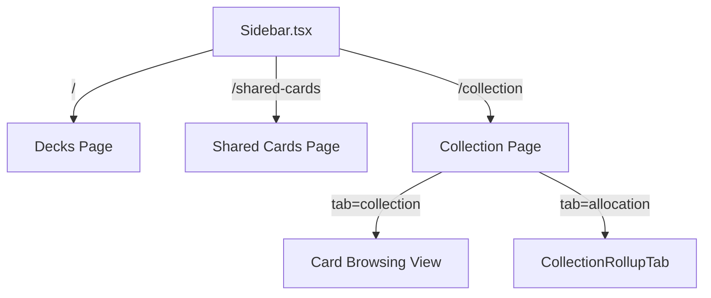
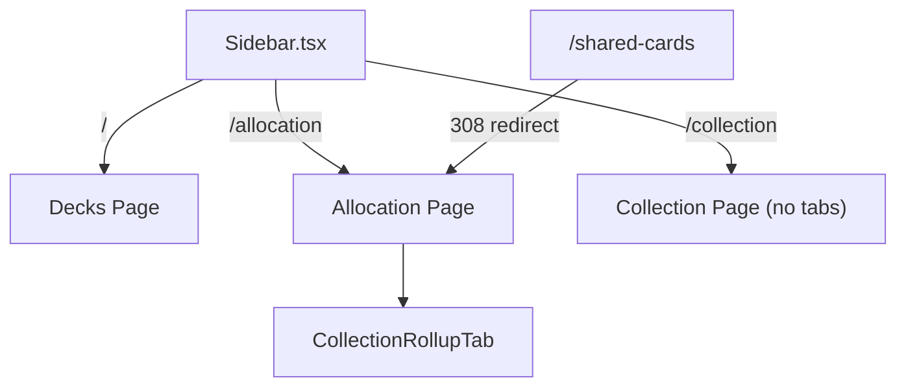

# Design Document: Nav Split Collection & Allocation

## Overview

This feature restructures The Oracle's primary navigation by splitting the Collection and Allocation concerns into two independent top-level routes. Currently, the Collection page at `/collection` hosts both card browsing and allocation as internal tabs (via `<Tabs>` component), while a separate "Shared Cards" nav entry exists at `/shared-cards`.

After this change:
- **Collection** (`/collection`) — focused solely on browsing owned cards (grid view, list/printing view, filtering, sorting). No tabs.
- **Allocation** (`/allocation`) — a new top-level page rendering the existing `CollectionRollupTab` content (two-pane rollup UI with instance detail panel and bulk actions).
- **Shared Cards** nav item is removed; its route redirects to `/allocation`.

The change is purely structural — no new data fetching, APIs, or business logic. The `CollectionRollupTab` component is reused as-is on the new Allocation page.

## Architecture

### Current State



### Target State



### Key Architectural Decisions

1. **Reuse `CollectionRollupTab` directly** — The component is already self-contained (owns its own data fetching via `useQuery`, manages its own layout state). It can be mounted directly in the new Allocation page without any props or lifting state.

2. **Next.js App Router redirect** — Use `next.config.ts` or a `redirect()` in the route handler for the 308 permanent redirect from `/shared-cards` → `/allocation`. A `next.config.ts` redirect is preferred since it handles the redirect at the framework level without needing a page component.

3. **Remove tab state from Collection page** — The `useSearchParams`/`router` logic for `?tab=` is removed. The URL param is ignored (no redirect, just not read). This keeps the URL clean and avoids breaking any deep links that happen to have the param.

4. **Nav item order preserved** — The `navItems` array in `Sidebar.tsx` is updated to replace "Shared Cards" with "Allocation" at the same index position, maintaining spatial consistency for users.

## Components and Interfaces

### Modified Components

| Component | Change |
|-----------|--------|
| `Sidebar.tsx` | Replace "Shared Cards" nav item with "Allocation" (`href: '/allocation'`, `label: 'Allocation'`). Keep `Copy` icon. |
| `app/collection/page.tsx` | Remove `Tabs`, `TabsList`, `TabsTrigger`, `TabsContent` imports and usage. Remove `CollectionRollupTab` import. Remove `activeTab`/`handleTabChange` state. Remove `useSearchParams`/`useRouter` for tab param. Page renders the browsing view directly. |

### New Components

| Component | Purpose |
|-----------|---------|
| `app/allocation/page.tsx` | New page component. Renders page header ("Allocation") + `<CollectionRollupTab />`. Includes loading/error boundary files. |
| `app/allocation/loading.tsx` | Loading skeleton consistent with other pages. |
| `app/allocation/error.tsx` | Error boundary (client component) with retry button. |

### Removed Components/Routes

| Item | Action |
|------|--------|
| `app/shared-cards/page.tsx` | Replaced by redirect config. File can be deleted after redirect is in place. |
| `app/shared-cards/loading.tsx` | Deleted (redirect doesn't need loading state). |
| `app/shared-cards/error.tsx` | Deleted. |
| `app/shared-cards/page.test.tsx` | Deleted or updated to test redirect behavior. |

### Redirect Configuration

In `next.config.ts` (or `next.config.mjs`):

```typescript
redirects: async () => [
  {
    source: '/shared-cards',
    destination: '/allocation',
    permanent: true, // 308
  },
],
```

## Data Models

No data model changes. The feature is purely a navigation/routing restructuring. All existing API endpoints (`/api/collection/rollup-v2`, `/api/collection/instances/:oracleId/ids`, `/api/shared-cards`) remain unchanged.

The `CollectionRollupTab` component continues to fetch from `/api/collection/rollup-v2` with the same query key `['collection', 'rollup-v2']`.

## Error Handling

- **Allocation page error boundary** (`app/allocation/error.tsx`): Client component that catches runtime errors in the allocation page tree. Displays a retry button that calls `reset()`. Follows the same pattern as `app/collection/error.tsx`.

- **Legacy URL handling** (`/collection?tab=allocation`): The tab query parameter is simply not read. No error, no redirect — the page renders the collection browsing view. This is the least disruptive approach for any cached/bookmarked URLs.

- **Redirect error handling**: The Next.js framework-level redirect in `next.config.ts` handles `/shared-cards` → `/allocation` before any page component mounts. No application-level error handling needed.

## Testing Strategy

### Why Property-Based Testing Does Not Apply

This feature is a **UI navigation restructuring** — it moves existing components between routes and updates a navigation menu. There are:
- No pure functions with varying input spaces
- No data transformations or algorithms
- No serialization/parsing
- No business logic that varies meaningfully with input

All acceptance criteria test specific routes rendering specific DOM elements. **Example-based unit tests and integration tests** are the appropriate testing strategy.

### Unit Tests (Component Level)

| Test | Validates |
|------|-----------|
| Sidebar renders "Allocation" nav item with correct href | Req 2.1 |
| Sidebar does NOT render "Shared Cards" nav item | Req 2.2 |
| "Allocation" nav item appears between "Decks" and "Collection" | Req 2.3 |
| "Allocation" nav item shows active state when pathname is `/allocation` | Req 2.5 |
| Collection page renders without tab navigation | Req 1.1 |
| Collection page retains grid/list view toggle, search, sort, filters | Req 1.2 |
| Collection page does not render `CollectionRollupTab` | Req 1.3 |
| Collection page ignores `?tab=allocation` param | Req 1.4 |
| Allocation page renders `CollectionRollupTab` content | Req 3.1 |
| Allocation page has "Allocation" heading | Req 3.2 |
| Allocation page shows loading skeleton when data is loading | Req 3.3 |
| Allocation page shows error state on fetch failure | Req 3.3 |
| Allocation page uses max-width container and dark background | Req 3.4 |
| "Allocation" nav item uses Copy icon with size-5 and strokeWidth 1.5 | Req 5.1, 5.2 |

### Integration Tests (Route Level)

| Test | Validates |
|------|-----------|
| GET `/shared-cards` returns 308 redirect to `/allocation` | Req 4.1, 4.2 |
| Navigation to `/allocation` renders the allocation rollup UI | Req 2.4, 3.1 |

### Test Tooling

- **Vitest** + **React Testing Library** for component unit tests
- **Next.js redirect tests** via the config or route-level assertions
- Run with `vitest --run` for CI (no watch mode)
