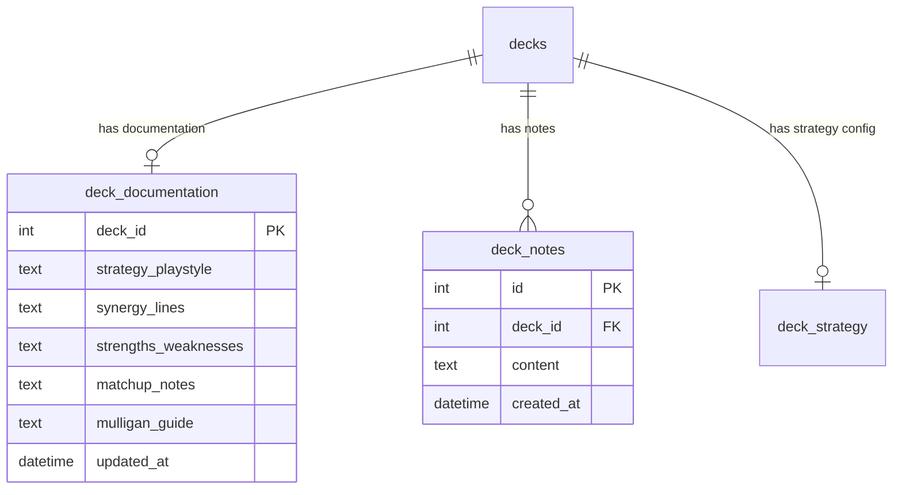

# Design Document: Remove Notion Dependency

## Overview

This feature replaces all Notion integration in The Oracle with native SQLite storage for deck documentation and notes. The change is primarily a plumbing migration — no new algorithms, just redirecting write targets from an external API to local tables, backfilling existing content, and deleting dead code.

**Key decisions:**
- Two new tables (`deck_documentation`, `deck_notes`) follow the existing content-table pattern (keyed by `deck_id`, CASCADE delete)
- A new data-access module (`deck-documentation-store.ts`) encapsulates all reads/writes
- Existing note formatting functions (`formatChangeLogEntry`, `formatDebriefNotionEntry`) are preserved — only the write target changes
- The backfill script is a one-time utility run before code deletion
- Migration 024 creates tables; migration 025 drops `notion_deck_map` (run after backfill)

## Architecture

```mermaid
graph TD
    subgraph "Before (Notion)"
        A[debrief/action route] -->|appendNotionNotes| N[Notion API]
        B[upgrade/apply route] -->|appendNotionNotes| N
        C[upgrade/skip route] -->|appendNotionNotes| N
        D[/api/notion/sync] -->|syncDecksToNotion| N
    end

    subgraph "After (Local SQLite)"
        A2[debrief/action route] -->|appendNote| S[deck-documentation-store.ts]
        B2[upgrade/apply route] -->|appendNote| S
        C2[upgrade/skip route] -->|appendNote| S
        E[/api/decks/:id/documentation] -->|get/put| S
        F[/api/decks/:id/notes] -->|get/post| S
        S --> DB[(SQLite: deck_documentation + deck_notes)]
    end
```

**Data flow (post-migration):**
1. AI generation routes write notes → `deck_notes` table via `appendNote()`
2. Strategy tab reads documentation → `deck_documentation` table via `getDocumentation()`
3. Strategy tab edits documentation → `deck_documentation` table via `upsertDocumentation()`
4. Strategy tab reads notes → `deck_notes` table via `getNotes()`

## Components and Interfaces

### 1. Migration SQL (024-deck-documentation.sql)

Creates the new tables. Follows existing migration pattern (IF NOT EXISTS, FK with CASCADE).

### 2. Migration SQL (025-drop-notion-deck-map.sql)

Drops the `notion_deck_map` table. Run after backfill is confirmed successful.

### 3. Data Access Module: `src/lib/deck-documentation-store.ts`

Exports:

```typescript
// Documentation (deck_documentation table)
export function getDocumentation(deckId: number): DeckDocumentation | null
export function upsertDocumentation(deckId: number, fields: Partial<DeckDocumentationFields>): void

// Notes (deck_notes table)
export function getNotes(deckId: number, limit?: number): DeckNote[]
export function appendNote(deckId: number, content: string): number  // returns inserted id
```

Interfaces:

```typescript
export interface DeckDocumentation {
  deck_id: number
  strategy_playstyle: string | null
  synergy_lines: string | null
  strengths_weaknesses: string | null
  matchup_notes: string | null
  mulligan_guide: string | null
  updated_at: string
}

export type DeckDocumentationFields = Omit<DeckDocumentation, 'deck_id' | 'updated_at'>

export interface DeckNote {
  id: number
  deck_id: number
  content: string
  created_at: string
}
```

### 4. API Route: `GET /api/decks/[id]/documentation`

Returns the `deck_documentation` row for the deck, or `{ documentation: null }` if none exists.

### 5. API Route: `PUT /api/decks/[id]/documentation`

Accepts partial updates to documentation fields. Uses INSERT OR REPLACE (upsert) semantics. Validates `synergy_lines` is valid JSON array if non-null.

### 6. API Route: `GET /api/decks/[id]/notes`

Returns notes for the deck ordered by `created_at DESC`. Accepts optional `?limit=N` query param.

### 7. API Route: `POST /api/decks/[id]/notes`

Appends a new note. Validates content is non-blank (at least one non-whitespace char). Returns the inserted note row.

### 8. Backfill Script: `scripts/backfill-notion-to-local.ts`

One-time migration utility:
1. Reads all rows from `notion_deck_map`
2. For each mapping, calls `NotionClient.getPageContent(pageId)`
3. Parses markdown sections by heading (`## Strategy & Playstyle`, etc.)
4. Writes extracted sections to `deck_documentation` via INSERT OR REPLACE
5. Extracts trailing note blocks and inserts into `deck_notes`
6. Logs errors per-deck, continues on failure
7. Prints summary at completion

### 9. Modified Routes (redirect write targets)

| Route | Current call | Replacement |
|-------|-------------|-------------|
| `src/app/api/ai/debrief/action/route.ts` | `appendNotionNotes(deckId, notionEntry)` | `appendNote(deckId, notionEntry)` |
| `src/app/api/decks/[id]/upgrade/apply/route.ts` | `appendNotionNotes(deckId, formattedEntry)` | `appendNote(deckId, formattedEntry)` |
| `src/app/api/decks/[id]/upgrade/skip/route.ts` | `appendNotionNotes(deckId, formattedEntry)` | `appendNote(deckId, formattedEntry)` |

The formatted content string is identical — only the write target changes. The `formatChangeLogEntry` and `formatDebriefNotionEntry` functions are preserved unchanged.

### 10. Files and Routes to Delete

| Path | Reason |
|------|--------|
| `src/lib/notion-sync.ts` | Core Notion integration module |
| `src/lib/notion-sync.test.ts` | Tests for deleted module |
| `src/lib/deck-list-integration.test.ts` | Tests that depend on Notion client |
| `src/lib/write-deck-list-section.test.ts` | Tests for Notion section writer |
| `src/app/api/notion/sync/route.ts` | Notion sync endpoint |
| `src/app/api/notion/sync/[deckId]/route.ts` | Single-deck Notion sync endpoint |
| `src/app/api/notion/notes/route.ts` | Notion notes endpoint |
| `src/test/migrations.test.ts` (notion_deck_map tests) | Remove specific test cases that reference notion_deck_map |

Additionally:
- Remove `NOTION_*` references from `.env.local.example`
- Remove `@notionhq/client` from `package.json` if present
- Remove Notion error state references from any conversational commands documentation

### 11. `sync-engine.ts` Changes

The `SyncCycleResult` interface has `notionUpdates: number` — this field becomes a no-op (always 0). Keep the field for backwards compat of the sync_runs JSON details, or remove it. Recommend removing since nothing reads it from stored JSON.

The `DeckSyncResult` interface has `notionUpdated: boolean` — same treatment: remove.

## Data Models

### deck_documentation

```sql
CREATE TABLE IF NOT EXISTS deck_documentation (
  deck_id INTEGER PRIMARY KEY REFERENCES decks(id) ON DELETE CASCADE,
  strategy_playstyle TEXT,
  synergy_lines TEXT,
  strengths_weaknesses TEXT,
  matchup_notes TEXT,
  mulligan_guide TEXT,
  updated_at DATETIME DEFAULT CURRENT_TIMESTAMP
);
```

**Constraints:**
- `synergy_lines` must be a valid JSON array when non-NULL (enforced at application layer via CHECK or app validation)
- `updated_at` is set on every write (application sets `datetime('now')` on upsert)

### deck_notes

```sql
CREATE TABLE IF NOT EXISTS deck_notes (
  id INTEGER PRIMARY KEY AUTOINCREMENT,
  deck_id INTEGER NOT NULL REFERENCES decks(id) ON DELETE CASCADE,
  content TEXT NOT NULL,
  created_at DATETIME DEFAULT CURRENT_TIMESTAMP
);

CREATE INDEX IF NOT EXISTS idx_deck_notes_deck_id ON deck_notes(deck_id);
```

**Constraints:**
- `content` NOT NULL and validated non-blank at application layer
- Append-only: no UPDATE or DELETE operations exposed via the data access module

### Entity Relationship (relevant subset)



## Correctness Properties

*A property is a characteristic or behavior that should hold true across all valid executions of a system — essentially, a formal statement about what the system should do. Properties serve as the bridge between human-readable specifications and machine-verifiable correctness guarantees.*

### Property 1: synergy_lines JSON validation

*For any* non-NULL string written to the `synergy_lines` column, the string SHALL be a parseable JSON array (i.e., `JSON.parse(value)` succeeds and `Array.isArray(result)` is true). Conversely, for any string that is NOT a valid JSON array, the write SHALL be rejected.

**Validates: Requirements 1.4**

### Property 2: Notes append-only invariant

*For any* sequence of `appendNote` calls with valid content and a valid deck_id, each call SHALL insert a new row into `deck_notes` without modifying or deleting any previously existing rows. The total row count for that deck_id SHALL equal the number of successful append calls made.

**Validates: Requirements 2.2**

### Property 3: Whitespace-only content rejection

*For any* string composed entirely of whitespace characters (spaces, tabs, newlines, carriage returns, or any combination thereof), calling `appendNote` with that string SHALL return an error and NOT insert a row into `deck_notes`.

**Validates: Requirements 2.3**

### Property 4: Notes retrieval ordering

*For any* deck_id with one or more notes, calling `getNotes(deckId)` SHALL return notes such that for every adjacent pair (note[i], note[i+1]) in the result array, `note[i].created_at >= note[i+1].created_at` (descending chronological order).

**Validates: Requirements 2.6**

### Property 5: Backfill section parsing

*For any* well-formed markdown page containing zero or more of the known section headings (`## Strategy & Playstyle`, `## Key Synergy Lines`, `## Strengths & Weaknesses`, `## Matchup Notes`, `## Mulligan Guide`), the backfill parser SHALL extract the content body of each present heading into the corresponding `deck_documentation` column, and leave columns NULL for headings not present.

**Validates: Requirements 3.2, 3.3**

### Property 6: Backfill idempotency

*For any* set of Notion page content, running the backfill script N times (N ≥ 1) SHALL produce the same `deck_documentation` row state as running it once. The row count for each deck_id in `deck_documentation` SHALL always be exactly 0 or 1.

**Validates: Requirements 3.7**

## Error Handling

| Scenario | Handling |
|----------|----------|
| `appendNote` called with blank content | Return `{ error: 'Content must not be blank' }`, HTTP 400. Do not insert. |
| `appendNote` called with non-existent deck_id | SQLite FK constraint error caught → return `{ error: 'Deck not found' }`, HTTP 404. |
| `upsertDocumentation` with invalid JSON in synergy_lines | Validate before write → return `{ error: 'synergy_lines must be a valid JSON array' }`, HTTP 400. |
| `getNotes` / `getDocumentation` for deck with no data | Return null/empty array — not an error (empty state). |
| DB write failure in route handlers (debrief, upgrade) | `console.error()` the failure, continue returning success to caller. Notes are non-blocking. Matches existing fire-and-forget pattern. |
| Backfill script: Notion fetch fails for one deck | Log error with deck ID/name, continue to next deck. Report in final summary. |
| Backfill script: markdown parsing finds no sections | Leave all documentation columns as NULL for that deck. Not an error. |

## Testing Strategy

**Unit tests** (example-based):
- Migration creates correct table schemas
- CASCADE deletes propagate correctly
- API routes return correct HTTP status codes for valid/invalid inputs
- Route handlers no longer import `appendNotionNotes`
- `upsertDocumentation` correctly handles partial updates
- Backfill summary reports correct counts

**Property-based tests** (using `fast-check`):
- Property 1: Generate random strings, verify JSON array validation (min 100 iterations)
- Property 2: Generate random sequences of valid notes, verify append-only invariant (min 100 iterations)
- Property 3: Generate random whitespace strings, verify rejection (min 100 iterations)
- Property 4: Insert random numbers of notes, verify ordering invariant (min 100 iterations)
- Property 5: Generate random markdown with/without known headings, verify parsing (min 100 iterations)
- Property 6: Run backfill parser multiple times on same input, verify idempotency (min 100 iterations)

**Tag format for property tests:**
```
// Feature: remove-notion-dependency, Property 1: synergy_lines JSON validation
```

**Integration tests:**
- Full endpoint round-trip: POST note → GET notes → verify in response
- Strategy tab endpoint returns documentation from local DB
- Application starts without NOTION_* env vars and serves all routes

**Smoke tests:**
- Migration 024 applies cleanly on fresh DB
- Migration 025 drops notion_deck_map
- No `notion-sync.ts` file exists post-removal
- No `/api/notion/` routes exist post-removal
- No `NOTION_*` references in source code post-removal
