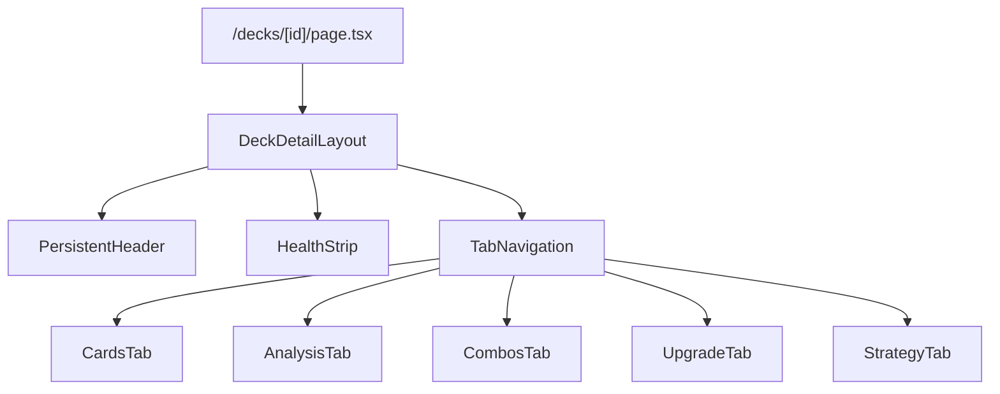
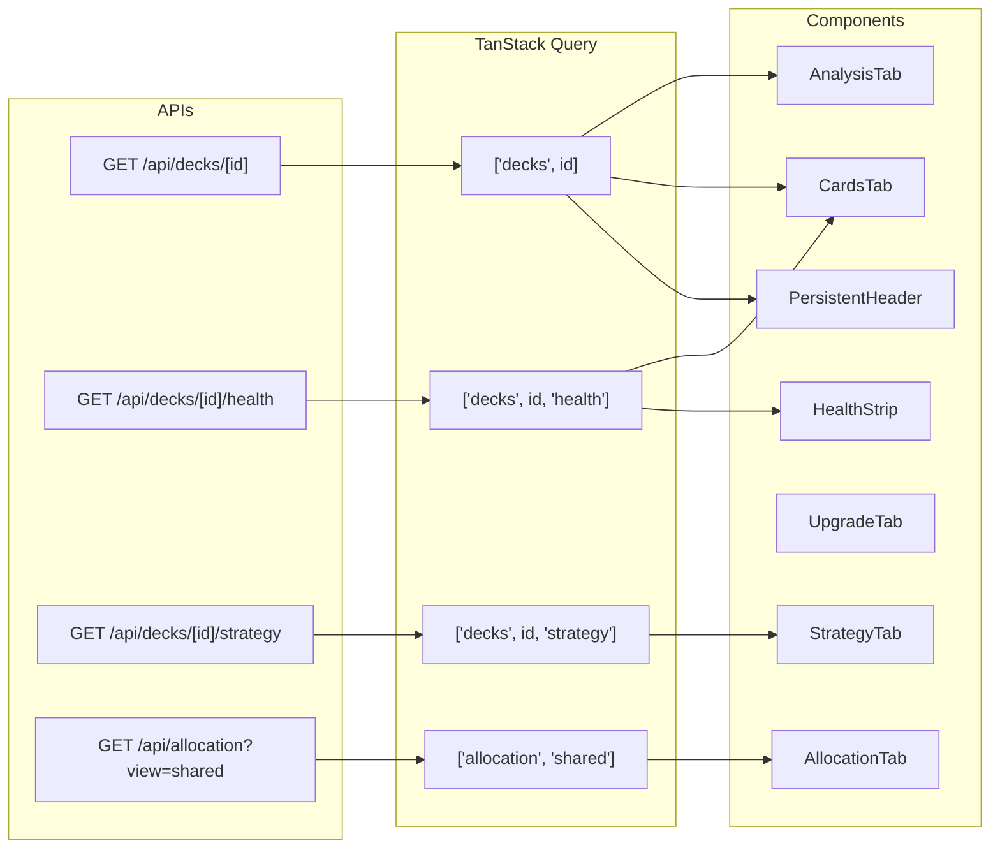

# Design Document: UI Overhaul

## Overview

This design restructures The Oracle's deck detail page from an 8-tab layout into a focused 5-tab layout with a persistent header and health strip. It also updates dashboard tiles, the collection view (adding an Allocation tab), and introduces two new shared components (OwnershipBadge, ConflictAlert). The design system is formalised with CSS custom properties aligned to the oracle-ui-spec.md colour palette.

All data flows are client-side — existing backend APIs serve all required data. No new API endpoints are needed. The work is purely React component architecture, state management via TanStack Query, and Tailwind CSS styling.

### Key Design Decisions

1. **Persistent header uses sticky positioning** — `position: sticky; top: 0` on the header + health strip container, with tab content scrolling independently beneath.
2. **Cards tab merges list + grid** — a single tab with a toggle component, sharing a common data layer and filter state. Eliminates context-switching.
3. **Analysis tab consolidates Overview + Mana** — all read-only analytics in one view, reducing cognitive load.
4. **Strategy tab absorbs Categories** — category management lives alongside deck intent and precon mod tracking.
5. **Component-first approach** — OwnershipBadge and ConflictAlert are standalone, reusable components used across Cards, Upgrade, and Allocation tabs.
6. **Design tokens as CSS custom properties** — enables runtime theming and consistent access from both Tailwind utilities and component styles.

## Architecture

### Page Structure



### Data Flow



### Component Mapping (Old → New)

| Old Component | New Location | Changes |
|---|---|---|
| `src/app/decks/[id]/page.tsx` | Same path, rewritten | 8 tabs → 5 tabs, sticky header, health strip |
| `DeckListTable.tsx` | `CardsTab` (list view) | Restyled rows with OwnershipBadge, category collapse |
| `CardGrid.tsx` | `CardsTab` (grid view) | 5-col grid, corner dots, category grouping preserved |
| `OverviewPanel.tsx` | `AnalysisTab` | Stat cards + attribute ratings merged into new layout |
| `ManaCurvePanel.tsx` | `AnalysisTab` | Embedded as right-column panel |
| `CategoriesPanel.tsx` | `StrategyTab` | Category manager section |
| `StrategyCanvas.tsx` | `StrategyTab` | Deck intent section; precon mod tracker added |
| `CombosPanel.tsx` | `CombosTab` | Unchanged (restyled to match design system) |
| `UpgradePanel.tsx` | `UpgradeTab` | Expanded with debrief banner, change log, ConflictAlert |
| `DeckTile.tsx` | Same path, enhanced | Health pips, proxy count, hover actions |
| `src/app/collection/page.tsx` | Same path, tabs added | "Collection" + "Allocation" tabs |

## Components and Interfaces

### New Components

#### `PersistentHeader`

```typescript
interface PersistentHeaderProps {
  deck: Deck
  commander: DeckCard | undefined
  totalCards: number
  proxyCount: number
}
```

Renders: commander avatar (36px circle), deck name (16px/500), precon mod badge (conditional), card/proxy/bracket stats, "Post-game debrief" button, "Open in Archidekt" link.

#### `HealthStrip`

```typescript
interface HealthCategory {
  name: string           // "Ramp", "Draw", "Removal", "Lands", "Win conditions"
  count: number
  threshold: number
  status: 'ok' | 'warn' | 'crit'
}

interface HealthStripProps {
  deckId: number
  categories: HealthCategory[]
  onPillClick: (category: string) => void
}
```

Fetches from `GET /api/decks/[id]/health`. Each pill is a button that triggers navigation to the Cards tab and scrolls to the category. Contextual note renders right-aligned when violations exist.

#### `HealthPill`

```typescript
interface HealthPillProps {
  category: HealthCategory
  onClick: () => void
}
```

Stateless pill component. Icons: `Check` (ok), `AlertTriangle` (warn), `AlertCircle` (crit) from lucide-react.

#### `OwnershipBadge`

```typescript
type OwnershipStatus = 'original' | 'proxy' | 'not_owned'

interface OwnershipBadgeProps {
  status: OwnershipStatus
  holderDeckName?: string  // for proxy tooltip
}
```

Three visual states with symbols (●, ◐, ○) ensuring colour is never the sole differentiator. Proxy state is interactive — shows tooltip on activation.

#### `ConflictAlert`

```typescript
interface ConflictAlertProps {
  conflictDeckName: string
  cardName: string
}
```

Inline amber warning rendered below upgrade recommendations when adding a card would create a proxy conflict in another deck.

#### `CardsTab`

```typescript
interface CardsTabProps {
  cards: DeckCard[]
  deckId: number
  healthCategories: HealthCategory[]
  scrollToCategory?: string | null
}
```

Manages local state: view toggle (list/grid), search filter, ownership filter, sort. Default view is list.

#### `AllocationTab`

```typescript
interface AllocationRow {
  card_name: string
  scryfall_id: string
  decks: Record<number, 'original' | 'proxy' | null>
  has_conflict: boolean
}

interface AllocationTabProps {
  // Data fetched internally via useQuery
}
```

Fetches from `GET /api/allocation?view=shared`. Sidebar filter, paginated table (100 rows), reassign action calls `POST /api/allocation/reassign`.

### Modified Components

#### `DeckTile` (enhanced)

New props:

```typescript
interface DeckTileProps {
  // ... existing props
  healthStatus?: Array<'ok' | 'warn' | 'crit'>  // up to 5 dots
  proxyCount?: number
  isDraft?: boolean
}
```

Additions: health pips row (small coloured dots), proxy count text, hover overlay with "Post-game" and "Open" action buttons, dashed border when `isDraft`.

#### `AnalysisTab`

```typescript
interface AnalysisTabProps {
  cards: DeckCard[]
  deckId: number
  bracket: string | null
}
```

Consolidates: stat cards row (Total Cards, Avg CMC, Proxies, Bracket), attribute ratings (left col), mana curve chart (right col), colour pips (left col), category distribution (right col).

#### `StrategyTab`

```typescript
interface StrategyTabProps {
  deckId: number
  deckType: string | null
  cards: DeckCard[]
}
```

Three sections: Precon mod tracker (conditional), Deck intent (StrategyCanvas restyled), Category manager (from CategoriesPanel).

## Data Models

### Health API Response

```typescript
// GET /api/decks/[id]/health
interface HealthResponse {
  categories: Array<{
    name: string
    count: number
    threshold: number
    status: 'ok' | 'warn' | 'crit'
  }>
  overrides: Array<{
    card_name: string
    category: string
  }>
  last_checked: string
}
```

### Allocation API Response

```typescript
// GET /api/allocation?view=shared
interface AllocationResponse {
  rows: AllocationRow[]
  decks: Array<{ id: number; name: string }>
  total: number
  page: number
  page_size: number
}

// POST /api/allocation/reassign
interface ReassignPayload {
  card_name: string
  from_deck_id: number
  to_deck_id: number
}
```

### Deck Response (existing, used by header)

```typescript
// GET /api/decks/[id] — already built
interface DeckResponse {
  deck: {
    id: number
    name: string
    commander_name: string
    commander_scryfall_id: string
    colour_identity: string
    card_count: number
    deck_type: string | null
    bracket: string | null
    is_precon_mod: boolean
  }
  cards: DeckCard[]  // includes ownership_status field
}
```

### TanStack Query Key Structure

| Query Key | API | staleTime | Notes |
|---|---|---|---|
| `['decks', id]` | GET /api/decks/[id] | 5 min | Deck + cards |
| `['decks', id, 'health']` | GET /api/decks/[id]/health | 5 min | Category health |
| `['decks', id, 'health', 'overrides']` | GET /api/decks/[id]/health/overrides | 5 min | User overrides |
| `['decks', id, 'strategy']` | GET /api/decks/[id]/strategy | 5 min | Strategy canvas |
| `['allocation', 'shared']` | GET /api/allocation?view=shared | 5 min | Cross-deck ownership |
| `['decks']` | GET /api/decks | 5 min | Dashboard list |


## Correctness Properties

*A property is a characteristic or behavior that should hold true across all valid executions of a system — essentially, a formal statement about what the system should do. Properties serve as the bridge between human-readable specifications and machine-verifiable correctness guarantees.*

### Property 1: PersistentHeader renders all required deck information

*For any* valid Deck object with a commander, totalCards count, proxyCount, and bracket value, rendering PersistentHeader should produce output containing the deck name, the card count, the proxy count, and the bracket number.

**Validates: Requirements 2.2**

### Property 2: HealthPill renders correct icon and colour for any status

*For any* HealthCategory with a status of 'ok', 'warn', or 'crit', the rendered HealthPill should contain both a unique icon (checkmark for ok, triangle-warning for warn, circle-alert for crit) AND the corresponding colour class (teal, amber, red). No status should be distinguished by colour alone.

**Validates: Requirements 3.3, 3.4, 3.5, 12.5**

### Property 3: HealthStrip renders one pill per category

*For any* valid array of HealthCategory objects (1–5 items), the rendered HealthStrip should produce exactly one HealthPill per category, each displaying the category name and its current count.

**Validates: Requirements 3.2**

### Property 4: Contextual note appears if and only if a violation exists

*For any* array of HealthCategory objects, the HealthStrip should display a contextual note if and only if at least one category has status 'warn' or 'crit'. When all are 'ok', no note should appear.

**Validates: Requirements 3.7, 3.8**

### Property 5: HealthPill click navigates to the correct category

*For any* category name in the HealthStrip, clicking its pill should trigger a tab change to "Cards" and set the scroll target to that category name.

**Validates: Requirements 3.6**

### Property 6: Ownership filter chip counts are correct

*For any* array of DeckCards with allocation_role values ('original', 'proxy', 'not_owned'), the ownership filter chips and summary footer should display counts where originals + proxies + not_owned equals the total card count, and each count accurately reflects the cards in that category.

**Validates: Requirements 4.2, 4.9**

### Property 7: List view groups cards correctly by category

*For any* array of DeckCards, the list view should create one collapsible section per unique primary category, and each section should contain only cards whose primary category matches the section heading.

**Validates: Requirements 4.4**

### Property 8: OwnershipBadge renders correct symbol and styling for any status

*For any* OwnershipBadge with status 'original', 'proxy', or 'not_owned', the component should render the correct symbol character (● for original, ◐ for proxy, ○ for not_owned), the correct text label, and the corresponding background/text colour styling. Every state is distinguishable by both symbol and colour.

**Validates: Requirements 10.1, 10.2, 10.3, 12.5**

### Property 9: Proxy OwnershipBadge tooltip contains holder deck name

*For any* OwnershipBadge with status 'proxy' and a non-empty holderDeckName, activating the badge should display a tooltip containing the text "Original held by" followed by the holderDeckName.

**Validates: Requirements 10.4**

### Property 10: Mana curve correctly buckets cards by CMC

*For any* array of DeckCards with numeric CMC values, the mana curve chart should group cards into exactly 6 buckets (1, 2, 3, 4, 5, 6+) where each card appears in the bucket matching its CMC (or the 6+ bucket if CMC ≥ 6), and the sum of all bucket sizes equals the total non-land card count.

**Validates: Requirements 5.3**

### Property 11: Stat cards compute correct values

*For any* array of DeckCards, the Analysis tab stat cards should display: total count equal to sum of quantities, average CMC equal to the arithmetic mean of non-land card CMCs, proxy count equal to the count of cards with allocation_role 'proxy', and the deck's bracket value.

**Validates: Requirements 5.1**

### Property 12: ConflictAlert renders if and only if a proxy conflict exists

*For any* upgrade recommendation, ConflictAlert should render if and only if the "add" card is already allocated as an original in a different deck. When it renders, it must contain the conflicting deck's name.

**Validates: Requirements 11.1, 11.2, 11.4**

### Property 13: Allocation table cells show correct status indicator

*For any* AllocationRow, each deck cell in the table should display "O" with teal styling when the value is 'original', "P" with amber styling when 'proxy', or remain empty when null.

**Validates: Requirements 9.3**

### Property 14: Reassign button appears if and only if row has conflict

*For any* AllocationRow, a "Reassign" button should be visible if and only if has_conflict is true or any deck cell in that row has value 'proxy'.

**Validates: Requirements 9.4**

### Property 15: DeckTile health pips reflect status array

*For any* array of health statuses (up to 5 entries of 'ok', 'warn', or 'crit'), the DeckTile should render exactly that many pip dots, each with the correct colour (teal for ok, amber for warn, red for crit).

**Validates: Requirements 8.1**

## Error Handling

### API Failures

| Scenario | Behaviour |
|---|---|
| Health API fails | HealthStrip renders in muted state with "Unable to load health data" text. Pills not clickable. |
| Deck fetch fails | Full-page error state with retry button (matches current pattern). |
| Strategy API fails | StrategyTab shows error inline with retry. Other tabs unaffected. |
| Allocation API fails | AllocationTab shows error state with retry. Collection tab unaffected. |
| Reassign mutation fails | Toast error notification. Table state unchanged. |
| Health recheck fails | Toast error. Previous health data remains displayed. |

### Loading States

All tabs show skeleton loaders matching their layout structure during data fetch. The persistent header and health strip have independent loading states — the header can render from cached deck data while health strip loads independently.

### Edge Cases

| Edge Case | Handling |
|---|---|
| Deck with 0 proxies | Ownership chips show "Proxies — 0", proxy count hidden in header |
| All categories healthy | Health strip pills in muted teal, no contextual note |
| No health data (new deck) | Health strip shows empty state: "Run health check to see category status" |
| Cards with no category | Grouped under "Other" in list view |
| Empty deck (0 cards) | Cards tab shows empty state with "Add cards via Archidekt" prompt |
| No upgrade candidates | Upgrade tab shows "Fresh analysis" prompt |
| Allocation with 1 deck | Table renders with single deck column (no conflicts possible) |

## Testing Strategy

### Testing Approach

This feature is UI-heavy with clear input→output rendering logic in several components, making a dual testing approach appropriate:

- **Unit tests (Vitest + React Testing Library):** Verify specific rendering states, user interactions, and edge cases
- **Property tests (Vitest + fast-check):** Verify universal properties across generated inputs for pure rendering logic

### Property-Based Testing Configuration

- Library: `fast-check` with Vitest
- Minimum 100 iterations per property test
- Each property test tagged with: `Feature: ui-overhaul, Property {N}: {title}`
- Generators produce randomised DeckCard arrays, HealthCategory arrays, and AllocationRow data

### Unit Test Coverage

| Component | Key Tests |
|---|---|
| PersistentHeader | Precon mod badge conditional, debrief button presence, Archidekt link href |
| HealthStrip | Empty state, single violation note selection (most severe wins) |
| CardsTab | View toggle persistence, search filtering, ownership filter interaction |
| AnalysisTab | Attribute ratings presence, chart axes labels |
| UpgradeTab | Debrief banner conditional, action button callbacks |
| StrategyTab | Precon tracker conditional, category lock state, Sync confirmation dialog |
| DeckTile | Hover state visibility, draft dashed border, link navigation |
| AllocationTab | Pagination controls, sidebar filter interaction, reassign mutation trigger |
| OwnershipBadge | WCAG contrast verification (static), tooltip trigger mechanism |
| ConflictAlert | Amber styling classes present |

### Integration Tests

| Scenario | What's Verified |
|---|---|
| Tab navigation flow | URL updates, content switches, scroll position resets |
| Health pill → Cards tab scroll | Cross-tab navigation triggers correct scroll target |
| Allocation reassign flow | Mutation fires, table updates, query invalidation |
| Ownership filter → card visibility | Filtering correctly hides/shows cards in both views |

### Design System Smoke Tests

- CSS custom property values match oracle-ui-spec.md hex values
- Border radius tokens resolve to 8px and 12px
- Font weights limited to 400 and 500 in rendered output
