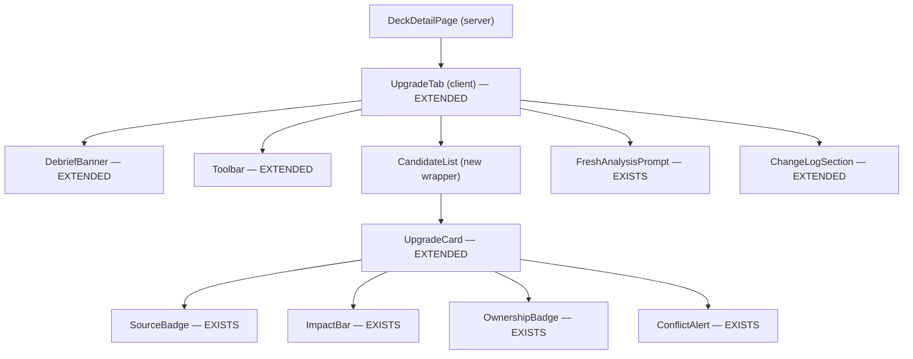
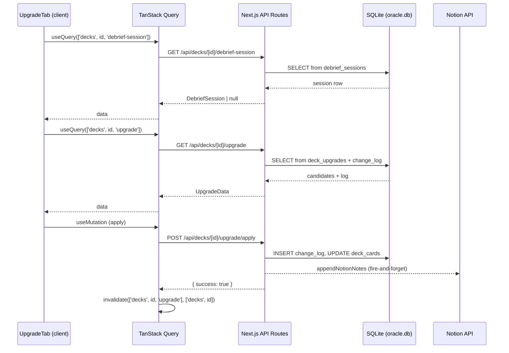

# Design Document: Upgrade Tab Expansion

## Overview

This design extends the existing `UpgradeTab.tsx` component with debrief integration, source-aware recommendation cards, toolbar sort/filter controls, a change log with Notion auto-sync, and a fresh analysis prompt. The feature builds on TanStack Query patterns already established in the project, the Notion integration via `appendNotionNotes`, and the Proxy Ownership Layer for conflict detection.

**Key design decisions:**
- Extend the existing `UpgradeTab.tsx` in-place rather than creating a new component — the current file already has 80% of the structure (debrief banner, toolbar, cards, change log).
- API mutations for apply/skip/refresh share the existing `/api/decks/[id]/upgrade` route family, adding sub-routes for `apply`, `skip`, and `refresh`.
- Notion writes are fire-and-forget from the API route handler — they do not block the JSON response to the client.
- Sort and filter are client-side operations on already-fetched data (no additional API calls).

## Architecture

### High-Level Component Tree



**Legend:**
- `EXISTS` — Already implemented in `UpgradeTab.tsx`, no changes needed.
- `EXTENDED` — Existing sub-component that gains new props or behaviour.
- `(new wrapper)` — New thin component for list rendering logic.

### Data Flow



## Components and Interfaces

### UpgradeTab (extended)

```typescript
interface UpgradeTabProps {
  deckId: number
}
```

The root component orchestrates all data fetching and mutation state. No changes to its public interface — all extensions are internal.

### DebriefBanner (extended)

```typescript
interface DebriefBannerProps {
  session: DebriefSession
  deckId: number
}

interface DebriefSession {
  id: number
  date: string               // ISO date string
  total_fixes: number
  reviewed_fixes: number
  applied: number
  skipped: number
  pending: number
  changes: Array<{
    from: string
    to: string
    skipped: boolean         // NEW — enables skipped styling
  }>
}
```

**Changes from current:** Add `skipped` field to each change entry so the banner can render skipped items in muted styling with "Skipped:" prefix. Conditionally hide the "Resume debrief" button when `reviewed_fixes === total_fixes`.

### Toolbar (extended)

```typescript
type SortMode = 'impact' | 'cheapest' | 'owned' | 'edhrec'
type FilterChip = 'owned_only' | 'under_5'

interface ToolbarProps {
  sortMode: SortMode
  onSortChange: (mode: SortMode) => void
  activeFilters: Set<FilterChip>
  onToggleFilter: (chip: FilterChip) => void
  onRefresh: () => void
  isRefreshing: boolean
}
```

No interface changes — the current Toolbar already supports this contract. Implementation is complete.

### UpgradeCard (extended)

```typescript
interface UpgradeCardProps {
  candidate: UpgradeCandidate
  onMakeChange: () => void
  onSkip: () => void
  onDiscuss: () => void       // NEW — navigates to OracleChat
  isMutating: boolean
}

interface UpgradeCandidate {
  priority: number
  impact: number              // 0–100
  source: 'debrief' | 'analysis'
  cut: {
    card_name: string
    reason: string
    ownership_status: OwnershipStatus
    holder_deck_name?: string
  }
  add: {
    card_name: string
    reason: string
    ownership_status: OwnershipStatus
    holder_deck_name?: string
    edhrec_percent?: number
    price?: number
  }
  conflict?: {
    deck_name: string
  }
}
```

**Changes from current:** Add `onDiscuss` prop. The card renders a teal left accent border when `source === 'debrief'` (Requirement 7.7). The "Discuss in debrief" button calls `onDiscuss` which navigates via `router.push`.

### ChangeLogSection (extended)

```typescript
interface ChangeLogSectionProps {
  entries: ChangeLogEntry[]
  thisMonthCount: number
}

interface ChangeLogEntry {
  id: number
  date: string
  cut_card: string
  add_card: string
  reason: string
  skipped: boolean
}
```

No changes — the current interface already handles applied vs skipped styling.

### ConflictAlert (exists — no changes)

```typescript
interface ConflictAlertProps {
  conflictDeckName: string
  cardName: string
}
```

Already renders inline with amber warning styling. The `UpgradeCard` conditionally renders it when `candidate.conflict` is truthy.

## API Endpoints

### GET `/api/decks/[id]/debrief-session`

Returns the most recent debrief session for the deck, or `null` / 404 if none exists.

```typescript
// Response: DebriefSession | null
{
  id: number,
  date: string,
  total_fixes: number,
  reviewed_fixes: number,
  applied: number,
  skipped: number,
  pending: number,
  changes: Array<{ from: string, to: string, skipped: boolean }>
}
```

**Implementation:** Query `debrief_sessions` table joined to `debrief_fixes` for per-fix status aggregation. Returns the most recent session by date.

### GET `/api/decks/[id]/upgrade`

Returns upgrade candidates and change log. Already partially implemented — extend to include `source` field on candidates and full change log.

```typescript
// Response: UpgradeData
{
  candidates: UpgradeCandidate[],
  change_log: ChangeLogEntry[]
}
```

**Implementation:** Query `deck_upgrades` for candidates (enriched with ownership from `collection` + `deck_cards` tables and conflicts from the proxy layer). Query `upgrade_change_log` for history entries.

### POST `/api/decks/[id]/upgrade/apply`

Applies a swap: removes the cut card from `deck_cards`, adds the add card, records in change log, triggers Notion sync.

```typescript
// Request body
{ cut: string, add: string }

// Response
{ success: true, change_log_id: number }
```

**Side effects:**
1. `DELETE FROM deck_cards WHERE deck_id = ? AND card_name = ?` (cut)
2. `INSERT INTO deck_cards (deck_id, card_name, quantity, ...) VALUES (...)` (add)
3. `INSERT INTO upgrade_change_log (deck_id, cut_card, add_card, reason, skipped, date) VALUES (...)`
4. Fire-and-forget: `appendNotionNotes(deckId, formattedEntry)` — does not block response

### POST `/api/decks/[id]/upgrade/skip`

Records the skip in the change log without modifying `deck_cards`. Triggers Notion sync.

```typescript
// Request body
{ cut: string, add: string }

// Response
{ success: true }
```

**Side effects:**
1. `INSERT INTO upgrade_change_log (deck_id, cut_card, add_card, reason, skipped, date) VALUES (..., true, ...)`
2. Remove candidate from `deck_upgrades` active list
3. Fire-and-forget: `appendNotionNotes(deckId, formattedSkipEntry)`

### POST `/api/decks/[id]/upgrade/refresh`

Triggers a fresh analysis run. Clears existing candidates, regenerates from the current deck state via the Oracle Upgrade Engine.

```typescript
// Request body (empty)
{}

// Response
{ success: true, candidate_count: number }
```

**Implementation:** Calls the upgrade engine (EDHREC staples, dead weight analysis, debrief fixes merge) and writes results to `deck_upgrades`. Invalidation happens client-side via TanStack Query after success.

## Data Models

### Database Schema (SQLite)

```sql
-- Already exists (extended with 'source' column if not present)
CREATE TABLE IF NOT EXISTS deck_upgrades (
  id INTEGER PRIMARY KEY AUTOINCREMENT,
  deck_id INTEGER NOT NULL REFERENCES decks(id),
  content TEXT NOT NULL,  -- JSON blob of UpgradeCandidate[]
  created_at TEXT DEFAULT (datetime('now')),
  UNIQUE(deck_id)
);

-- NEW table
CREATE TABLE IF NOT EXISTS upgrade_change_log (
  id INTEGER PRIMARY KEY AUTOINCREMENT,
  deck_id INTEGER NOT NULL REFERENCES decks(id),
  cut_card TEXT NOT NULL,
  add_card TEXT NOT NULL,
  reason TEXT DEFAULT '',
  skipped INTEGER NOT NULL DEFAULT 0,  -- 0 = applied, 1 = skipped
  date TEXT DEFAULT (date('now'))
);

-- Already exists (debrief sessions from monitor-mode spec)
CREATE TABLE IF NOT EXISTS debrief_sessions (
  id INTEGER PRIMARY KEY AUTOINCREMENT,
  deck_id INTEGER NOT NULL REFERENCES decks(id),
  date TEXT NOT NULL,
  total_fixes INTEGER NOT NULL DEFAULT 0,
  reviewed_fixes INTEGER NOT NULL DEFAULT 0
);

CREATE TABLE IF NOT EXISTS debrief_fixes (
  id INTEGER PRIMARY KEY AUTOINCREMENT,
  session_id INTEGER NOT NULL REFERENCES debrief_sessions(id),
  cut_card TEXT NOT NULL,
  add_card TEXT NOT NULL,
  status TEXT NOT NULL DEFAULT 'pending',  -- 'applied' | 'skipped' | 'pending'
  reason TEXT DEFAULT ''
);
```

### Notion Entry Format

The auto-write formats entries as a single append block to the deck's Notion page:

```
**Change Log Entry — {date}**
• {Applied|Skipped}: Cut {cut_card} → Add {add_card}
• Reason: {reason}
```

## Data Fetching Patterns (TanStack Query)

Following the project's established patterns from the steering file:

```typescript
// Debrief session — 5 min stale (Archidekt-sourced cadence)
const { data: debriefSession } = useQuery<DebriefSession | null>({
  queryKey: ['decks', deckId, 'debrief-session'],
  queryFn: async () => { /* ... */ },
  staleTime: 5 * 60 * 1000,
})

// Upgrade data — 5 min stale
const { data: upgradeData, isLoading } = useQuery<UpgradeData | null>({
  queryKey: ['decks', deckId, 'upgrade'],
  queryFn: async () => { /* ... */ },
  staleTime: 5 * 60 * 1000,
})

// Mutations invalidate specific keys
const makeChangeMutation = useMutation({
  mutationFn: async (candidate) => { /* POST /apply */ },
  onSuccess: () => {
    queryClient.invalidateQueries({ queryKey: ['decks', deckId, 'upgrade'] })
    queryClient.invalidateQueries({ queryKey: ['decks', deckId] })
  },
})
```

### Notion Integration Pattern

The Notion write happens server-side in the API route handler, not from the client. This follows the existing `appendNotionNotes` pattern:

```typescript
// Inside POST /api/decks/[id]/upgrade/apply handler
const result = await applyUpgrade(deckId, cut, add)

// Fire-and-forget — don't await, don't block response
appendNotionNotes(deckId, formatChangeLogEntry(cut, add, reason, 'applied'))
  .catch((err) => console.error('[Notion sync failed]', err))

return Response.json({ success: true, change_log_id: result.id })
```

If the Notion write fails, it logs to server console only — no user-facing error (Requirement 12.4).


## Correctness Properties

*A property is a characteristic or behavior that should hold true across all valid executions of a system — essentially, a formal statement about what the system should do. Properties serve as the bridge between human-readable specifications and machine-verifiable correctness guarantees.*

### Property 1: Debrief banner conditional rendering

*For any* render of UpgradeTab, the DebriefBanner is present in the output if and only if the debrief session query returns a non-null DebriefSession. When session is null/undefined, the banner is absent.

**Validates: Requirements 1.1, 1.5**

### Property 2: Resume button conditional on pending fixes

*For any* DebriefSession, the "Resume debrief" button renders if and only if `reviewed_fixes < total_fixes`. When `reviewed_fixes === total_fixes`, the button is absent.

**Validates: Requirements 1.3, 1.4**

### Property 3: Banner displays all session fields and changes

*For any* valid DebriefSession with N changes, the rendered DebriefBanner contains: the formatted date, reviewed count, total count, applied count, skipped count, pending count, and for each change entry the `from` and `to` card names — with "Skipped:" prefix when `change.skipped === true`.

**Validates: Requirements 1.2, 1.6, 1.7**

### Property 4: Sort function produces correctly ordered output

*For any* array of UpgradeCandidate and any SortMode, `sortCandidates(candidates, mode)` produces an output where consecutive pairs satisfy the mode's ordering: impact descending, price ascending, ownership tier ascending, or EDHREC percentage descending.

**Validates: Requirements 3.3**

### Property 5: Owned-only filter excludes non-owned candidates

*For any* array of UpgradeCandidate, `filterCandidates(candidates, Set(['owned_only']))` returns only candidates where `add.ownership_status` is `'original'` or `'proxy'`. No candidate with `add.ownership_status === 'not_owned'` appears in the output.

**Validates: Requirements 3.7**

### Property 6: Under-$5 filter excludes expensive candidates

*For any* array of UpgradeCandidate, `filterCandidates(candidates, Set(['under_5']))` returns only candidates where `add.price < 5`. No candidate with `add.price >= 5` appears in the output.

**Validates: Requirements 3.8**

### Property 7: Debrief-first partition ordering

*For any* array of UpgradeCandidate, any SortMode, and any set of active FilterChips, after filtering and sorting, the final output has all candidates with `source === 'debrief'` appearing before all candidates with `source === 'analysis'`. No analysis-sourced candidate precedes any debrief-sourced candidate.

**Validates: Requirements 6.1, 6.2, 6.4**

### Property 8: Within-partition sort ordering

*For any* array of UpgradeCandidate and any SortMode, within the debrief partition (candidates where `source === 'debrief'`) and within the analysis partition (candidates where `source === 'analysis'`), consecutive pairs satisfy the active SortMode's ordering comparator.

**Validates: Requirements 6.3**

### Property 9: Change log month count accuracy

*For any* array of ChangeLogEntry, the computed `thisMonthCount` equals the number of entries whose `date` (parsed as Date) has the same month and year as the current date, counting only entries where `skipped === false`.

**Validates: Requirements 11.2**

### Property 10: Change log reverse chronological order

*For any* array of ChangeLogEntry returned by the API, entries are ordered such that for every pair of adjacent entries (i, i+1), `new Date(entries[i].date) >= new Date(entries[i+1].date)`.

**Validates: Requirements 11.5**

### Property 11: Notion entry format completeness

*For any* valid change log entry (cut_card, add_card, action, reason, date), the `formatChangeLogEntry` function produces a string that contains all five fields: the cut card name, the add card name, the action type ("Applied" or "Skipped"), the reason text, and the formatted date.

**Validates: Requirements 12.5**

## Error Handling

| Scenario | Behaviour |
|----------|-----------|
| Debrief session fetch returns 404 / network error | `debriefSession` resolves to `null`; banner hidden; rest of tab renders normally |
| Upgrade data fetch returns 404 | `upgradeData` resolves to `null`; empty candidate list; fresh analysis prompt shown as primary CTA |
| Upgrade data fetch throws | TanStack Query error state; can add `error.tsx` boundary or inline error UI |
| Apply mutation fails (network / server error) | Toast error "Failed to apply change"; buttons re-enabled; no state change |
| Skip mutation fails | Toast error "Failed to skip"; buttons re-enabled; no state change |
| Refresh mutation fails | Toast error "Failed to refresh analysis"; spinner stops; button re-enabled |
| Notion write fails (fire-and-forget) | `console.error` server-side; no user-facing feedback; API response already sent |
| Conflict alert — user clicks "Action anyway" | Proceeds with apply mutation; conflict is informational, not blocking |
| Conflict alert — user clicks "Cancel" | Dismisses the intent; no mutation fired; candidate remains in list |

## Testing Strategy

### Unit Tests (example-based)

- **DebriefBanner rendering:** Verify correct rendering for sessions with/without pending fixes, with/without changes, with skipped changes.
- **SourceBadge variants:** Render with `source='debrief'` and `source='analysis'`, verify correct text and icon.
- **UpgradeCard layout:** Render with a full candidate object, verify all fields displayed (priority, impact, card names, reasons, badges, price, EDHREC %).
- **ConflictAlert inline:** Render when `candidate.conflict` is present; verify absent when undefined.
- **FreshAnalysisPrompt:** Verify button disabled state during pending mutation.
- **Toolbar:** Verify initial sort mode is 'impact'; verify filter chip toggle styling.

### Property Tests (fast-check, minimum 100 iterations)

Library: **fast-check** (already available in the project's test toolchain via vitest).

Each property test references its design property by tag comment:

```typescript
// Feature: upgrade-tab-expansion, Property 4: Sort function produces correctly ordered output
test.prop([fc.array(arbitraryCandidate()), fc.constantFrom('impact', 'cheapest', 'owned', 'edhrec')])
```

Configuration: `{ numRuns: 100 }` minimum per property.

Properties to implement as PBT:
- Property 4: `sortCandidates` ordering correctness
- Property 5: `filterCandidates` owned-only correctness
- Property 6: `filterCandidates` under-$5 correctness
- Property 7: Debrief-first partition invariant (combined sort + filter pipeline)
- Property 8: Within-partition ordering
- Property 9: `thisMonthCount` computation
- Property 10: Change log chronological ordering
- Property 11: `formatChangeLogEntry` format completeness

### Integration Tests

- **Apply mutation flow:** Mock fetch, fire onMakeChange, verify POST body `{ cut, add }`, verify cache invalidation of `['decks', deckId, 'upgrade']` and `['decks', deckId]`.
- **Skip mutation flow:** Same pattern, verify different URL and single invalidation key.
- **Refresh mutation flow:** Verify POST to `/upgrade/refresh`, verify cache invalidation.
- **Notion fire-and-forget:** Mock `appendNotionNotes` in the API route test; verify it's called but does not block the response. Verify failure logs to console without throwing.
- **Discuss navigation:** Verify `router.push` called with correct OracleChat URL including card name.
