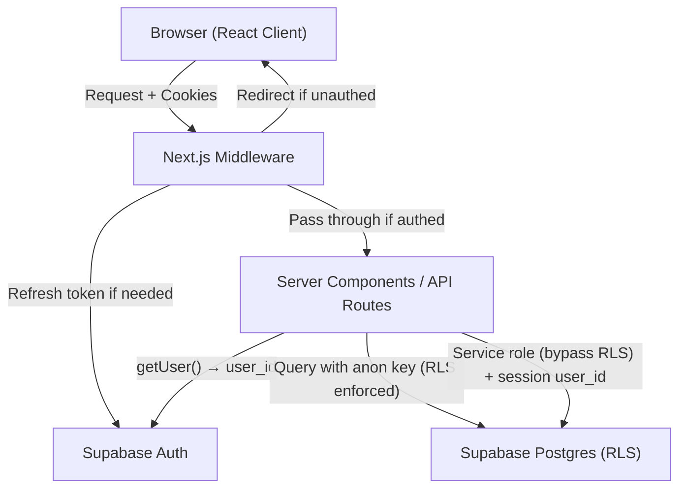

# Design Document: User Authentication

## Overview

This design adds Supabase Auth to The Oracle, replacing the hardcoded `SUPABASE_DEFAULT_USER_ID` pattern with real cookie-based authentication. The implementation uses the `@supabase/ssr` package for Next.js App Router integration, Next.js middleware for route protection and token refresh, and Postgres Row Level Security (RLS) policies for data isolation.

The auth model is invite-only — no public sign-up. The admin (Brad) provisions accounts via the Supabase dashboard, and members log in with email/password. The existing single-user data is migrated to Brad's new auth user ID in a single transaction.

**Key research findings:**
- `@supabase/ssr` is the current Supabase package for SSR frameworks ([source](https://supabase.com/docs/guides/auth/server-side-rendering)). It replaces the deprecated `@supabase/auth-helpers-nextjs`.
- It handles cookie-based session storage using the PKCE flow, with middleware responsible for token refresh (server components cannot write cookies).
- `getUser()` is the secure server-side validation method — never rely on `getSession()` alone as it doesn't validate the JWT.
- Next.js 16 middleware (`middleware.ts`) runs on every request and is the ideal place to refresh tokens and enforce auth redirects.

## Architecture



**Authentication flow:**
1. Browser sends request with session cookies
2. Middleware reads cookies, refreshes expired access tokens via refresh token
3. If no valid session exists and route is protected → redirect to `/login`
4. Authenticated requests proceed to server components / API routes
5. Server code calls `getUser()` to extract the user ID from the validated session
6. Database queries use either the anon-key client (RLS enforced) or service-role client (with user_id explicitly from session)

**Design decisions:**
- **Middleware-first protection**: All route protection happens in middleware, not scattered across individual routes. This provides a single enforcement point.
- **Dual client pattern retained**: The existing `createServerClient` (service role) and `createBrowserClient` (anon key) remain, but are augmented with a new `createAuthServerClient` that uses cookies for session-aware server operations.
- **RLS as defense-in-depth**: Even though API routes extract user_id from sessions, RLS policies add a second layer ensuring data isolation at the database level.

## Components and Interfaces

### 1. Supabase Client Utilities (`src/lib/supabase.ts`)

Refactored to provide three client factories:

| Function | Purpose | Key used | RLS |
|----------|---------|----------|-----|
| `createBrowserClient()` | Client components (React) | Anon key | Enforced |
| `createAuthServerClient(cookieStore)` | Server components & API routes needing session | Anon key + cookies | Enforced |
| `createAdminClient()` | Trusted server operations (sync, migration) | Service role key | Bypassed |

```typescript
// New: session-aware server client using @supabase/ssr
import { createServerClient as createSupabaseServerClient } from '@supabase/ssr'
import { cookies } from 'next/headers'

export async function createAuthServerClient() {
  const cookieStore = await cookies()
  return createSupabaseServerClient<Database>(
    process.env.NEXT_PUBLIC_SUPABASE_URL!,
    process.env.NEXT_PUBLIC_SUPABASE_ANON_KEY!,
    {
      cookies: {
        getAll: () => cookieStore.getAll(),
        setAll: (cookiesToSet) => {
          cookiesToSet.forEach(({ name, value, options }) =>
            cookieStore.set(name, value, options)
          )
        },
      },
    }
  )
}
```

### 2. Auth Helper (`src/lib/auth.ts`)

```typescript
export async function getAuthUser() {
  const supabase = await createAuthServerClient()
  const { data: { user }, error } = await supabase.auth.getUser()
  if (error || !user) return null
  return user
}

export async function requireAuth() {
  const user = await getAuthUser()
  if (!user) {
    return Response.json({ error: 'Unauthorized' }, { status: 401 })
  }
  return user
}
```

### 3. Middleware (`src/middleware.ts`)

```typescript
import { createServerClient } from '@supabase/ssr'
import { NextResponse, type NextRequest } from 'next/server'

const PUBLIC_ROUTES = ['/login', '/auth/callback']

export async function middleware(request: NextRequest) {
  const { pathname } = request.nextUrl

  // Allow public routes
  if (PUBLIC_ROUTES.some(route => pathname.startsWith(route))) {
    return NextResponse.next()
  }

  // Create supabase client with cookie access
  let supabaseResponse = NextResponse.next({ request })
  const supabase = createServerClient(
    process.env.NEXT_PUBLIC_SUPABASE_URL!,
    process.env.NEXT_PUBLIC_SUPABASE_ANON_KEY!,
    {
      cookies: {
        getAll: () => request.cookies.getAll(),
        setAll: (cookiesToSet) => {
          cookiesToSet.forEach(({ name, value }) =>
            request.cookies.set(name, value)
          )
          supabaseResponse = NextResponse.next({ request })
          cookiesToSet.forEach(({ name, value, options }) =>
            supabaseResponse.cookies.set(name, value, options)
          )
        },
      },
    }
  )

  // Refresh session (this writes updated cookies)
  const { data: { user } } = await supabase.auth.getUser()

  if (!user) {
    const loginUrl = new URL('/login', request.url)
    return NextResponse.redirect(loginUrl)
  }

  return supabaseResponse
}

export const config = {
  matcher: [
    '/((?!_next/static|_next/image|favicon.ico|.*\\.(?:svg|png|jpg|jpeg|gif|webp)$).*)',
  ],
}
```

### 4. Login Page (`src/app/login/page.tsx`)

A server component rendering a client login form. No user data in the HTML source.

### 5. Auth Callback Route (`src/app/auth/callback/route.ts`)

Handles the redirect from Supabase after email invite links and password resets. Exchanges the auth code for a session and redirects to home.

### 6. Logout Action

A server action or API route that calls `supabase.auth.signOut()` and redirects to `/login`.

## Data Models

### RLS Policies

Applied to all 24 user-owned tables. Policy template:

```sql
-- Enable RLS
ALTER TABLE <table_name> ENABLE ROW LEVEL SECURITY;

-- SELECT: users can only read their own rows
CREATE POLICY "Users can view own data"
  ON <table_name> FOR SELECT
  USING (auth.uid() = user_id);

-- INSERT: users can only insert rows with their own user_id
CREATE POLICY "Users can insert own data"
  ON <table_name> FOR INSERT
  WITH CHECK (auth.uid() = user_id);

-- UPDATE: users can only update their own rows
CREATE POLICY "Users can update own data"
  ON <table_name> FOR UPDATE
  USING (auth.uid() = user_id)
  WITH CHECK (auth.uid() = user_id);

-- DELETE: users can only delete their own rows
CREATE POLICY "Users can delete own data"
  ON <table_name> FOR DELETE
  USING (auth.uid() = user_id);
```

**Reference tables** (no RLS restrictions on read):
- `sets`, `card_metadata`, `precon_cards`, `card_kingdom_prices`, `oracle_to_printings`, `sync_meta`, `_migrations`

These get a permissive SELECT policy for authenticated users:
```sql
CREATE POLICY "Authenticated users can read reference data"
  ON <ref_table> FOR SELECT
  TO authenticated
  USING (true);
```

### User-Owned Tables (24 total)

Based on the schema migration, tables requiring RLS policies:
`card_definitions`, `decks`, `collection`, `physical_copies`, `deck_cards`, `deck_allocations`, `deck_documentation`, `brew_sessions`, `brew_session_cards`, `dead_weight_dismissals`, `upgrade_candidates`, `upgrade_changelog`, `generic_land_preferences`, `deck_health_cache`, `health_run_log`, `precon_mod_tracking`, `card_ratings`, `card_rating_history`, `deck_synergy_scores`, `commander_recommendations`, `recommendation_history`, `deck_upgrade_summary`, `deck_category_targets`, `deck_category_analysis`

### Migration Script

```sql
BEGIN;

-- Replace old hardcoded UUID with Brad's new Supabase Auth user ID
DO $$
DECLARE
  old_id UUID := '00000000-0000-0000-0000-000000000000'; -- or actual current value
  new_id UUID := '<brads-supabase-auth-uid>';
  tbl TEXT;
  affected BIGINT;
  tables TEXT[] := ARRAY[
    'card_definitions', 'decks', 'collection', 'physical_copies',
    'deck_cards', 'deck_allocations', 'deck_documentation',
    'brew_sessions', 'brew_session_cards', 'dead_weight_dismissals',
    'upgrade_candidates', 'upgrade_changelog', 'generic_land_preferences',
    'deck_health_cache', 'health_run_log', 'precon_mod_tracking',
    'card_ratings', 'card_rating_history', 'deck_synergy_scores',
    'commander_recommendations', 'recommendation_history',
    'deck_upgrade_summary', 'deck_category_targets', 'deck_category_analysis'
  ];
BEGIN
  FOREACH tbl IN ARRAY tables LOOP
    EXECUTE format('UPDATE %I SET user_id = $1 WHERE user_id = $2', tbl)
      USING new_id, old_id;
    GET DIAGNOSTICS affected = ROW_COUNT;
    RAISE NOTICE 'Updated % rows in %', affected, tbl;
  END LOOP;
END $$;

COMMIT;
```

Row count verification runs as a post-migration check comparing counts before and after.

## Correctness Properties

*A property is a characteristic or behavior that should hold true across all valid executions of a system — essentially, a formal statement about what the system should do. Properties serve as the bridge between human-readable specifications and machine-verifiable correctness guarantees.*

### Property 1: RLS Data Isolation

*For any* user-owned table and *for any* authenticated user, all CRUD operations (SELECT, INSERT, UPDATE, DELETE) SHALL only succeed on rows where the `user_id` column matches the authenticated user's `auth.uid()`. Operations targeting rows belonging to a different user SHALL be rejected or return empty results.

**Validates: Requirements 3.1, 3.2, 3.3, 3.4**

### Property 2: Service Role Writes Use Session User ID

*For any* API route that uses the service-role client to write data, the `user_id` value written to the database SHALL equal the authenticated user's ID extracted from the session — never a hardcoded value or a value from request input.

**Validates: Requirements 3.6, 4.1, 4.2**

### Property 3: Unauthenticated API Requests Return 401

*For any* API route (except `/auth/callback`), a request without a valid authenticated session SHALL receive a 401 Unauthorized response. No user data, deck data, or collection data SHALL be included in the response body.

**Validates: Requirements 4.3, 7.2**

### Property 4: Unauthenticated Page Requests Redirect to Login

*For any* page route (except `/login` and `/auth/callback`), a request without a valid authenticated session SHALL receive a redirect response to `/login`. The redirect response SHALL not contain any user data in its body or headers.

**Validates: Requirements 1.1, 7.1, 7.3, 7.4**

## Error Handling

| Scenario | Handling |
|----------|----------|
| Expired access token, valid refresh token | Middleware silently refreshes; user sees no interruption |
| Expired refresh token | Middleware redirects to `/login`; stale cookies are cleared |
| Invalid credentials on login | Generic error: "Invalid email or password" (no field-specific hints) |
| Supabase Auth service unavailable | Login page shows "Unable to connect. Please try again." |
| RLS policy violation (should not happen in normal flow) | Supabase returns empty result or error; API routes return 500 with generic message |
| Missing session in API route | Return `{ error: "Unauthorized" }` with status 401 |
| Migration failure | Transaction rolls back; all data retains original user_id; admin alerted |

**Error message security:** Error responses never reveal internal state, user existence, or which credential field was incorrect. This prevents enumeration attacks.

## Testing Strategy

### Unit Tests (Vitest)

- `requireAuth()` helper: returns user when session valid, returns 401 response when not
- Login form component: renders correctly, calls signInWithPassword, displays error on failure
- Middleware route matching: correctly identifies public vs protected routes

### Property-Based Tests (fast-check + Vitest)

The project already includes `fast-check ^4.8.0`. Property tests verify the correctness properties above:

- **Property 1 (RLS isolation):** Generate random user IDs and table operations. With mocked Supabase RLS behavior, verify that queries scoped to user A never return user B's data. Minimum 100 iterations.
  - Tag: `Feature: user-authentication, Property 1: For any user-owned table and any authenticated user, CRUD operations only succeed on rows matching auth.uid()`

- **Property 2 (Session user_id in writes):** Generate random session user IDs. For each API write operation, verify the user_id written to the database matches the session. Minimum 100 iterations.
  - Tag: `Feature: user-authentication, Property 2: For any API route using service role writes, user_id equals session user's ID`

- **Property 3 (401 on unauthenticated API):** Generate random API route paths from the known route list. Verify each returns 401 without auth. Minimum 100 iterations.
  - Tag: `Feature: user-authentication, Property 3: For any API route, unauthenticated requests return 401`

- **Property 4 (Redirect on unauthenticated pages):** Generate random page paths. Verify middleware redirects to /login. Minimum 100 iterations.
  - Tag: `Feature: user-authentication, Property 4: For any protected page route, unauthenticated requests redirect to /login`

### Integration Tests

- Full login → access protected route → logout flow
- Invite link → set password → login flow
- Token refresh (expired access token with valid refresh token)
- Data migration script (verify row counts and user_id values)

### Smoke Tests

- No `SUPABASE_DEFAULT_USER_ID` references remain in `src/`
- Login page renders with no user data in HTML source
- Supabase project has self-registration disabled
- RLS is enabled on all 24 user-owned tables
